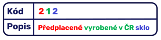

# Evidence obalů (EKO-KOM) – Nastavení

> Aktualizace: 01.3.2025

Prvním krokem při práci s modulem **Evidence obalů** je vytvoření **Výkazů obalů**. Ty představují nadřazené kategorie, které slouží jako základ pro následné nastavování parametrů obalové evidence. V systému lze založit libovolný počet těchto výkazů, přičemž každý z nich může obsahovat specifická data podle potřeb firmy nebo legislativy.

Pokud plánujete pracovat s parametrizací systému **EKO-KOM**, je nutné nejprve vytvořit **Výkaz obalů s kódem EKO-KOM**. Tento krok umožní správný import souborů s přednastavenými hodnotami.

Jakmile je výkaz obalů vytvořen, nastavují se podrobnější parametry, které definují strukturu a vlastnosti evidovaných obalů. Tento proces zahrnuje rozdělení obalů do specifických skupin a jejich následnou klasifikaci podle stanovených kritérií. Správné nastavení těchto prvků zajišťuje přesnou evidenci a usnadňuje následné vykazování podle legislativních požadavků.

<video src="media/pack-tracking.mp4" width="640" height="360" controls></video>

Pro správné nastavení je nutné provést následující kroky:

- **Založení Výkazu obalů**
- **Parametrizace Výkazu obalů EKO-KOM**
- **Definice prvků Výkazu obalů (struktury výkazu)**
- **Založení prvků ve Výkazu obalů (definice vlastního výkazu)**
- **Založení výjimek ve výkazu obalů**

## Založení výkazu obalů

1. Vyberte ikonu , zadejte **Výkazy obalů** a poté vyberte související odkaz.
2. Na stránce **Výkazy obalů** je nutné založit nový řádek s **Kódem** EKO-KOM.

Po vyplnění **Kódu** a **Popisu** máte dále na výběr zvolit:

- **Výkaz VRP** – Označuje, zda bude tento výkaz použit pro definici viditelných recyklačních poplatků.
- **Počítat VRP při vydání prodejního dokladu** – Aktivuje funkci automatického výpočtu recyklačních poplatků na prodejních dokladech.
- **Typ účtu VRP** – Určuje typ účtu, který bude použit pro evidenci viditelných recyklačních poplatků v prodejním dokladu.
- **Číslo účtu VRP** – Definuje konkrétní účet, na který se budou recyklační poplatky účtovat.

## Parametrizace Výkazu obalů EKO-KOM

Pro správnou funkčnost výkaznictví EKO-KOM je nutné nejprve provést odpovídající parametrizaci. Veškeré potřebné soubory s nastavením budou nahrávány za pomoci konfiguračních balíčků, které zajistí rychlé a bezchybné zavedení požadovaných údajů do systému.

Abychom vám tento proces co nejvíce usnadnili, připravili jsme asistované nastavení, které vás krok za krokem provede celým procesem konfigurace. Díky tomu můžete snadno aplikovat potřebná data bez nutnosti manuálního nastavování jednotlivých parametrů.

1. Vyberte ikonu , zadejte **Asistované nastavení** a poté vyberte související odkaz.
2. Na stránce **Asistované nastavení** pod záložkou **Nastavení rozšíření ARICOMA** naleznete **Nastavit Evidenci obalů EKO-KOM**.
3. Spusťte nastavení.

## Definice prvků Výkazu obalů

Pro každý založený výkaz je nutno nadefinovat jeho prvky. Každá kategorie (Pozice) obsahuje jednotlivé prvky (Kód), které popisují konkrétní charakteristiky obalu.

1. Vyberte ikonu , zadejte **Definice prvků výkazu obalů** a poté vyberte související odkaz.
2. Na stránce **Definice prvků výkazu obalů** vyplňte řádky dle následujících kritérií.
    - **Kód pro vykazování** - Kód výkazu založeného v předchozím kroku.
    - **Pozice** - Určuje skupinu prvků v rámci výkazu.
    - **Kód** - Jednoznačný identifikátor prvku v dané pozici.
    - **Popis** - Popis prvku výkazu.
    - **Umístění ve výkazu** - Doplňující popis určující, kde se prvek v rámci výkazu nachází.

V případě EKO-KOMu vypadá vyplněná tabulka následovně.

## Založení prvků ve Výkazu obalů

Na stránce Prvky výkazu obalů se definují konkrétní řádky výkazu na základě dříve nadefinovaných prvků. Každý řádek je složen z kombinace kategorií a jejich jednotlivých prvků, což umožňuje přesnou identifikaci obalového materiálu podle jeho vlastností. Systém automaticky generuje popis na základě přiřazených hodnot, což eliminuje možnost nesprávné klasifikace.

1. Vyberte ikonu , zadejte **Prvky výkazu obalů** a poté vyberte související odkaz.
2. Z dříve nadefinovaných prvků zde nadefinujte jednotlivé řádky výkazu.
3. Pole **Popis** je následně automaticky doplněno systémem v závislosti na plnění pole na stránce **Definice prvků výkazu obalů**.

## Založení výjimek ve výkazu obalů

V každém založeném Výkazu obalů lze definovat výjimky, specifikované stavem řádků v Deníku zboží, které nebudou do výkazu zahrnuty.

1. Vyberte ikonu , zadejte **Vyjímky prvku výkazu obalů** a poté vyberte související odkaz.
2. Na stránce **Výjimky prvku výkazu obalů** specifikujte **Kód prvku**, **Typ pohybu**, **ID pole**, **Hodnota** a **Pozice**.

## Viz také

[Evidence obalů základ (EKOKOM)](pack-tracking-basic.md)  
[Financial Pack](finance-pack.md)  
