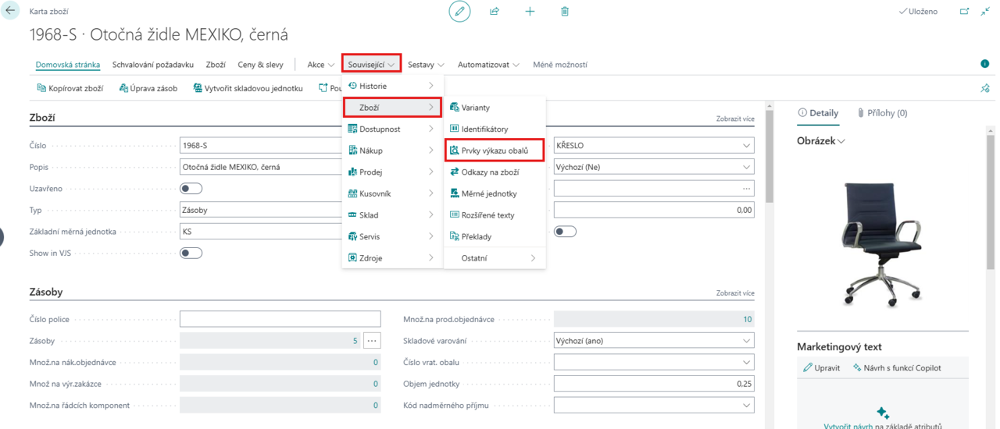
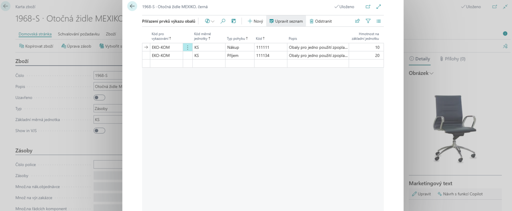

# Evidence obalů (EKO-KOM)

> Aktualizace: 01.3.2025

Obaly hrají klíčovou roli v celém dodavatelském řetězci – chrání zboží, usnadňují manipulaci a pomáhají splnit legislativní požadavky. Jejich správa je však často náročná, ať už se jedná o **obaly pro jedno použití**, **obaly pro opakované použití nebo obaly s různými podmínkami zpoplatnění**.

Ruční evidence těchto obalů může být nepřehledná a náchylná k chybám. Firmy se často potýkají s nesrovnalostmi v reportech, složitým dohledáváním dat nebo neefektivním vykazováním odpovědným institucím. Modul Evidence obalů (EKOKOM) tento proces automatizuje a zajišťuje přesnou evidenci napříč celým životním cyklem obalů.

## Moderní přístup k evidenci obalů

Modul **Evidence obalů (EKOKOM)** pro **MicrosoftDynamics 365 Business Central** vám poskytne plnou kontrolu nadobaly všech typů. Umožňuje evidovat a sledovat nejen **obalyna jedno použití**, ale i **opakovaně použitelné obaly**a rozlišovat je dle zpoplatnění – **zpoplatněné, předplacené aneplacené**.

Systém automaticky propojuje obaly s pohyby zboží, čímž eliminuje potřebu manuálního zaznamenávání. Díky plné integraci s výkaznictvím EKO-KOM jsou všechny legislativní podklady připraveny automaticky a v souladu se **Zákonem o obalech č. 477/2001 Sb**.

### Funkce modulu Evidence obalů (EKOKOM)

- **Automatická evidence všech typů obalů** - Modul rozlišuje obaly dle použití i zpoplatnění a umožňuje přesnou klasifikaci v souladu s firemními a legislativními požadavky.
- **Plná integrace se skladovým hospodářstvím** - Obaly jsou pevně propojeny s materiálovými toky a evidovány spolu s pohybem zboží, což umožňuje přesné sledování jejich stavu.
- **Legislativní výkaznictví EKO-KOM** - Systém automaticky generuje podklady pro výkaz obalů a další reporty dle platné legislativy, čímž eliminuje chybovost a urychluje administrativní procesy.
- **Přiřazení obalových prvků ke zboží** - Každý obal lze propojit s konkrétními produkty a evidovat je společně v rámci skladového hospodářství.
- **Přehledné reporty a sestavy** - Díky snadno dostupným reportům získáte vždy aktuální přehled o stavu obalového hospodářství a připravené podklady pro reporting.

## Přiřazování prvků Výkazu obalů

Pro správné fungování modulu **Evidence obalů** je nutné na kartách zboží přiřadit odpovídající prvky výkazu obalů.

Toto přiřazení se provádí přímo na kartě zboží v nabídce **Související** > **Zboží** > **Prvky výkazu obalů**.

Každé zboží a jeho měrná jednotka mohou být zařazeny do jednoho nebo více výkazů obalů. Přiřazení prvku je vázáno na **Kód pro vykazování** a **Typ pohybu**. Tyto hodnoty společně určují zařazení obalu do správné kategorie ve výkazu. Doplněním **Kódu** se nastaví konkrétní pozice ve výkazu a pole **Hmotnost** se vztahuje k měrné jednotce na řádku výkazu.

## Reporting

Modul Evidence obalů základ poskytuje komplexní nástroje pro reporting obalového hospodářství. Díky integrovanému systému můžete snadno generovat podklady pro výkaznictví a zajistit tak soulad s legislativními požadavky.

1. Vyberte ikonu , zadejte **Podklad pro výkaz obalů** a poté vyberte související odkaz.
2. Zobrazí se dialogové okno s možnostmi nastavení reportu.

V této sestavě lze nastavit:

- **Položky** - Umožňuje zvolit, zda se mají zobrazit **všechny obaly**, **nevykázané obaly** nebo již **vykázané obaly**.
  - **Nevykázané** - Obaly, které dosud nebyly zahrnuty do žádného výkazu. Pokud je chcete vykázat, je nutné aktivovat volbu **Označit položky**.
  - **Vykázané** - Obaly, které již byly zahrnuty v předchozích výkazech.
- **Označit položky** - Dostupné pouze při volbě **Nevykázané**. Tato volba umožňuje označit obaly pro vykázání, čímž zajistíte, že nebudou v budoucích reportech vedeny jako „nevykázané“.
- **Číslo výpisu** - Slouží k jednoznačné identifikaci konkrétního výkazu.
- **Filtr: Položka výkazu obalů** - Umožňuje upřesnit vykazovaná data podle **kódu pro vykazování, zúčtovacího data, čísla výpisu nebo kódu prvku výkazu obalů**.
  - Pokud aktivujete volbu **Označit položky**, systém vás automaticky přesměruje na pole **Kód prvku výkazu obalů**, kde je nutné vybrat odpovídající klasifikaci.

Po nastavení parametrů můžete sestavu exportovat, vytisknout nebo zobrazit náhled.

## Viz také

[Nastavení - Evidence obalů základ (EKOKOM)](pack-tracking-basic-setup.md)
[Financial Pack](finance-pack.md)