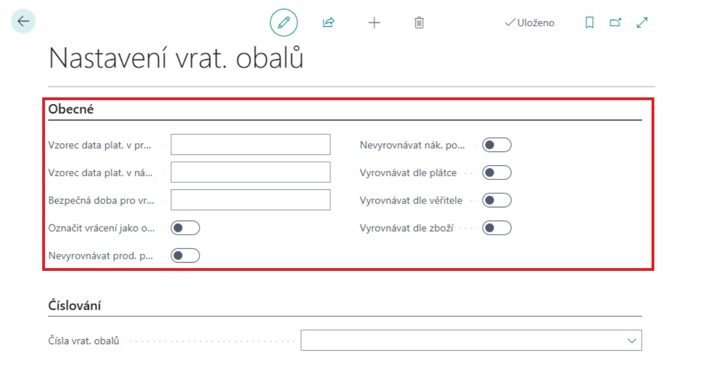
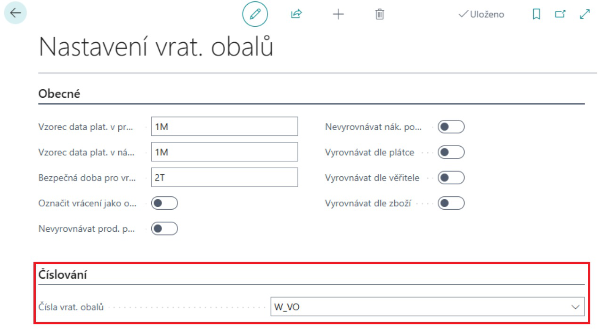
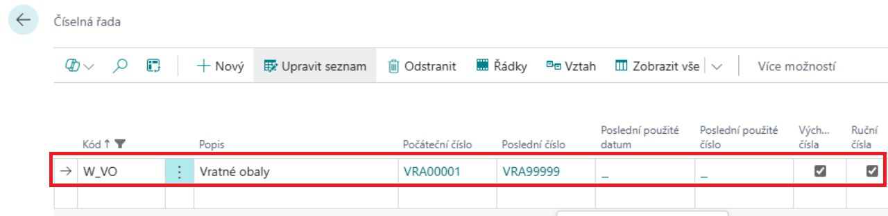
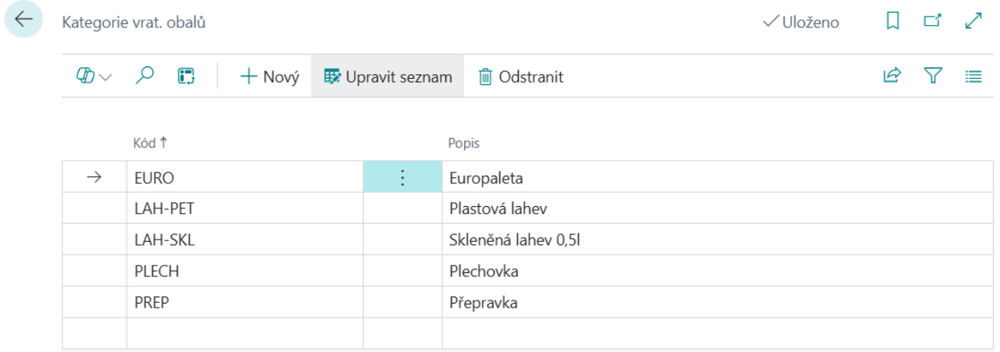
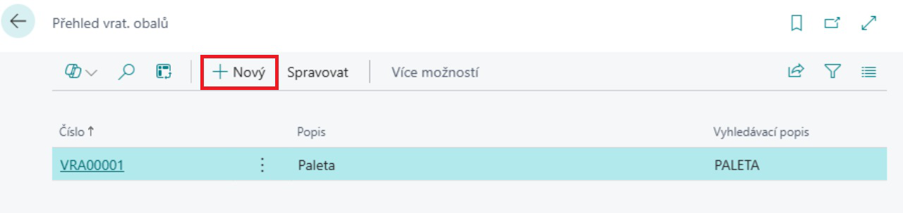

# Vratné obaly - Nastavení
> Aktualizace: 01.12.2024

Modul Evidence vratných obalů je rozšířením modulu Zásoby. Umožňuje sledování oběhu vratných obalů a paletového hospodářství. Lze pomocí něj sledovat obalová salda obchodních partnerů s vazbou na příslušné obchodní transakce (Nákup, Prodej, Příjem, Výdej, Transfer, Spotřeba a Výroba) a dále pak sledovat aktuální cenu obalů.

Pro správné fungování modulu vratné obaly, je nutné předem provést některá nastavení:

- **Nastavit výpočtové vzorce**
- **Nastavit číselné řady**
- **Založit kategorie vratných obalů**
- **Založit šablony deníků vratných obalů**

## Nastavení výpočtových vzorců a číselných řad

1. Vyberte ikonu , zadejte **Nastavení vrat. obalů** a poté vyberte související odkaz.
2. Na stránce **Nastavení vrat. Obalů** na záložce **Obecné** je nutné nastavit výpočtové vzorce.

Karta obecné obsahuje tyto pole:

- **Vzorec data platnosti v prodeji** – zadejte dobu, do kdy má zákazník povinnost vratný obal vrátit
- **Vzorec data platnosti v nákupu** – zadejte dobu, do kdy máte povinnost vratný obal vrátit dodavateli
- **Bezpečná doba pro vrácení** – tato funkce umožňuje nastavit dodatečnou lhůtu k základní lhůtě pro vrácení vratných obalů.  Systém vás po uplynutí této "bezpečné doby" upozorní na obaly, které nebyly včas vráceny.
- **Označit vrácení jako opravu**
- **Nevyrovnávat prodej. položky** – pokud je tato volba aktivní, vypne se automatické vyrovnání položky vrat. obalu při dobropsání (prodej).
- **Nevyrovnávat nákup. položky** – pokud je tato volba aktivní, vypne se automatické vyrovnání položky vrat. obalu při dobropsání (nákup).
- **Vyrovnávat dle plátce** – volba nastavuje vyrovnávání položek vrat. obalů dle plátce uvedeného na prodejním dokladu. V případě, že tato volba není zaškrtnuta, provádí se vyrovnání dle zákazníka.
- **Vyrovnávat dle věřitele** – volba nastavuje vyrovnávání položek vrat. obalů dle věřitele uvedeného na nákupním dokladu. V případě, že tato volba není zaškrtnuta, provádí se vyrovnání dle dodavatele.
- **Vyrovnávat dle zboží** – volba nastavuje vyrovnávání položek vrat. obalů dle zboží, které je svázáno s daným vratným obalem. V případě, že tato volba není zaškrtnuta, provádí se vyrovnání dle vratného obalu

3. Pro správnou funkci je též nutno nastavit na stránce **Nastavení vrat. Obalů** na záložce **Číslování** číselnou řadu vratných obalů.

4. V případě, že nemáte vytvořenou číselnou řadu pro vratné obaly, rozbalte řádek **Čísla vrat. obalů** klikněte na funkci **Nový** a vytvořte novou číselnou řadu.
5. Zadejte Kód, Popis, Počáteční číslo a Poslední číslo číselné řady.
6. Zaškrtněte políčko Výchozí čísla pro automatické vyplňování čísel při zadávaní nových požadavků.

## Nastavení kategorií vratných obalů

Dalším krokem je nastavení kategorií vratných obalů. Kategorie vratných obalů slouží k filtraci v přehledových funkcích a tiskových sestavách.

1. Vyberte ikonu , zadejte **Kategorie vrat. obalů** a poté vyberte související odkaz.
2. Na stránce **Kategorie vrat. obalů** vyberte akci **Nový** a poté zadejte **Kód** a **Popis.**

## Nastavení Šablon deníků vrat. obalů

Šablony deníků slouží k předpřipravení deníků pro účtování o vratných obalech (jedná se o obdobnou funkčnost jako šablony deníků zboží).

1. Vyberte ikonu , zadejte **Šablona deníku vrat. obalu** a poté vyberte související odkaz.
2. Na stránce **Šablona deníku vrat. obalu** vyberte akci **Nový** a poté zadejte **Název, Popis, Číselná řada, Číselná řada účtování** a **Kód původu**.

## Nastavení karet vratných obalů

1. Vyberte ikonu , zadejte **Přehled vrat. obalů** a poté vyberte související odkaz.
2. Na stránce **Přehled vrat. obalů** vyberte akci **Nový**.

3. Po vybrání akce **Nový** se otevře **Karta vrat. obalu.**

Každá Karta vratného obalu obsahuje tato pole:

- **Číslo** – zvolte číselnou řadu vratných obalů
- **Popis** – název vratného obalu
- **Kód kategorie vrat. obalu** – identifikace kategorie vratného obalu
- **Vyhledávací popis**
- **Pohyb** – needitovatelné pole s odkazem do tabulky „**Položky vrat. obalu**“. Zde zobrazená hodnota udává stav salda vratných obalů
- **Vzorec data platnosti v prodeji** – zadejte dobu, do kdy má zákazník povinnost vratný obal vrátit
- **Vzorec data platnosti v nákupu** – zadejte dobu, do kdy máte povinnost vratný obal vrátit dodavateli
- **Uzavřeno** – pole pro uzavření(zamezení) dalšího použití dané karty vratného obalu

Nastavené hodnoty mají v případě, že jsou vyplněny, přednost před obecným nastavením.

Z karty je dále možnost s pomocí akce **Související** zobrazit **Položky vrat. obalu** a **Poznámky**.

**Viz také**  

[Evidence vratných obalů (Vratné obaly)](pack-tracking-return-packing.md)  
[Financial Pack](finance-pack.md)  
