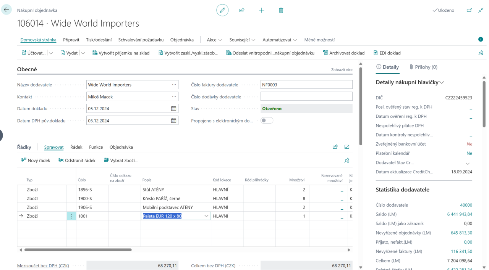
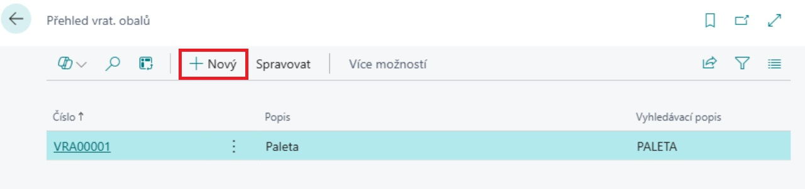
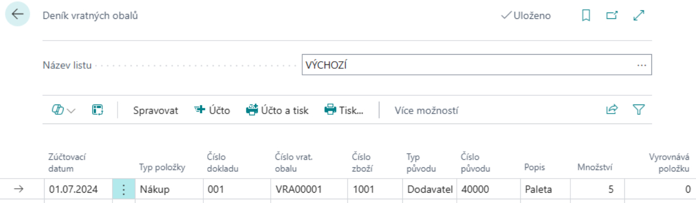
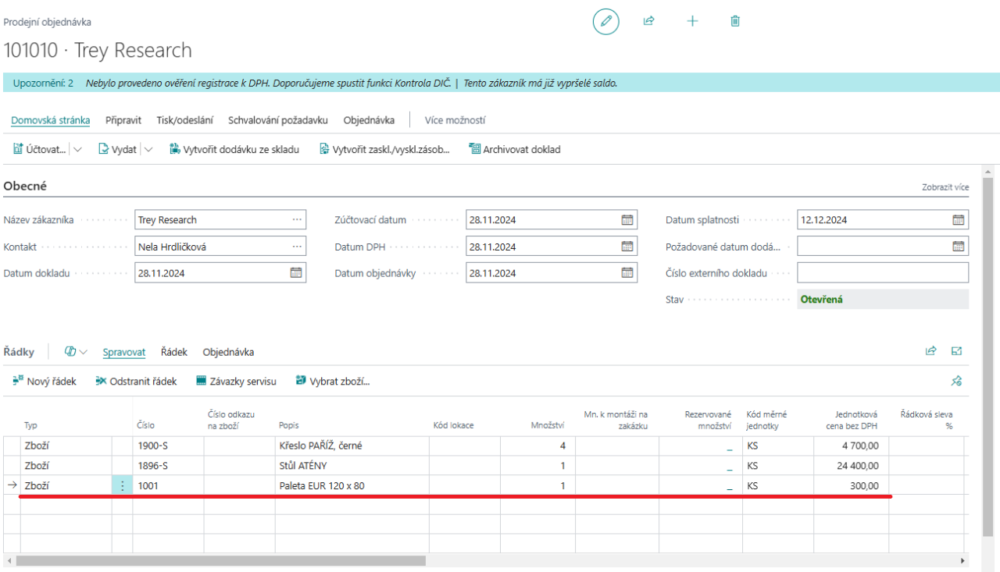
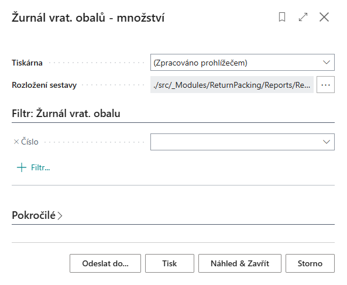
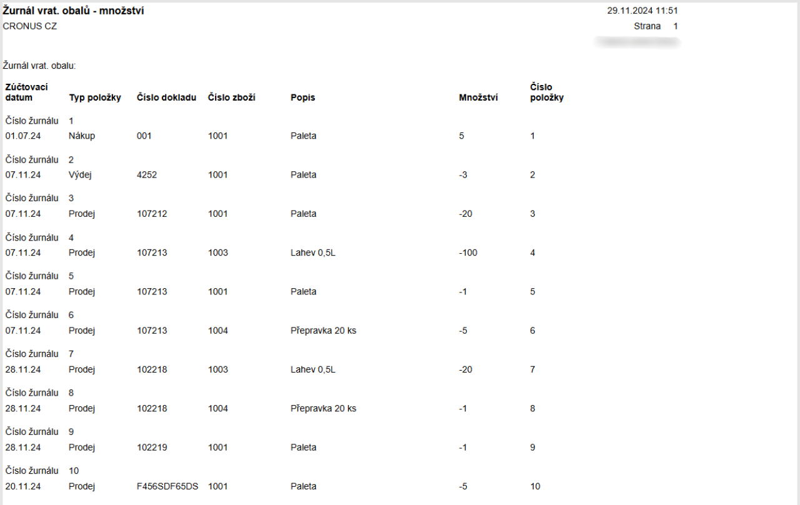
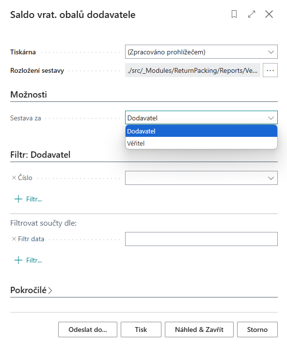
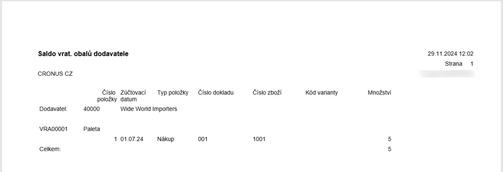

# Vratné obaly
> Aktualizace: 01.12.2024

V dnešní době, kdy je **udržitelnost a efektivita klíčová**, hrají vratné obaly zásadní roli v moderních firmách. Tyto obaly, navržené pro opakované použití, nejenže snižují náklady na jednorázové obaly, ale také minimalizují ekologickou stopu. Firmy je využívají pro přepravu a skladování zboží, čímž zajišťují bezpečnost a ochranu produktů během celého logistického procesu.
Typické vratné obaly zahrnují **palety, přepravky, sudy, lahve** používané pro nápoje, **kontejnery** a opakovaně použitelné **krabice**. Každý z těchto obalů má své specifické využití – od přepravy těžkých materiálů na paletách až po skladování kapalin v sudech a nápojů v lahvích. Firmy sledují pohyb těchto obalů pomocí moderních informačních systémů, které zajišťují efektivní evidenci, údržbu a optimalizaci procesů, což vede k výrazným úsporám a zvýšení celkové efektivity.

## Nový standard v efektivitě obalového hospodářství

Modul **Vratné obaly** v systému Dynamics 365 Business Central je vaším klíčem k dokonalé kontrole nad obalovým hospodářstvím. Tento modul umožní **optimalizovat oběh vratných obalů** a přinést do vaší společnosti **přehlednost** a **úspory**. Ať už sledujete **salda obchodních partnerů**, spravujete **nákupní a prodejní transakce**, nebo potřebujete **detailní reporting**.

Dejte sbohem zbytečnému chaosu ve skladovém hospodářství a využijte systém, který šetří váš čas, peníze i životní prostředí. Přesvědčte se sami, jak jednoduše lze zvládnout komplexní evidenci vratných obalů a vytvořit udržitelnější budoucnost.

### Klíčové Funkce Modulu Vratných Obalů

- **Samostatná evidence Vratných obalů:** Naše řešení umožňuje detailní evidenci vratných obalů, včetně čísla, popisu, kategorie a dalších důležitých údajů. Tím zajišťujeme, že každý obal je vždy pod kontrolou.
- **Integrace se zásobami:** V rámci standardní funkcionality zásob lze ke kartám zboží přiřadit odpovídající vratný obal. Například pro paletu lze vytvořit kartu zboží “Paleta” a na ni přiřadit kartu vratného obalu “Paleta”. Tento systém zajišťuje hladkou integraci a snadné sledování obalů při každém pohybu zboží.
- **Automatizace na dokladech:** Na nákupních a prodejních dokladech lze vkládat karty zboží s přiřazenými vratnými obaly. Při účtování dokladů vznikají položky vratných dokladů, které slouží ke sledování příjmů a výdejů vratných obalů. Tento proces umožňuje efektivní sledování obalového salda dodavatele nebo odběratele.
- **Deník vratných obalů:** Pro ruční pohyby vratných obalů slouží Deník vratných obalů, kde lze realizovat ruční příjem a výdej obalů, nastavit počáteční stavy nebo provést korekci dle skutečného stavu. Tento nástroj poskytuje flexibilitu a přesnost při správě obalů.

## Scénáře použití Vratných obalů

Abychom vám usnadnili práci, přinášíme přehled nejčastějších scénářů, se kterými se můžete v běžné praxi setkat:

- **Zavedení nového obalu**
- **Nastavení počátečního množství obalu**
- **Nákup zboží zahrnující vratné obaly**
- **Prodej zboží zahrnující vratné obaly**
- **Reporty**

### Zavedení nového obalu

1. Vyberte ikonu , zadejte **Přehled vrat. Obalů** a poté vyberte související odkaz.
2. Na stránce **Přehled vrat. Obalů** vyberte akci **Nový**.

3. Po vybrání akce **Nový** se otevře **Karta vrat. obalu**.

Každá Karta vratného obalu obsahuje tato pole:

- **Číslo** – zvolte číselnou řadu vratných obalů
- **Popis** – název vratného obalu
- **Kód kategorie vrat. obalu** – identifikace kategorie vratného obalu
- **Vyhledávací popis**
- **Pohyb** – needitovatelné pole s odkazem do tabulky „**Položky vrat. Obalu**“. Zde zobrazená hodnota udává stav salda vratných obalů
- **Vzorec data platnosti v prodeji** – zadejte dobu, do kdy má zákazník povinnost vratný obal vrátit
- **Vzorec data platnosti v nákupu** – zadejte dobu, do kdy máte povinnost vratný obal vrátit dodavateli
- **Uzavřeno** – pole pro uzavření(zamezení) dalšího použití dané karty vratného obalu

Nastavené hodnoty mají v případě, že jsou vyplněny, přednost před obecným nastavením.

Z karty je dále možnost s pomocí akce **Související** zobrazit **Položky vrat. Obalu** a **Poznámky**.

Jelikož každý Vratný obal je zbožím, je také nutno vytvořit kartu zboží daného vratného obalu a přiřadit jí číslo Vratného obalu. Volba „dvojité“ evidence je z důvodu oddělení sledování expirace vratných obalů od účetních operací.

1. Vyberte ikonu , zadejte **Zboží** a poté vyberte související odkaz.
2. Na stránce **Zboží** vyberte akci **Nový**.
    - Jestliže máte nastavené **Šablony zboží**, objeví se tabulka **Vybrat šablonu pro nové zboží**, kde vyberete možnost **Zboží**.
3. Otevře se **Karta zboží**. Zde zadáte informace o vratném obalu a přiřadíte **Číslo vrat. obalu.**

### Nastavení počátečního množství obalu

Pro nastavení počátečních stavů salda obalů využijeme deníky vratných obalů, které slouží dále také k provádění oprav a korekcí.

1. Vyberte ikonu , zadejte **Deník vratných obalů** a poté vyberte související odkaz.
2. Na stránce **Deník vratných obalů** vyplňte následující pole.

Deník vratných obalů obsahuje tyto pole:  

- **Typ položky –** vyberte, zda se jedná o Nákup, Prodej, Příjem, Výdej  
- **Číslo dokladu –** vyplňte číslo dokladu  
- **Číslo vratného obalu –** vyberte číslo související karty vratného obalu  
- **Číslo zboží –** vyberte číslo souvisejícího karty zboží  
- **Typ původu –** needitovatelné pole vyplněné automaticky na základě pole Typ položky  
- **Číslo původu** – vyberte číslo konkrétního dodavatele  
- **Popis** – název vratného obalu  
- **Množství** – zadejte počet kusů vratného obalu  
- **Vyrovnává položku –** vyberte položku k vyrovnání

3. Po vyplnění požadovaných polí vyberte akci **Tisk**, kde můžete zkontrolovat správnost vyplnění.  
4. Na základě preferencí vyberte akci **Účto**, nebo **Účto a tisk**.

> [!WARNING]
> Při použití volby Oprava v deníku vratných obalů není při účtování prováděno párování položek dle nastavených kritérií.

### Nákup zboží zahrnující vratné obaly

Při nákupu zboží obsahující vratné obaly je nutné zajistit, aby tyto obaly byly správně evidovány v systému. Vratné obaly jsou často používány pro přepravu zboží, a proto je důležité je uvést na nákupní objednávce, aby bylo možné sledovat jejich stav a salda.

#### Scénář

Oddělení nákupu se na základě zvýšené poptávky rozhodlo objednat nové zboží od dodavatele Wide World Importers. Nákupní objednávka zahrnuje 5x **Stůl ATÉNY (1896-S)** a 20x **Křeslo PAŘÍŽ, černé (1900-S)**. Na základě informací od dodavatele víme, že zboží dorazí na 6 paletách, které budou evidovány jako vratné obaly. Správná evidence těchto obalů umožní jejich efektivní správu a sledování salda.

#### Řešení

1. Vytvoříme novou **nákupní objednávku**
2. Vyplníme detaily dodavatele na záložce **Obecné**
3. Na řádcích objednávky vybereme požadované zboží a množství
4. Navíc ručně přidáme zboží vytvořené pro vratný obal

> [!IMPORTANT]
> Pro správné fungování je nutné, aby byla karta zboží propojena s kartou vratného obalu viz. **Zavedení nového obalu**.

### Prodej zboží zahrnující vratné obaly

Při prodeji zboží obsahujícího vratné obaly je nutné zajistit, aby tyto obaly byly správně evidovány v systému. Vratné obaly jsou často využívány k přepravě prodaného zboží, a proto je důležité je uvést na prodejní objednávce. To umožní přesné sledování jejich stavu a salda.

#### Scénář

Zákazník si objednal 1x **Stůl ATÉNY (1896-S)** a 4x **Křeslo PAŘÍŽ, černé (1900-S)**. Pro splnění této objednávky je nutné vytvořit prodejní objednávku, do které kromě samotného zboží přidáme také položku vratného obalu – paletu, na které bude zboží přepraveno.

#### Řešení

1. Vytvoříme novou **prodejní objednávku**
2. Vyplníme informace o zákazníkovi na záložce **Obecné**
3. Na řádcích objednávky vyplníme objednané zboží a množství
4. Navíc ručně přidáme zboží vytvořené pro vratný obal

> [!IMPORTANT]
> Pro správné fungování je nutné, aby byla karta zboží propojena s kartou vratného obalu viz. **Zavedení nového obalu**.

## Reporting

Pro efektivní správu vratných obalů máte k dispozici různé reporty, které naleznete na příslušných kartách modulu. Tyto reporty vám umožní získat přehled o pohybech, saldu a dalších detailech vratných obalů.

1. Vyberte ikonu , zadejte požadovaný report a poté vyberte související odkaz na tiskovou sestavu.

- **Podklad pro výkaz obalů:** Slouží k přípravě podkladů pro výkaznictví.
- **Účtování vratných obalů – test:** Umožňuje otestovat správnost účtování vratných obalů.  
- **Žurnály vrat. obalů:** Při každém účtování položky vratného obalu je vytvořen záznam v Žurnálu vratného obalu (obdoba Žurnálu zboží)

- **Žurnál vratných obalů – množství:** Nabízí detail množstevních pohybů jednotlivých žurnálů vratných obalů.
  - Na řádku číslo zvolíme konkrétní žurnál, u kterého chceme znát detail

- Jestliže necháme řádek prázdný, sestava vytiskne detail všech žurnálů viz. Foto níže

- **Detailní pohyby vratných obalů:** Poskytuje detailní historii všech pohybů vratných obalů.
- **Přesun vratných obalů:** Přehled přesunů vratných obalů mezi sklady či zákazníky.  
- **Saldo vratných obalů zákazníka:** Ukazuje aktuální stav salda vratných obalů u jednotlivých zákazníků.
  - Je třeba zadat číslo zákazníka a období (datum), pro které chceme zjistit stav salda
  - Sestavu můžeme spustit za **Zákazníka** nebo za **Plátce**

- **Saldo vratných obalů dodavatele:** Zobrazuje stav salda vratných obalů u vašich dodavatelů.
  - Je třeba zadat číslo dodavatele a období (datum) pro které chceme zjistit stav salda
  - Sestavu můžeme spustit za **Dodavatele** nebo za **Věřitele**

**Viz také**  

[Nastavení - Evidence vratných obalů (Vratné obaly)](pack-tracking-return-packing-setup.md)  
[Financial Pack](finance-pack.md)  
