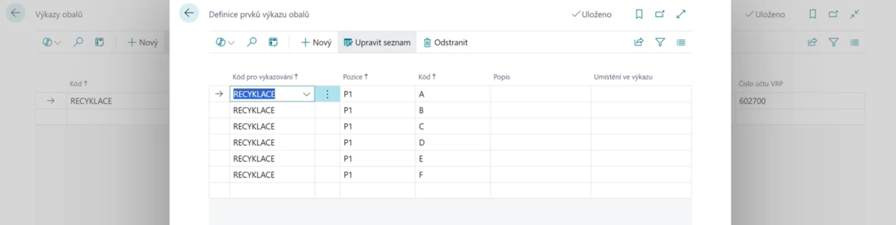

# VRP – Nastavení a konfigurace

> Aktualizace: 01.06.2025

Pro správnou funkci **VRP (veřejné recyklační příspěvky)** je nutné provést několik kroků v prostředí Business Central. Tento návod popisuje, jak aktivovat funkci VRP, nastavit účty, definovat prvky VRP a propojit je s kartami zboží.

## Aktivace VRP ve výkazu obalů

1. Vyberte ikonu , zadejte **Výkazy obalů** a poté vyberte příslušný odkaz.
2. Na stránce **Výkazy obalů** založte nový řádek nebo upravte existující výkaz.
3. Zaškrtněte pole **Výkaz VRP**.
4. Aktivujte volbu **Počítat VRP při vydání prodejního dokladu**.
5. Nastavte **Typ účtu VRP** na Finanční účet.
6. Vyplňte příslušné **Číslo účtu VRP**.

## Definice prvků VRP

Definice prvků VRP určuje, jaký příspěvek se má dopočítat (např. za hmotnost, kusy, v CZK nebo EUR).

1. Vyberte ikonu , zadejte **Definice prvků výkazu obalů** a potvrďte.
2. Vytvořte nové řádky dle potřeby:
   - **Kód pro vykazování** – např. EKOKOM, VRP-CZ, VRP-EUR
   - **Pozice** – např. P1 (hmotnost), P2 (kusy)
   - **Kód** pozice – např. A,B,C,D... nebo 1,2,3,4...
   - **Popis** – např. Recyklační příspěvek za kilogram, Recyklační příspěvek za kus

## Nastavení karty zboží

1. Na kartě zboží zvolte **Související** > **Zboží** > **Prvky výkazu obalů**.
2. Přidejte příslušný prvek VRP ke konkrétnímu zboží.

## Proces při vystavení dokladu

Při vystavení prodejního dokladu (faktura, dodací list) systém automaticky:

- Zkontroluje, zda je na kartě zboží přiřazen prvek VRP.
- Na základě množství (kusů nebo hmotnosti) vypočítá příslušný příspěvek.
- Přidá na doklad samostatný řádek na finanční účet s příslušnou částkou VRP.

Příklad faktury s VRP:

> [!TIP]
> **Zkontrolujte měny** – příspěvky je možné nastavit zvlášť pro CZK a EUR.
> **Definujte všechny potřebné kombinace** – například VRP za kg pro CZK i EUR, VRP za kus pro CZK i EUR.
> **Ověřte účty VRP** – správné zaúčtování na účet (např. 548) je klíčové pro správnou evidenci.

## Viz také

[Veřejné recyklační příspěvky (VRP) – Přehled a využití](vrp.md)