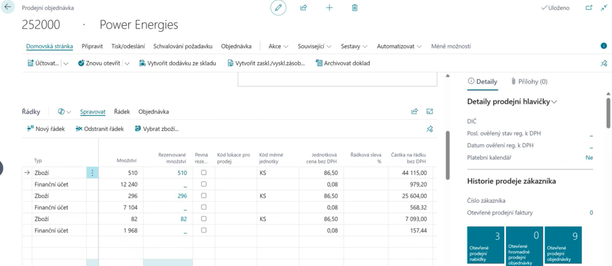

# Viditelné recyklační příspěvky (VRP)

> Aktualizace: 01.06.2025

Viditelné recyklační příspěvky (VRP) umožňují firmám jednoduše a přehledně evidovat poplatky spojené s recyklací obalů přímo v systému **Business Central**. Díky propojení s modulem **Evidence obalů (EKOKOM)** je možné VRP automaticky vypočítat a zahrnout do prodejních dokladů.

## Jak VRP funguje?

- **Automatické výpočty při vystavení dokladu** – při vystavení prodejního dokladu systém automaticky přidá řádek s VRP příspěvkem na základě hmotnosti nebo kusů prodaného zboží.
- **Podpora více měn a zákazníků** – VRP lze nastavit jak pro české, tak pro zahraniční zákazníky, například s různými sazbami v CZK a EUR.
- **Snadná integrace** – VRP je integrováno přímo v systému Dynamics 365 Business Central, bez nutnosti dalších modulů.
- **Plná kontrola nad přehledy** – VRP poplatky jsou evidovány jako samostatné řádky na prodejních dokladech, což zajišťuje přehlednost a transparentnost vůči zákazníkům.

## Klíčové přínosy

- Automatický výpočet VRP na základě hmotnosti, kusů nebo ceny produktu  
- Možnost přizpůsobení podle zákazníka, země a měny  
- Přehledné řádky VRP přímo na faktuře – zákazník vidí přesnou výši příspěvku  
- Úspora času a eliminace chyb při manuálním počítání poplatků  
- Plná kompatibilita s legislativou a principy environmentální odpovědnosti

## Typické scénáře využití

- **Prodej obalů s VRP příspěvkem** – systém automaticky dopočítá poplatek na základě hmotnosti obalu a přidá ho do dokladu.
- **Zákazníci v různých měnách** – příspěvky lze nastavit jak v CZK, tak EUR (např. pro české a zahraniční zákazníky).
- **Individuální sazby pro různé produkty** – například jiný příspěvek za plastové lahve a jiný za palety.

## Viz také

[VRP – Nastavení a konfigurace](vrp-setup.md)