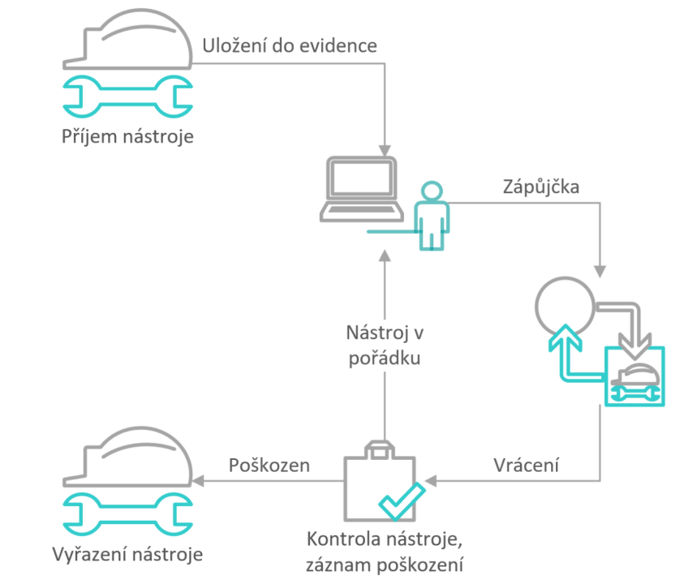

# Evidence nástrojů a pomůcek
> Aktualizace: 01.12.2024

Získejte plnou kontrolu nad vašemi nástroji a vybavením díky chytrému řešení, pomocí našeho modulu integrovaného přímo do systému Business Central. Sledujte pohyb nástrojů, minimalizujte ztráty a prodlužte jeho životnost díky snadnému přehledu o evidenci, zápůjčkách, kontrolách a údržbě. Modul Evidence nástrojů a pomůcek řeší problematiku evidence nástrojů, pomůcek a forem a jiných potřeb obvykle evidovaných pomocí skladové evidence systému. Tento modul je postaven nad základy evidence majetku, s ohledem na sjednocení evidence pro potřeby sledování dlouhodobého majetku a výrobní evidence, tj. půjčování nástrojů a pomůcek.

### Klíčové funkce modulu

- **Příjem nástrojů:** Umožňuje snadné zaevidování každého nového nástroje. Získáte přehled o stavu dostupnosti vybavení od samého začátku.
- **Zapůjčení nástrojů:** Usnadňuje správu zápůjček, ať už jde o krátkodobé, či dlouhodobé využití. Můžete sledovat, kdo má nástroje aktuálně zapůjčené.
- **Vrácení nástrojů:** Zajišťuje přehled o stavu nářádí při vrácení a umožňuje jeho okamžitou aktualizaci v evidenci.
- **Vyřazení nástrojů:** Umožňuje snadné vyřazení poškozených nebo zastaralých nástrojů, čímž vzniká místo pro nové vybavení.

### Proces používání nástrojů

Používání nástrojů probíhá dle následujícího schématu:

## Scénáře použití Evidence nástrojů a pomůcek

Abychom vám usnadnili práci, přinášíme přehled nejčastějších scénárů, se kterými se můžete v běžné praxi setkat:

- **Zavedení nového nástroje**
- **Přijetí nástrojů na sklad**
- **Zapůjčení nástrojů**
- **Vrácení nástrojů**
- **Výdej nástrojů**

### Zavedení nového nástroje

1. Vyberte ikonu  a do vyhledávače zadejte **Přehled evidence nástrojů** a poté vyberte související odkaz
2. Na stránce **Přehled evidence nástrojů** vyberte akci **Nový**.

3. Po vybrání akce **Nový** se otevře **Karta evidence nástrojů**

**Každá karta evidence nástrojů obsahuje tato pole:**

- **Číslo** – zvolte číselnou řadu pro evidenci nástrojů
- **Popis** – název nástroje
- **Sériové číslo** – sériové číslo nástroje
- **Hlavní majetek/komponenta** – určuje hlavní datový zdroj nástroje
- **Komponenta hlavního datového zdroje** – určuje komponentu hlavního datového zdroje
- **Vyhledávací popis** – popis, podle kterého nástroj vyhledáme
- **Neaktivní** – určuje, zda je nástroj aktivní
- **Uzavřeno** – určuje, zda je nástroj blokován

4. po vyplnění polí v **Kartě evidence nástrojů** se nám nástroj uloží do naší **Evidence nástrojů**.

**Z karty je dále možnost s pomocí akce Související v sekci Dlouhodobý majetek**

- **Přehled** : Zobrazí souhrnný pohled na aktuálně vybraný dlouhodobý majetek. Tento přehled zahrnuje klíčové informace, jako je popis majetku, jeho účetní kategorie, aktuální zůstatky, a další relevantní údaje.
- **Knihy odpisů** : Poskytuje přístup k přehledu odpisových knih spojených s daným majetkem(nástrojem). Zde můžete sledovat historii odpisů, použité odpisové metody a další informace o účetních pohybech majetku
- **Poznámky** : Slouží k přidávání a správě poznámek souvisejících s konkrétním dlouhodobým majetkem. Umožňuje například zaznamenat specifické detaily, které nejsou standardně evidovány v jiných částech systému.
- **Obrázek** : Tato funkce umožňuje připojit nebo zobrazit obrázky spojené s dlouhodobým majetkem. Obrázky mohou být užitečné například pro vizuální identifikaci majetku nebo dokumentaci.
- **Evidence údržby** : Přístup k záznamům o údržbě pro daný dlouhodobý majetek. Tato funkce je určena pro sledování servisních zásahů, oprav a dalších údržbových aktivit. Pomáhá zajistit, že majetek je udržován v provozuschopném stavu
- **Komponenty hl majetku** : Zobrazuje přehled komponent, které tvoří hlavní majetek. Tato funkce je relevantní zejména pro složený majetek, který zahrnuje více dílčích částí.
- **Kopírovat DM** : Umožňuje vytvořit kopii aktuálního záznamu dlouhodobého majetku. Tato funkce šetří čas při zakládání nového majetku s podobnými parametry které má již existující položka.
- **Statistika hlavního majetku** : Poskytuje statistický pohled na dlouhodobý majetek, zahrnující například přehled o hodnotě majetku, odpisy a zůstatky. Tato data jsou užitečná pro finanční analýzy a plánování.
- **Přehled typů účtování majetku**: Tato funkce zobrazuje přehled všech typů účtování, které byly použity pro daný dlouhodobý majetek. Umožňuje rychlou kontrolu, jakým způsobem je majetek účetně zpracováván.
- **Celková pojištěná částka** : Poskytuje informaci o celkové hodnotě pojištění, která se vztahuje na daný majetek. Tato funkce pomáhá ověřit, zda je majetek dostatečně pojištěn. 
- **Položky protokolu změn** : Umožňuje prohlížet historii změn, které byly provedeny na záznamech o dlouhodobém majetku. Tato funkce je užitečná pro auditní účely nebo zpětné sledování úprav.

### Příjem nástrojů

1. Vyberte ikonu  a do vyhledávače zadejte **Deník nástrojů** a poté vyberte související odkaz.
2. Zvolte šablonu, která nejlépe odpovídá vaším potřebám.
3. Do příslušného pole zadejte **číslo externího dokladu**.
4. Pro **Typ položky** zvolte možnost **Příjem** a vyberte nástroj, který chcete zaevidovat.
5. Vyplňte pole **Číslo zaměstnance** pro osobu, která je zodpovědná za příjem nástrojů.
6. Uveďte požadované hodnoty do polí **Množství** a **Cena**.
7. Zadejte **Evidenční číslo** nástroje, aby bylo možné jednotlivé nástroje jednoznačně identifikovat při budoucích operacích.
8. Pokud používáte čtečky čárových kódů, je možné zadat také **EAN kód**.
9. Klikněte na tlačítko **Účtovat** pro uložení položky do evidence.
10. Všechny vytvořené položky je možné sledovat na stránce **položky evidence nástrojů**.

**Ukázka pomocí obrázků:**

**Řádky deníku nástrojů:**

> [!IMPORTANT]  
> Povinná pole pro **Typ položky** **Příjem**: **Číslo externího dokladu**, **Číslo zaměstnance**, **Evidenční číslo**, **Cena**.

### Zapůjčení nástrojů

1. Vyberte ikonu  a do vyhledávače zadejte **Deník nástrojů** a poté vyberte související odkaz.
1. Zvolte šablonu, která nejlépe odpovídá vaším potřebám.
1. Vyplňte pole **Číslo DM**
1. V poli **Číslo zaměstnance** zvolte zaměstnance, který si nástroj půjčuje
1. Vyplňte **Množství**
1. Vyplňte pole **Evideční číslo**, tedy konkrétní nástroj, který má být zapůjčen.
1. Pokud používáte čtečky čárových kódů, je možné zadat také **EAN kód**.
1. Klikněte na tlačítko **Účtovat** pro uložení položky do evidence.
1. Všechny vytvořené položky je možné sledovat na stránce **položky evidence nástrojů**.

**Ukázka pomocí obrázků:**

**Řádky deníku nástrojů:**

> [!IMPORTANT]  
> Povinná pole pro **Typ položky** **Zapůjčit**: **Číslo zaměstnance**, **Evidenční číslo**.

### Vrácení nástrojů

1. Vyberte ikonu  a do vyhledávače zadejte **Deník nástrojů** a poté vyberte související odkaz.
2. Zvolte šablonu, která nejlépe odpovídá vaším potřebám.
3. Pro **Typ položky** zvolte možnost **Vrátit**.
4. V poli **Číslo DM** vyberte nástroj, který chcete vrátit.
5. Vyplňte pole **Číslo zaměstnance** pro zaměstnance, který nástroj vrací.
6. Uveďte hodnotu do pole **Množství**, odpovídající počtu vrácených nástrojů.
7. Zadejte hodnotu do pole **Evidenční číslo**, abyste mohli jednoznačně identifikovat konkrétní nástroj.
8. Vyplňte pole **Kód poškození**, pokud je to relevantní.
9. Pokud používáte čtečky čárových kódů, je možné zadat také **EAN kód**.
10. Klikněte na tlačítko **Účtovat**, čímž uložíte položku do evidence.
11. Všechny vytvořené položky je možné sledovat na stránce **Položky evidence nástrojů**.

**Ukázka pomocí obrázků:**

**Řádky deníku nástrojů:**

> [!IMPORTANT]  
> Povinná pole pro **Typ položky** **Vrátit**: **Číslo zaměstnance**, **Kód poškození**, **Evidenční číslo**.

### Výdej nástrojů

1. Vyberte ikonu  a do vyhledávače zadejte **Deník nástrojů** a poté vyberte související odkaz.
2. Zvolte šablonu, která nejlépe odpovídá vaším potřebám.
3. Pro **Typ položky** vyberte možnost **Výdej**.
4. V poli **Číslo DM** zvolte nástroj, který chcete vydat.
5. Vyplňte pole **Číslo zaměstnance**, odpovídající osobě, která akci provádí.
6. Uveďte hodnotu do pole **Evidenční číslo**, abyste mohli jednoznačně identifikovat konkrétní nástroj.
7. Vyplňte pole **Kód poškození**, pokud je to relevantní.
8. Pokud používáte čtečky čárových kódů, je možné zadat také **EAN kód**.
9. Klikněte na tlačítko **Účtovat**, čímž uložíte položku do evidence.
10. Všechny vytvořené položky je možné sledovat na stránce **Položky evidence nástrojů**.

**Ukázka pomocí obrázků:**

**Řádky deníku nástrojů:**

> [!IMPORTANT]  
> Povinná pole pro **Typ položky** **Výdej**: **Číslo zaměstnance**, **Kód poškození**, **Evidenční číslo**.

### Položky evidence nástrojů

Jak již bylo zmíněno, všechny vytvořené položky je možné sledovat na kartě **Položky evidence nástrojů**, zde je postup, jak tuhle stránku zobrazit:

1. Vyberte ikonu  a do vyhledávače zadejte **Položky evidence nástrojů** a poté vyberte související odkaz.
1. Zobrazí se vám stránka **Položky evidence nástrojů** kde můžete sledovat všechny vzniklé položky.

> [!TIP]
> Na stránku **Položky evidence nástrojů** je možné se dostat i přes klávesovou zkratku **CTRL + F7** z karet **Přehled evidence nástrojů**, nebo z karet jednotlivých nástrojů.

## Viz také

[Evidence nástrojů a pomůcek - nastavení](production-tools-setup.md)  
[Productivity Pack](productivity-pack.md)

[def]: media/production-tools-tool-card.png