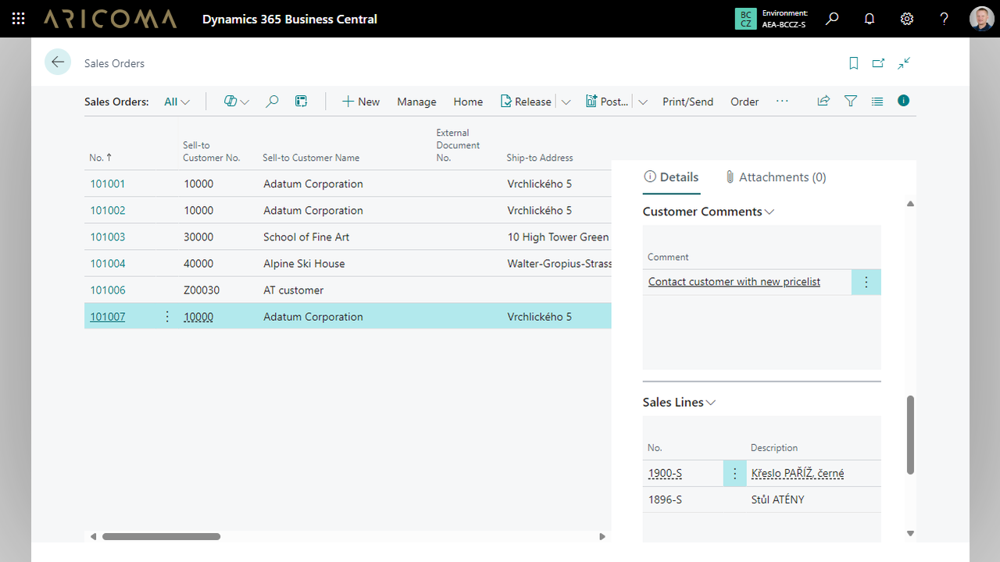

# **Business Pack**

**Business Pack integruje často používaná pole a okna s fakty přímo do vašich stránek.**

Už vás nebaví ručně nastavovat zobrazení polí ve vašem Business Central?  
Business Pack automaticky přidává užitečná a často používaná pole a okna s fakty přímo na stránky, abyste se mohli soustředit na to podstatné – Vaše podnikání.  

## Hlavní přínosy Business Pack

- Automatické zobrazení klíčových polí – přidává pole pro důležitá data, jako je adresa a město příjemce, datum dodávky, způsob platby, IČO a DIČ.
- Okna s fakty na klíčových stránkách – rychlý přístup k důležitým informacím na stránkách, jako jsou Prodejní a Nákupní objednávky, Dodávky a Faktury.
- Snadná viditelnost a úpravy – ve výchozím nastavení jsou viditelná všechna pole a okna s fakty.

## Klíčové funkce aplikace zahrnují

- Přehledy prodejních a nákupních objednávek s klíčovými informacemi.
- Přidání nových oken s fakty a polí pro lepší správu dat.
- Přidání poznámek k zákazníkům a prodejním dokladům.
- Detailní přehledy zboží a jejich zásob.

Zjednodušte si práci a zvyšte produktivitu s Business Packem!  

## Viz také
[ARICOMA Řešení](../index.md)  
[Streamline Tools](streamlinetools.md)  
