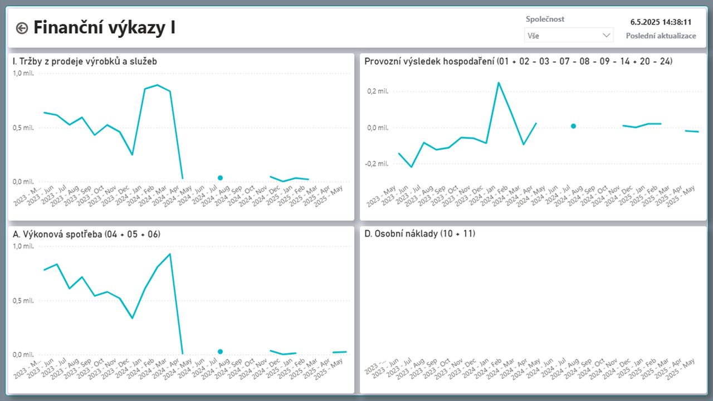
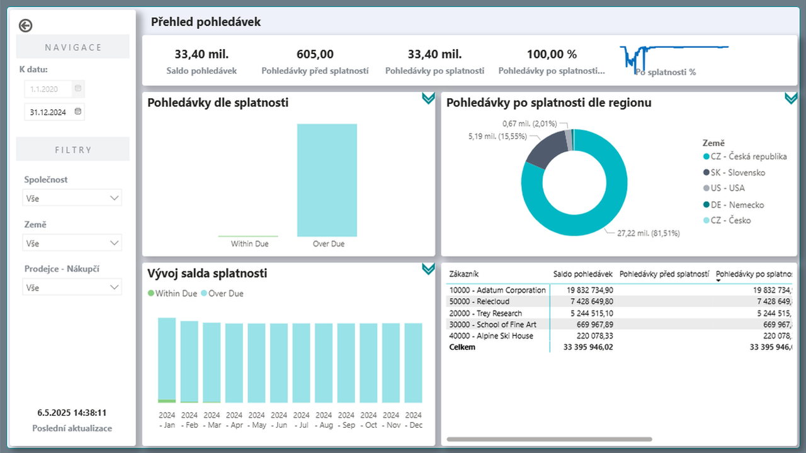

# Analytics Suite - Power BI řešení pro Dynamics 365 Business Central

> Aktualizace: 28.05.2025

Analytics Suite přináší firmám výkonný nástroj pro analýzu dat a vizualizaci klíčových ukazatelů. Umožňuje snadno propojit, filtrovat a analyzovat finanční, prodejní i provozní data, což vede k rychlejšímu a efektivnějšímu rozhodování. Díky interaktivním dashboardům a automatizovaným reportům získáte lepší přehled o výkonnosti firmy a odhalíte nové obchodní příležitosti.

## Řešené oblasti

- Finance
- Banky
- Pohledávky
- Prodej
- Zásoby

## Firemní procesy a výkonnost pod kontrolou díky BI

Nástroje Business Intelligence (BI) pomáhají firmám efektivně řídit klíčové procesy, snižovat náklady, optimalizovat objem prodeje a správně vybírat rozvojové projekty. Umožňují detailní analýzu ziskovosti zakázek, identifikaci finančních prostředků vázaných v zásobách nebo pohledávkách a jejich efektivní uvolnění. Díky pokročilé práci s daty pomáhají odhalit nevyužitý tržní potenciál, rozpoznávat trendy a optimalizovat vytíženost vlastních zdrojů.

Systém poskytuje přehled nad daty pohledávek a umožňuje jejich detailní analýzu. Nabízí možnost porovnání dat v různých časových obdobích a interaktivní reporty, které zajišťují okamžitou zpětnou vazbu a možnost analýzy dat z různých úhlů pohledu.

Díky připravenému řešení, které lze snadno přizpůsobit individuálním potřebám, je nasazení rychlé a nevyžaduje další investice. Uživatelé mohou napojit a doplnit další datové zdroje, upravit datový model podle konkrétních požadavků a vytvářet vlastní dashboardy a reporty, například propojením s mzdovými systémy nebo rozpočty v Excelu.

Systém je plně integrovaný s Business Central, což umožňuje snadné propojení s podnikovými daty a efektivní řízení procesů v reálném čase.

## Finance

Analytics Suite pro finance poskytuje komplexní přehled nad klíčovými finančními ukazateli, jako jsou výnosy, náklady a ziskovost. Umožňuje detailní analýzu rozpočtů, sledování trendů a identifikaci odchylek, což usnadňuje optimalizaci finančního řízení a strategické plánování.

Řešení je plně integrované s Finančními výkazy definovanými v Business Central a umožňuje uživatelům vytvářet interaktivní reporty nad finančními daty. Nabízí například analýzy mzdových nákladů, porovnání tržeb podle středisek či jiných dimenzí definovaných v BC. Díky intuitivnímu ovládání a přizpůsobitelným vizualizacím získáte okamžitý přehled o finanční výkonnosti podniku a podpoříte efektivní rozhodování.

  

### Banky

Modul Analytics Suite pro bankovní data poskytuje komplexní přehled o finančních transakcích, stavech účtů a pohybu peněz. Umožňuje sledovat platební operace a řídit likviditu s vyšší přesností, rychle reagovat na změny ve finančních tocích.

Uživatelé mohou snadno analyzovat příchozí a odchozí platby, sledovat vývoj zůstatků na účtech a identifikovat potenciální finanční rizika. Modul také umožňuje porovnání historických dat s aktuálními trendy, což podporuje lepší rozhodování v oblasti správy financí a bankovních operací.

  

### Pohledávky

Správa pohledávek poskytuje přehled nad platební morálkou zákazníků a pomáhá identifikovat riziko neuhrazených faktur. Pokročilé analytické nástroje umožňují sledovat vývoj pohledávek v čase a optimalizovat proces jejich vymáhání.

Interaktivní analytické přehledy umožňují detailní pohled na strukturu pohledávek, identifikaci faktur po splatnosti a kategorizaci dlužných částek dle časových pásem (např. 30, 60, 90 dní). Díky vizualizaci těchto dat lze rychle reagovat na rizikové situace a zefektivnit finanční řízení.

## Prodej

Analytics Suite pro prodej poskytuje detailní přehled nad prodejními výsledky z různých úhlů pohledu, včetně zákazníků, produktů, lokací nebo jednotlivých prodejců. Umožňuje analyzovat zákaznické chování, identifikovat nejvýnosnější produkty a trhy a optimalizovat prodejní strategie pro maximální růst obratu.

Pokročilé analytické nástroje umožňují sledovat klíčové ukazatele v čase, například vývoj prodejů od začátku roku nebo jejich porovnání s předchozím obdobím. Díky tomu lze efektivně vyhodnocovat prodejní trendy, identifikovat sezónní výkyvy a přizpůsobit obchodní strategii aktuálním podmínkám trhu.

## Zásoby

Řízení zásob poskytuje detailní přehled o úrovni zásob, obrátkovosti produktů a efektivitě dodavatelského řetězce. Pomáhá minimalizovat přebytky zásob, optimalizovat objednávky a snižovat náklady na skladování.

Obrátkovost produktů je klíčový ukazatel efektivity skladového hospodářství. Analýza obrátkovosti umožňuje lépe plánovat nákupy, optimalizovat kapacity skladů a efektivně řídit cashflow.

## Přínosy

- Okamžitý přístup k finančním, prodejním a dalším datům, i pro více společností v jednom pohledu, usnadňuje efektivní rozhodování a řízení.
- Interaktivní dashboardy poskytují podklady pro strategické řízení a umožňují lepší přehled o výkonnosti firmy.
- Podpora pro mobilní zařízení zjednodušuje přístup k datům a reportům odkudkoliv, což zvyšuje flexibilitu a dostupnost informací.
- Snadné propojení dat s Business Central bez nutnosti složité integrace zrychluje nasazení a používání.
- Možnost napojovat další datové zdroje a upravovat datový model dle konkrétních požadavků dává firmám vysokou flexibilitu.
- Uživatelsky přívětivé rozhraní zajišťuje intuitivní ovládání a umožňuje snadno vytvářet a upravovat reporty, dashboardy a jiné vizualizace dle potřeb firmy.

## Začněte svou cestu k vyšší produktivitě ještě dnes!

Chcete mít ve své firmě nástroj, který vám umožní okamžitý přístup k důležitým datům, zvýší efektivitu v rozhodování a usnadní strategické řízení?  
Kontaktujte nás pro nezávaznou konzultaci a zjistěte, jak vám Power BI Analytics Suite pro Dynamics 365 Business Central přinese konkurenční výhodu.

## Viz také
[Analytics Suite - Nastavení](analytics-suite-setup.md)  
[Řešení ARICOMA](../index.md)  
[Streamline Tools](streamlinetools.md)  
