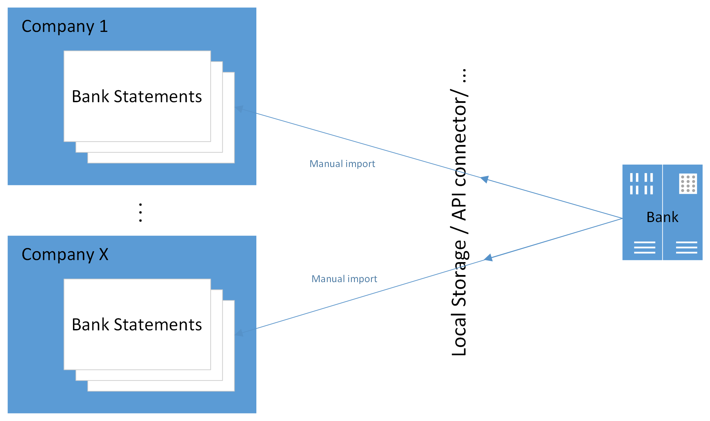
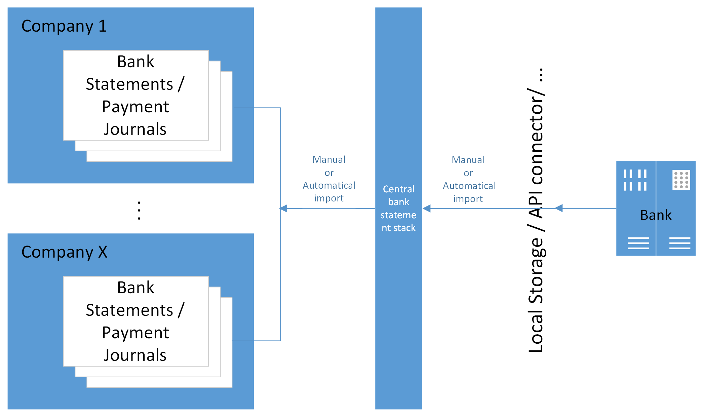

# Rozšířené CZ bankovnictví

> Update 19.08.2025

Modul Rozšíření CZ bankovnictví rozšiřuje funkčnost „Bankovní doklady pro Česko (rozšíření)“, která je součástí českých lokálních funkčností Dynamics 365 Business Central (dále jen BC).

Hlavním přínosem modulu je zjednodušení importu a následného zpracování bankovních výpisů a tím snížení rutinních činností uživatelů.

Výhodou je variabilita v nastavení importu bankovních výpisů do BC a jejich následné zpracování, kdy lze individuálně nastavit režim pro každý bankovní účet zvlášť.

Modul umožňuje podporu uživatelů při zpracování výpisů ve 2 úrovních: Základní a Pokročilá.

## Základní varianta

### Bankovní výpisy

Přístup k funkcionalitě získáte zakoupením předplatného pro první bankovní účet. Tato varianta neřeší počet účtů, pro které ji budete využívat. Ovšem práce je ruční v rámci společnosti a pro konkrétní banku, v případě více účtů u jedné banky podporuje import více výpisů najednou.
I k této variantě je možné si dokoupit některý z nabízených [doplňků pro API komunikací s bankou](cz-banking-extension-API-setup.md).

### Platební příkazy

V základní variantě se používá standardní funkce pro Export na stránce Vydaný platební příkaz. V případě nastaveného API rozhraní je výpis odeslán bez stažení souboru na klientský počítač.

## Pokročilá varianta

### Bankovní výpisy

Přístup k funkcionalitě umožňující plnou automatizaci (s výjimkou finálního zaúčtování Deníku plateb) získáte zakoupením předplatného pro více bankovních účtů.
Pokročilá varianta přináší možnost automatizace všech kroků:

- nahrávání bankovních výpisů (pomocí metod bez ručního vstupu, typicky API či jiné na míru vyvinuté metody)
- spouštění importů bankovních výpisů napříč firmami
- automatizaci zpracování výpisů přes možnost vytvoření záznamů v Deníku plateb (vč. návrhu spárování) až po zaúčtování deníku.

### Platební příkazy

V rámci rozvoje budeme modulu bude v průběhu roku 2026 dopracována podpora automatizace odesílání Vydaných platebních příkazů napříč společnostmi a bankovními účty.

## Příklady použití

Následující kapitoly popisují nejběžnější scénáře použití funkcionality pro import výpisů a export platebních příkazů.
V příkladných scénářích je popisován import výpisů ve formátu .gpc viz [Formáty bankovních výpisů a platebních příkazů](cz-banking-extension-setup\#formáty-bankovních-výpisů-a-platebních-příkazů).

### Základní – Import  a zpracování jednoho výpisu

V tomto případě se jedná o standardní funkcionalitu BC. Uživatel otevře novou kartu Bankovního výpisu a spustí akci *Import bankovního výpisu*.
Po importu uživatel použije funkci *Vydat a vytvořit deník* k jeho zaúčtování.

> [!NOTE]
> Detailní popis funkčnosti a nastavení viz [CZ Bankovní výpisy a Platební příkazy](https://learn.microsoft.com/cs-cz/dynamics365/business-central/localfunctionality/czech/bank-feature?source=recommendations#bank-statement-and-payment-orders).

### Základní – Import a zpracování hromadného výpisu

Jedná se o situaci, kdy jeden soubor bankovního výpisu obsahuje více bankovních výpisů pro jeden nebo více bankovních účtů.

Nastavení pro funkčnost viz [Formáty bankovních výpisů a platebních příkazů](cz-banking-extension-setup\#formáty-bankovních-výpisů-a-platebních-příkazů) a [Podpůrná nastavení pro import bankovních výpisů](cz-banking-extension-setup\#podpůrná-nastavení-pro-import-výpisů).

1. Vyberte ikonu , zadejte **Import bankovních výpisů** a poté vyberte související odkaz.
2. Spusťte akci *Importovat…*
3. Přetáhněte soubor nebo pro procházení klikněte a soubor vyberte.
4. Po stisku OK se automaticky otevře Zásobník bankovních výpisů. Jedná se o dočasní tabulku pro přehled importovaných výpisů a jejich okamžité zpracování. Proto je nutné pokračovat dalším krokem.
5. Spusťte akci *Zpracování* pro vytvoření bankovního výpisu do nastavené úrovně zpracování.

> [!NOTE]
> Při importu po vybrání souboru, se může zobrazit hláška „Není co importovat. Chcete zobrazit přehled s bankovními výpisy?“ Po kliknutí na ANO se zobrazí soubory s detailem chyby.
> [!TIP]
> Nejčastější chyby:
>
> - Importovaný soubor již v BC existuje --> v tom případě je v poli Stav zobrazený stav zpracování v BC.
> - Číslo bankovního účtu nebylo rozpoznáno --> v tom případě je pole „Číslo bankovního účtu“ vyznačeno červeně.
>  - Buď importovaný soubor nepatří do importované společnosti
>  - nebo v souboru bankovního výpisu je číslo účtu v jiném formátu, obvykle předčíslí a číslo účtu bez pomlčky.  V tomto případě proveďte nastavení dle [Číslo bank.účtu na bank.výpisu (volitelné)](cz-banking-extension-setup\#číslo-bankúčtu-na-bankvýpisu-volitelné).

### Základní – Import a zpracování více souborů výpisů

Jedná se typicky o situaci, kdy se používají soubory obsahující pouze jeden bankovní výpis a je třeba takových souborů importovat více najednou.
Soubory je potřeba zkomprimovat do jednoho .zip souboru, který bude naimportován, přičemž dojde k automatické extrakci.

Postup importu bankovního výpisu je stejný, jak je popsáno v [Základní - Import a zpracování hromadného bankovního výpisu](#základní--import-a-zpracování-hromadného-výpisu).

> [!NOTE]
> Více souborů najednou lze předat přímo v dialogovém okně pro výběr souboru (od verze BC26).

### Základní – Export souboru platebního příkazu

Export platebních příkazů se provádí na kartě Vydaného platebního příkazu spuštěním akce *Exportovat*.

> [!NOTE]
> V případě zakoupení některého z [API rozšíření](cz-banking-extension-API-setup.md) lze příkaz takto exportovat přímo do systému vaší banky.

### Pokročilá – manuální import pro více společností

Scénář popisuje situaci, kdy v prostředí BC je více společností a import bankovních výpisů bude prováděn centrálně pro více společností najednou z lokálního úložiště.

Importuje se do tabulky Centrální zásobník bankovních výpisů. Záznamy tabulky jsou společné pro všechny společnosti. Importované výpisy jsou zde uložené pro další zpracování. Po jejich zpracování je vhodné je průběžně mazat.

> [!TIP]
> V Nastavení rozšířeného CZ bankovnictví zapněte automatické čištění.

1. Vyberte ikonu , zadejte **Centrální zásobník bankovních výpisů** a poté vyberte související odkaz.
2. Spusťte funkci *Import…*
3. Přetáhněte soubor nebo pro procházení klikněte a soubor vyberte.
4. Po stisku OK se výpisy automaticky naimportují do řádků Centrálního zásobníku bankovních výpisů. Každý výpis se založí na samostatný řádek.

> [!NOTE]
> Pokud importujete soubor ve formátu .zip, funkčnost z komprimovaných souborů naimportuje pouze podporované formáty. Pokud jsou v .zip nepodporované formáty, import je ignoruje.
>
> Více souborů najednou lze předat přímo v dialogovém okně pro výběr souboru (od verze BC26).

### Pokročilá – automatizovaný import pro více společností

V tomto případě se jedná o situaci, kdy v prostředí BC je více společností a import bankovních výpisů bude prováděn centrálně pro všechny společnosti automaticky bez zásahu uživatele.

Příkladem může být přímá komunikace s bankou prostřednictvím API, kdy si BC přímo stahuje výpisy nebo realizované transakce a ukládá je do Centrálního zásobníku bankovních výpisů pro jejich další zpracování.

Popis nastavení automatizace importu najdete v [Automatické stahování výpisů do centrálního zásobníku](cz-banking-extension-setup\#automatické-stahování-výpisů-do-centrálního-zásobníku)

> [!TIP]
> Pokyny pro vytvoření vlastní automatizace importu najdete v [Vlastní funkce pro stahování výpisů do centrálního zásobníku](cz-banking-extension-setup\#vlastní-funkce-pro-stahování-výpisů-do-centrálního-zásobníku).

### Pokročilá – manuální zpracování výpisů

Na příkladu ručního zpracování si ukážeme kroky, které je třeba po načtení výpisu provést, abychom dospěli až k zaúčtování deníku.

Tento způsob zpracování se může hodit v situaci s větším počtem účetních, kdy každý/každá má na starosti jednu nebo málo firem s více bankovními účty. V takovém případě si každý uživatel z jednoho místa vytvoří výpisy ve společnostech či pro banky, které má na starosti:

1. Vyberte ikonu , zadejte **Centrální zásobník bankovních výpisů** a poté vyberte související odkaz.
2. V poli **Název společnosti** vyberte společnost.
3. Zapněte příznak **Pouze bankovní výpisy společnosti** pro zobrazení výpisů náležejících k vybrané společnosti.
4. Zvolte funkci *Zpracovat* a potvrďte spuštění volbou Ano. Tím se v příslušné společnosti vytvoří Bankovní výpisy pro řádky, pro které ještě vytvořeny nebyly – v sloupci **Stav** a **Číslo bankovního výpisu** je vidět výsledek.
5. Kliknutím na hodnotu v poli **Stav** (nebo přímo na Číslo bankovního výpisu) v řádku dojde k otevření buď Bankovního výpisu, Deníku plateb nebo Vydaného bankovního výpisu v závislosti na hodnotě pole Stav. Proveďte další kroky vedoucí k zaúčtování výpisu v Deníku plateb.
6. Vraťte se na Centrální zásobník bankovních výpisů a pokračujte dalšími výpisy, popř. další společností.

> [!TIP]
> Pokud nedošlo k vytvoření bankovního výpisu, nebo importujete nový bankovní účet, zkontrolujte nastavení viz [Nastavení automatizace importu a zpracování bankovních výpisů prostřednictvím centrálního zásobníku](cz-banking-extension-setup/#nastavení-automatizace-importu-a-zpracování-bankovních-výpisů-prostřednictvím-centrálního-zásobníku)

### Pokročilá – automatizované zpracování výpisů

Automatizované zpracování importovaných výpisů je stále častěji využíváno nejen ve firmách s menším počtem účetních obsluhujících více společností s mnoha bankovními účty. Úspora času spočívá v procesování centrálně importovaných výpisů dle nastavených parametrů, tedy jejich přenášení do jednotlivých společností včetně zpracování do definované úrovně (např. až do návrhu řádků v Deníku plateb).

Funkcionalita ví, které výpisy již byly importovány a v intervalu 14 dní zpětně pouze doplní chybějící (pokud dosud nebyl vstupní soubor k dispozici nebo když záznam v Centrálním zásobníku obsluha smaže).

Prostřednictvím stránky Centrální zásobník bankovních výpisů má uživatel přehled o stavu zpracování v jednotlivých společnostech a může ji využívat jako tzv. pult dispečera (z řádku si může otevřít záznam v jiné společnosti a stav změnit, např. výpis zaúčtovat):

1. Vyberte ikonu , zadejte **Centrální zásobník bankovních výpisů** a poté vyberte související odkaz.
2. V poli **Název společnosti** vyberte společnost.
3. Setřiďte si sloupec **Datum výpisu** Sestupně.
4. Přejděte na řádek, kde **Stav** není Zaúčtováno. Kliknutím na hodnotu v poli **Stav** otevřete záznam a proveďte další kroky vedoucí k zaúčtování výpisu v Deníku plateb.
5. Vraťte se na Centrální zásobník bankovních výpisů a pokračujte dalšími řádky, dokud nebudou všechny ve stavu Zaúčtováno.

> [!NOTE]
> Ověřte nastavení pro automatizaci viz [Podpůrná nastavení pro automatické zpracování výpisů](cz-banking-extension-setup/#podpůrná-nastavení-pro-automatické-zpracování-výpisů).
> [!IMPORTANT]
> Pro práci s Centrálním zásobníkem bankovních výpisů musí uživatel disponovat standardní sadou oprávnění pro založení a zpracovávání bankovních výpisů ve společnostech, ve kterých mají být výpisy tímto nástrojem obsluhovány.

### Pokročilá – okamžité automatizované účtování jednotlivých plateb

Kombinací importu jednotlivých transakcí v průběhu dne s nastavením automatického importu a účtování výpisů lze docílit takřka online aktualizaci saldokonta. Tím lze např. výrazně urychlit dodávky zákazníkům po zaplacení zálohy.
Podmínkou je použití API konektoru banky, která tuto možnost podporuje.

### Pokročilá – automatizovaný export platebních příkazů

Funkcionalita bude doplněna v průběhu roku 2026.

**See also**  

[Nastavení rozšířeného CZ bankovnictví](cz-banking-extension-setup.md)  
[Nastavení API konektorů](cz-banking-extension-API-setup.md)  
[Financial Pack](finance-pack.md)
