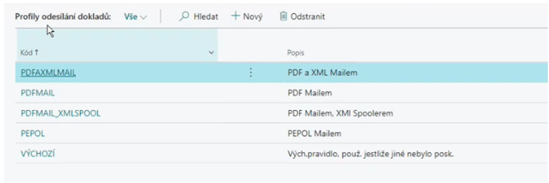

# Odesílání elektronických dokladů - Nastavení

> Aktualizace 20.06.2023

Než budete moci využívat rozšířených možností odesílání elektronických dokladů, musíte nakonfigurovat pravidla a hodnoty, které definují požadavky společnosti v této oblasti.

## Profily odesílání dokladů

Používá-li vaše společnost více způsobů odesílání dokladů zákazníkům či dodavatelům, je vhodné pro všechny vydefinovat tzv. Profily odesílání dokladů. Lze definovat jeden způsob jako výchozí a ty specifické pak přiřadit vybraným partnerům.

Pro více informací navštivte [Nastavení profilů odesílání dokladů](https://docs.microsoft.com/cs-cz/dynamics365/business-central/sales-how-setup-document-send-profiles).

> [!NOTE]
> Musí být vytvořeno tolik profilů odesílání, kolik různých kombinací odesílání bude firma používat (např. tedy pokud odesílání faktur e-mailem formou elektronické dokladu formátu XML nebo PEPPOL, je třeba mít 2 profily odesílání).
> [!WARNING]
> Tento modul není uzpůsoben pro použití hodnoty „Elektronický doklad“ v poli E-mail příloha. Namísto toho je třeba použít hodnotu „Prostřednictvím služby výměny dokumentů“ v poli Elektronický doklad (viz také Nastavení formátu ISDOC a XML).

## Profily odesílání dokladů dle typů dokladů

### Výchozí nastavení

1. Vyberte ikonu , zadejte **Nastavení elektronických dokladů** a poté vyberte související odkaz.
2. Na stránce Nastavení elektronických dokladů spusťte akci *Nastavení dokladů partnera*.
3. Na řádku ve sloupci Použití vyberte doklad, pro který chcete nastavit výchozí způsob odesílání (sloupec *Profil odesílání dokladů*).

### Specifické nastavení

1. Vyberte ikonu , zadejte **Zákazníci** a poté vyberte související odkaz.
2. Najděte příslušného zákazníka a otevřete jeho kartu.
3. Na stránce Karta zákazníka spusťte akci *Nastavení El. dokladů partnera*.
4. Na řádku ve sloupci Použití vyberte doklad, pro který chcete nastavit specifický způsob odesílání pro zákazníka (sloupec *Profil odesílání dokladů*) a další parametry (e-mail apod.).

> [!NOTE]
> Je-li třeba, je možné definovat odlišné parametry i pro jednotlivé Adresy příjemce. Analogicky je funkcionalita dostupná na kartě Dodavatele a na kartě Adresy objednávek.

## Automatické odesílání dokladů

1. Vyberte ikonu , zadejte **Nastavení elektronických dokladů** a poté vyberte související odkaz.
2. Vyberte voblu **Automatické odesílání dokladů**.
3. Zavřete stránku

Funkce vytvoří Položky fronty úloh na pracovní dny s intervalem 30 minut. V případě potřeby si můžete parametry upravit.

## Protokolování odeslání

Pokud zapnete protokolování aktivit odeslání, každé použití funkce Odeslat na dokladech najdete v Protokolu aktivit.

1. Vyberte ikonu , zadejte **Nastavení elektronických dokladů** a poté vyberte související odkaz.
2. Vyberte voblu **Použít protokol aktivity**.
3. Zavřete stránku

## Nastavení formátu ISDOC a XML

Pro správné nastavení formátů ISDOC a XML použijte asistované nastavení, které doplní základní nastavení do seznamu Formáty elektronických dokladů pro doklady Prodejní faktura a Prodejní dobropis. V rámci zákaznických úprav je možné si vytvořit vlastní exporty a upravit nastavení.

Formáty s kódem „AC_ISDOC_6“ (resp. „AC_XML“) slouží pro použití na profilech odesílání dokladů, kde je nastaveno pole *E-mail* jako způsob doručení elektronického dokladu (pole *E-mail příloha* = PDF & Elektronický doklad).

Oproti tomu formáty s kódem končícím na SPOOLER slouží pro použití na profilech odesílání dokladů, kde je nastaveno pole *Elektronický doklad* jako způsob doručení.

Poznámka: Průvodce doplní i nastavení pro odesílání PDF pomocí funkcionality Spooler („AC_PDF_SPOOLER“).

## Nastavení ISDOC – Způsoby platby

Pro používání ISDOC formátu je třeba nastavit mapování požívaných způsobů plateb v BC na způsoby platby definované ve formátu ISDOC elementem „PaymentMeansCodeType“.

1. Vyberte ikonu , zadejte **Způsoby platby** a poté vyberte související odkaz.
2. Na stránce Způsoby platby přejděte na řádek odpovídající hotovostní úhradě.
3. Zadejte 10 ve sloupci Kód způsobu ISDOC.
4. Opakujte pro další používané způsoby plateb (42 - Převod na účet, 48 – Platba kartou,… více viz [isdoc.cz/6.0.2/xsd/isdoc-invoice-6.0.2.xsd](https://isdoc.cz/6.0.2/xsd/isdoc-invoice-6.0.2.xsd))

## Obecné e-maily - nastavení

### Definice e-mailu

1. Vyberte ikonu , zadejte **Přehled nastavení odesílání obecných e-mailů** a poté vyberte související odkaz.
2. Na stránce Přehled nastavení odesílání obecných e-mailů spusťte akci *Nový*.
3. Na kartě Nastavení odesílání obecných e-mailů vyberte *Typ* a *Kód jazyka*, které jsou určující kombinací pro nalezení správné šablony e-mailu. Prázdný kód jazyka je platný pro všechny jazyky, není-li nalezen nastavení pro určitý kód.
4. V poli *E-mail scénář* vyberte způsob odeslání e-mailu.
5. V poli *Předmět* můžete definovat text předmětu e-mailu (není povinné).
6. Do *E-maily Skrytá* a *E-maily Kopie* zadejte e-maily adresátů, kterým má být zaslán nad rámec definovaných příjemců předaných při volání funkce (nejsou povinné).
7. V poli *ID tabulky těla e-mailu* vyberte tabulku, z jejích dat bude vytvářen samotný e-mail.
8. V poli *ID sestavy těla zprávy* vyberte sestavu definující tělo e-mailu.
9. V poli *Kód rozvržení textu e-mailu* pak vyberte specifický layout, který chcete pro vytvoření e-mailu použít (např. tedy jiná jazyková mutace).
10. Je-li nastavení hotové, zapněte příznak *Aktivní* a zavřete kartu.

> [!NOTE]
>Pro addon Řízení stavů je k dispozici Akce, pomocí které můžete při změně stavu spustit vytvoření a odeslání obecného e-mailu.
>Popis parametrů akce: 1 = Typ, 2 = E-mail, 3 = Kód jazyka (Volitelný), 4 = Předmět (Volitelný), 5 = Kopie (Volitelný), 6 = Skrytá (Volitelný)

### Přílohy e-mailu

Do e-mailu lze nechat vložit i přílohy spuštěním sestavy nad libovolnou tabulkou. Při volání funkce je ale nutné předat odkaz na příslušný záznam tabulky a funkcionalita najde všechna nastavení příloh pro stejnou tabulku a vytvoří PDF přílohu.  

Pro nastavení postupujte takto:

1. Vyberte ikonu , zadejte **Přehled nastavení odesílání obecných e-mailů** a poté vyberte související odkaz.
2. Na stránce Přehled nastavení odesílání obecných e-mailů spusťte akci *Úpravy*.
3. Na kartě Nastavení odesílání obecných e-mailů jděte na záložku Přílohy nastavení odesílání obecných e-mailů a vytvořte zde nový řádek.
4. V poli *Název přílohy* zadejte název souboru, jaký má mít při vložení do e-mailu. Lze přebírat hodnotu z libovolného pole tabulky, např. definice "Objednávka č. [3].pdf" pak pojmenuje soubor "Objednávka č. 101123.pdf".
5. V poli *Číslo tabulky přílohy* vyberte tabulku, z jejíž dat má být vytvořena příloha.
6. V poli *Číslo sestavy přílohy* vyberte sestavu, která má vytvořit pdf soubor nad daty tabulky.
7. Je-li třeba nastavit specifické parametry sestavy, spusťte akci Naplnit parametry a definujte je do otevřené stránky sestavy.
8. Zavřete kartu.

### Příklad funkce pro vytvoření e-mailu

Následující kód znázorňuje volání funkcí, které nejprve vytvoří e-mail, následně předá zavolá funkci pro vytvoření příloh nad záznamem ze kterého se vytváří samotný e-mail. Další funkce vytvoří relace e-mailu. Poslední funkcí je zařazení e-mailu do fronty úloh k odeslání.
{
...
    EMailManagement.InitEMail(EmailTypeEnum, LanguageCode, SrcRecordRef, Recipients, Subject, CC, BCC);
    EMailManagement.AddEMailAttachments(SrcRecordRef);
    IF AddEPrimaryEmailRelation THEN
        EMailManagement.AddEMailPrimaryRelation(SrcRecordRef);
    IF AddRelatedEmailRelation THEN
        EMailManagement.AddEMailRelatedRelation(SrcRecordRef);
    EMailManagement.EnqueueEMail();
...
}

## Volitelné – Odesílání přes Spooler

Pokud máte aktivní modul Spooler, můžete odesílat doklady jeho prostřednictvím. Nedoporučuje se pro odesílání emailů, spíše pro pokrytí zákaznických požadavků s potřebou protokolované komunikace.
Pro modul Odesílání elektronických dokladů je třeba nastavit výchozí označení **typu procesu**.

1. Vyberte ikonu , zadejte **Nastavení elektronických dokladů** a poté vyberte související odkaz.
2. Vyberte voblu **Typ procesu Spooler**.
3. Zavřete stránku.

Následně je třeba pro každého zákazníka nastavit specifické parametry pro odesílání přes Spooler.

### Parametry doručení dokladu

1. Vyberte ikonu , zadejte **Zákazníci** a poté vyberte související odkaz.
2. Otevřete vybranou kartu zákazníka a vyberte Nastavení partnera pro Elektrounické odesílání dokladů.
3. Vyplňte **Typ procesu Spooler, ID Cílohového systému Spooleru a Parametr komunikace Spooleru.**
4. Zavřete stránku.

Pro více informací navštivte dokumentaci modulu [Spooler](https://www.aricoma.com/docs/cs-cz/dynamics365/business-central/Solutions/spooler.html).

## OnPrem – Odesílání přes Datovou schránku

**Popisovaná funkcionalita je dostupná pouze v OnPrem verzi!**

Pokud máte zakoupen modul Datové schránky, můžete odesílat doklady i tímto komunikačním kanálem. Výhodou takové komunikace je, že je zajištěna důvěryhodnost doručování datových zpráv.

Pro použití datové schránky pro odesílání dokladů je třeba definovat, přes kterou **Šablonu odchozí pošty** mají být zprávy odesílány.

1. Vyberte ikonu , zadejte **Nastavení elektronických dokladů** a poté vyberte související odkaz.
2. V poli **Šablona datové schránky** vyberte kterou šablonu použít.
3. Zavřete stránku.

Pokud nestačí jedno ID datové schránky zadané na kartě zákazníka, je možné nastavit ID datové schránky specifické pro různé doklady:

1. Vyberte ikonu , zadejte **Zákazníci** a poté vyberte související odkaz.
2. Najděte příslušného zákazníka a otevřete jeho kartu.
3. Na stránce Karta zákazníka spusťte akci *Nastavení El. dokladů partnera*.
4. Na řádku s požadovanou kombinací Použití a Profil odesílání dokladů zadejte **ID Datové schránky**.

## OnPrem – Elektronické podepisování dokumentů

**Popisovaná funkcionalita je dostupná pouze v OnPrem verzi!**

Potřebná nastavení pro podepisování PDF dokumentů je doporučeno provádět pomocí Průvodce nastavením.

Jedná se o 3 kroky:

1. Vyberte ikonu , zadejte **Nastavení elektronických dokladů** a poté vyberte související odkaz.
2. Na stránce Nastavení elektronických dokladů vyberte možnost *Import* v nabídce v pásu akcí *Certifikát Pfx*.
3. Vyberte Pfx soubor a otevřete ho.
4. Na stránce Nastavení elektronických dokladů vyplňte heslo Pfx certifikátu.
5. Zavřete stránku.

## Instalace PDFXchange

Aplikaci PDFXchange je třeba nainstalovat na server, na kterém provozujete střední vrstvu. Licence k aplikaci pro používání na pozadí je součástí addonu. Pokud však budete chtít aplikaci používat i jinak než jen prostřednictvím Business Central, musíte si zakoupit licenci.

Instalační soubory naleznete na stránkách výrobce na https://www.pdfxchange.cz/download, je možné použít kteroukoliv z dostupných edicí (Editor, Standard nebo PRO).

## Nastavení časových razítek

Jedná se o volitelný krok v případě využití placené služby poskytovatele takové služby. Pokud chcete upravit základní nastavení ručně, otevřete Nastavení elektronických dokladů.

1. Vyberte ikonu , zadejte **Nastavení elektronických dokladů** a poté vyberte související odkaz.
2. Do pole URL serveru časového razítku zadejte adresu URL poskytovatele služby časových razítek.
3. Do pole Účet serveru časového razítka zadejte název účtu přidělený poskytovatelem služeb.
4. Do pole Heslo serveru časového razítka zadejte heslo.
5. Zavřete stránku.

## Viz také

[Odesílání elektronických dokladů](electronic-documents.md)  
[Productivity Pack](productivity-pack.md)
