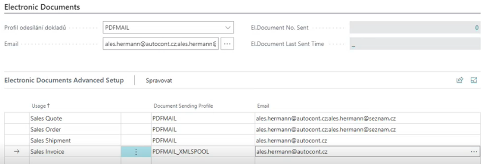

# Odesílání elektronických dokladů

> Aktualizace 30.06.2025

Modul **Odesílání elektronických dokladů** slouží k automatizaci moderní bezpapírové výměny (nejen) daňových dokladů se zákazníkem či dodavatelem. Funkcionalita výrazně rozšiřuje možnosti, které Business Central poskytuje, hned v několika oblastech.

V první řadě se jedná o vylepšenou uživatelskou přívětivost. Uživatel vždy ví, jakým způsobem a v jakém formátu bude doklad odeslán k partnerovi a následně také, kdy k tomu došlo. Může dokonce tyto parametry na konkrétní dokladech upravit dle aktuálních potřeb či jen provést dodatečné další odeslání.

Podstatné je i rozšíření podporovaných dokladů, především o Upomínky a také Nákupní objednávky. Tím je pokryt celý obchodní proces.

Další oblastí vylepšení jsou formáty komunikace. Funkcionalita rozšiřuje standardní [odesílání dokladů](https://learn.microsoft.com/cs-cz/dynamics365/business-central/sales-how-to-send-electronic-documents) v Dynamics 365 Business Central tak, že k formátu PEPPOL navíc doplňuje jeho českou obdobu ISDOC a také unifikovaný XML formát.

Formát ISDOC vychází ze standardu UBL (Universal Business Language) a doplňuje jej o česká specifika. Technicky se jedná o formát XML podepsaný elektronickým podpisem dle standardu XML Signature. Pro ověření platnosti a neporušenosti ISDOC dokumentu slouží aplikace [ISDOC Reader](http://www.isdoc.org/), která umožňuje i zobrazení nebo i vytištění dokumentu. Existuje i varianta s přílohami (dodací listy, certifikáty atd.), výsledný soubor je pak ve formátu ISDOCX (zip soubor).

Formát XML dodávaný v rámci modulu je možné s výhodou použít pro výměnu dokladů mezi firmami, které používají tento modul. Podobně jako u formátu ISDOC je možné připojit i elektronické přílohy. Pro uživatelské zobrazení XML dokumentu (strukturovaná data využitelná pro automatické exporty do informačních systémů) lze definovat tzv. XSD šablony, které transformují data z XML do vizuální podoby HTML dokumentu.

A v neposlední řadě funkcionalita rozšiřuje (v kombinaci s jinými moduly od ARICOMA) možnosti odesílání dokladů. V případě požadavku na protokolovanou komunikaci je možné využít addon [Spooler](https://www.aricoma.com/docs/cs-cz/dynamics365/business-central/Solutions/spooler.html).

Součástí modulu je i podpora odesílání e-mailů v návaznosti na zákaznické procesy. Typickým příkladem je notifikace zákazníků o stavech, kterých nabývá jejich objednávka. Nicméně je potřeba programová úprava v podobě volání funkce, které je popsáno v [nastavení modulu](https://www.aricoma.com/docs/cs-cz/dynamics365/business-central/Solutions/electronic-documents-setup.html)

## Pouze Business Central on-premise

Ve spolupráci s modulem [Datové schránky](https://www.aricoma.com/docs/cs-cz/dynamics365/business-central/Solutions/data-boxes.html) je lze doklady odesílat i tímto komunikačním kanálem. Datové schránky fungují na podobném principu jako běžná e-mailová schránka, samotné technické řešení však zajišťuje důvěryhodnost doručování datových zpráv, kdy každá je opatřena elektronickou značku (e-razítko) a časovou značku (kvalifikované časové razítko). Pro více informací navštivte [oficiální stránky](https://info.mojedatovaschranka.cz/).

Pokud preferujete PDF formát, můžete díky modulu tyto dokumenty elektronicky podepisovat či je dokonce opatřovat elektronickým časovým razítkem.

## Použití funkcionality

Následující text popisuje nejběžnější případy použití funkcionality modulu Odesílání elektronických dokladů.

### Zaúčtování prodejního dokladu s okamžitým odesláním s jedním Profilem odesílání pro zákazníka

V tomto případě se jedná o standardní funkcionalitu Business Central, kdy uživatel pro účtování použije funkci Účtovat a Odeslat. Profil odesílání dokladů má každý zákazník nastaven na své kartě, popř. se použije profil označený jako výchozí.

> [!NOTE]
> Výsledek „odeslání“ se liší v závislosti na nastavení *Profilů odeslání dokladů* (viz oficiální dokumentace [Nastavení profilů odesílání dokladů](https://learn.microsoft.com/cs-CZ/dynamics365/business-central/sales-how-setup-document-send-profiles)).

### Zaúčtování prodejního dokladu s okamžitým odesláním s více Profily odesílání pro zákazníka

V tomto případě se jedná o situaci, kdy je u zákazníka třeba více profilů odesílání dokladů, tzn. různé typy dokladů mají být odesílány různými způsoby. K tomuto účelu je na kartě zákazníka k dispozici Nastavení El. dokladů partnera, kde lze určitému Použití přiřadit jiný Profil odesílání dokladů, než je jako výchozí uveden na kartě zákazníka.

Stejně jako v předchozím scénáři je možné Profil odesílání dokladů na konkrétním dokladu zkontrolovat či změnit na záložce Elektronické doklady před použitím funkce *Účtovat a Odeslat*.

> [!NOTE]
> Pole E-mail je na záložce Elektronické doklady pro lepší přehled, je to ale stejné pole jako na záložce Obecné.

### Zaúčtování prodejního dokladu s odloženým odesláním

Pro správnou funkčnost odloženého odesílání je třeba mít nastaveno spouštění úlohy ve Frontě úloh viz Automatické odesílání dokladů.

1. Vyberte ikonu , zadejte **Prodejní faktury** a poté vyberte související odkaz.
2. Vytvořte novou prodejní fakturu dle vašich zvyklostí na zákazníka a ověřte, že je na záložce Elektronické doklady vyplněno pole *Profil odesílání dokladů*.
3. Na stránce Prodejní faktura spusťte akci *Účtovat*.
4. Při zobrazení informace o čísle zaúčtované faktury zvolte její otevření a ověřte, že po uplynutí definované periody spouštění automatického odeslání se na zaúčtované faktuře navýší hodnota pole *Kolikrát odeslán el.doklad*.

> [!NOTE]
> Stejným způsobem lze odesílat zaúčtované prodejní dobropisy, prodejních dodávky a vydané upomínky.

### Dodatečné ruční odeslání zaúčtovaného prodejního dokladu

V případě následné potřeby odeslání jiným způsobem, než je běžné, lze toto provést na stránce příslušného dokladu.

1. Vyberte ikonu , zadejte **Účtované prodejní faktury** a poté vyberte související odkaz.
2. Najděte příslušný doklad a otevřete jeho kartu.
3. Na záložce Elektronické doklady vyberte v poli *Profil odesílání dokladů* požadovaný způsob.
4. Jedná-li se o odeslání e-mailu, v poli *Email* zadejte požadovanou e-mailovou adresu (popř. více oddělených středníkem).
5. Na stránce Prodejní faktura spusťte funkci *Odeslat*.
6. Ověřte, že se navýšila hodnota pole *Kolikrát odeslán el.*doklad a změnila hodnota v poli *Čas posledního odeslání el.dokladu.*

> [!NOTE]
> Stejně to funguje i pro odesílání zaúčtovaných prodejních dobropisů, prodejních dodávek a vydaných upomínek.

### Odeslání nezaúčtovaného prodejního dokladu

Součástí obchodních procesů bývá odesílání prodejních nabídek či potvrzení prodejních objednávek e-mailem. Tyto doklady jsou rozšířeny o funkci Odeslat tak, aby bylo možné (obdobně jako u předchozích scénářů) využít individuálního nastavení komunikace se zákazníkem.

1. Vyberte ikonu , zadejte **Prodejní nabídky** a poté vyberte související odkaz.
2. Vytvořte novou prodejní nabídku pro zákazníka a ověřte, že je na záložce Elektronické doklady vyplněno pole *Profil odesílání dokladů*.
3. Na stránce Prodejní nabídka spusťte akci *Odeslat*.
4. Ověřte, že se na navýší hodnota pole *Kolikrát odeslán el.doklad*.

### Odeslání nezaúčtovaného nákupního dokladu

Součástí obchodních procesů bývá odesílání nákupních poptávek či nákupních objednávek e-mailem.

1. Vyberte ikonu , zadejte **Nákupní objednávky** a poté vyberte související odkaz.
2. Vytvořte novou nákupní objednávku na dodavatele a ověřte, že je na záložce Elektronické doklady vyplněno pole *Profil odesílání dokladů*.
3. Na stránce Nákupní objednávka spusťte akci *Odeslat*.
4. Ověřte, že se na navýší hodnota pole *Kolikrát odeslán el.doklad*.

### Změna přednastaveného odesílání v návazných prodejních dokladech

Následující scénář popisuje situaci, kdy se uživatel v průběhu obchodního případu rozhodne pro změnu v odesílání dokladů, které teprve budou vytvořeny. Předpokladem je existence nastavení odesílání dle typů dokladů (viz Profily odesílání dokladů dle typů dokladů), konkrétně pro zákazníka odesílání jak nabídky, tak objednávky a faktury (příp. i dodacího listu).

1. Vyberte ikonu , zadejte **Prodejní nabídky** a poté vyberte související odkaz.
2. Vytvořte novou prodejní nabídku pro zákazníka, u kterého máte nastaveno různé odesílání dle typů dokladů.
3. Na záložce Elektronické doklady ověřte, že v Rozšíření nastavení Elektronických dokladů jsou zobrazeny parametry odesílání návazných dokladů dle nastavení pro zákazníka.
4. Na řádku s použitím Prodejní objednávka změňte hodnotu v poli Profil odesílání dokladů.
5. Na řádku s použitím Prodejní faktura změňte hodnotu v poli Profil odesílání dokladů (popř. i E-mail)
6. Na stránce Prodejní nabídka spusťte akci *Vytvořit objednávku*.
7. Při zobrazení informace o vytvořené objednávce zvolte její otevření. Ověřte, že v poli Profil odesílání dokladů je hodnota zadaná v bodě 4 a také že se přenesla i změna z bodu 5.
8. Na stránce Prodejní objednávka spusťte akci *Účtovat*.
9. Při zobrazení informace o zaúčtované faktuře zvolte její otevření a ověřte, že v poli *Profil odesílání dokladů* a *E-mail* jsou hodnoty zadané v bodě 5.

## Viz také

[Odesílání elektronických dokladů - Nastavení](electronic-documents-setup.md)  
[Productivity Pack](productivity-pack.md)
