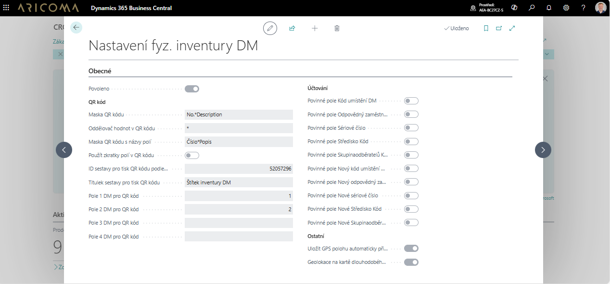

# Inventura majetku — Nastavení

Aplikaci **Inventura majetku** je potřeba nastavit dle následujícího popisu.

## Nastavení inventury DM

- Vyberte ikonu  a zadejte **Nastavení inventury DM** a poté vyberte související odkaz.  
- Na stránce **Nastavení inventury DM** lze:
  - definovat strukturu QR kódu – **Pole 1 .. 4 DM pro QR kód**.
  - sestava pro tisk QR kódu.
  - při účtování vynutit vyplnění polí sekce **Účtování**.  
  - Nastavit automatické uložení GPS polohy při skenování-sekce **Ostatní**.

  

## Nastavení Šablon deníku inventury DM

- Vyberte ikonu  a zadejte **Šablony deníku inventury DM** a poté vyberte související odkaz.  
- Na stránce **Šablony deníku inventury DM** je třeba vytvořit parametrizaci.  
- Na stránce **Šablony deníku inventury DM**  přes akci **Související/Šablona/Listy** lze vytvořit jednotlivé listy pro inventuru majetku např. pro jednotlivé střediska, umístění, odpovědné zaměstnance, ...

## Nastavení online map

- Vyberte ikonu  a zadejte **Nastavení Online Map**, poté vyberte související odkaz.  
- Na stránce **Nastavení Online Map** vytvořte parametrizaci:
  - **Povoleno** – povolit danou funkčnost.  
  - **Kód nastavení parametru map** – zvolte, na jaké mapě se budou souřadnice zobrazovat.  

## Související informace
[Inventura majetku](fa-inventory.md)  
[ARICOMA řešení](solutions.md)  
