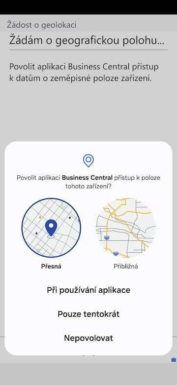
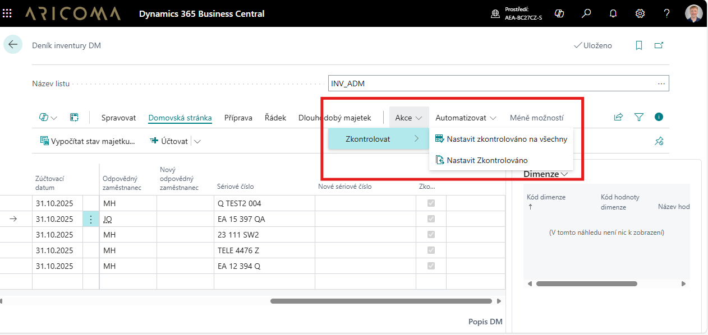
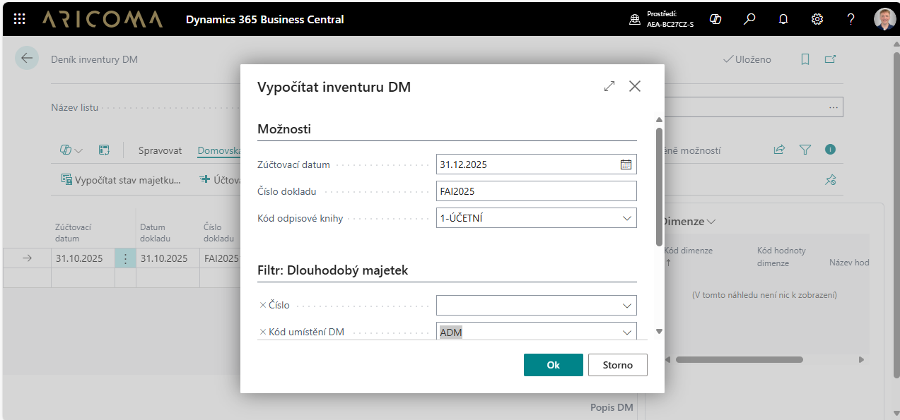
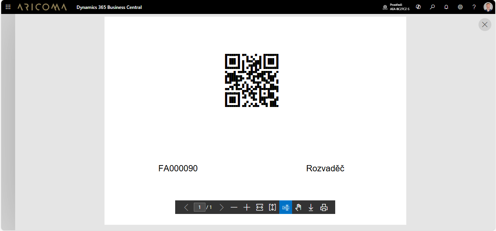
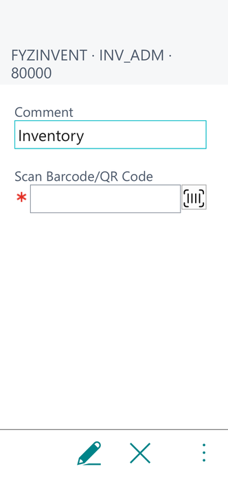
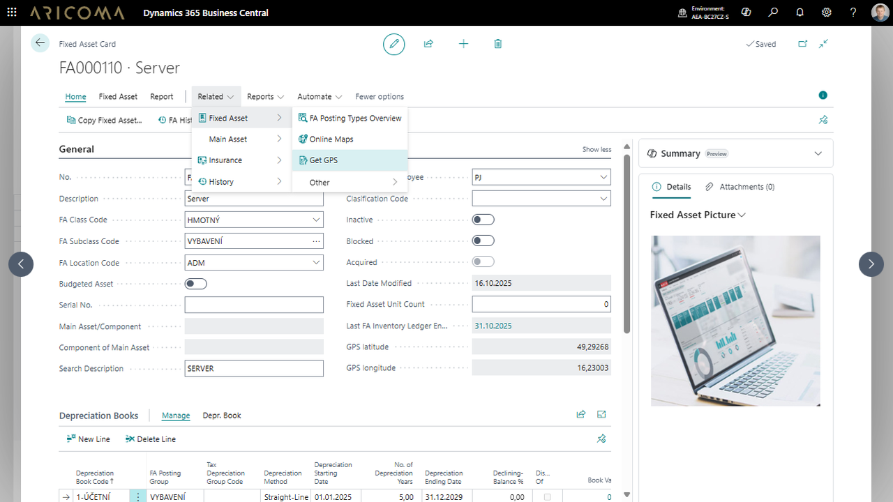
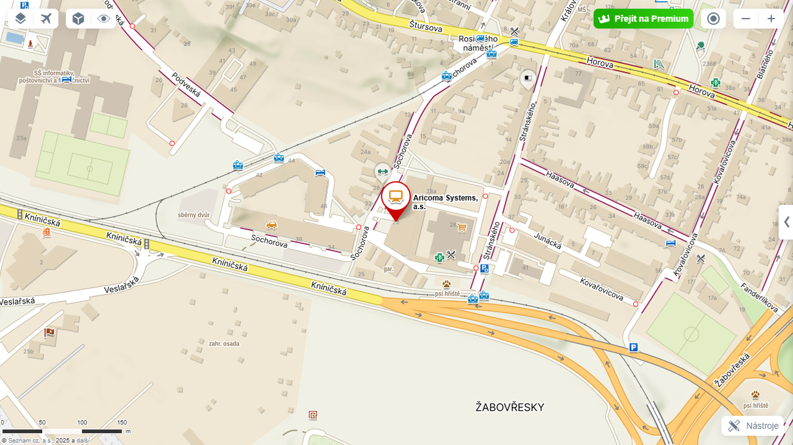

# Inventura majetku

Aplikace **Inventura majetku** slouží pro fyzickou inventarizaci majetku v systému [!INCLUDE [d365fin_long_md](../includes/d365fin_long_md.md)] za využití **QR kódů**.

Už žádné chaotické tabulky, ztracené papíry ani nekonečné dohledávání majetku. Přináší efektivní řešení inventarizace pomocí QR kódů a mobilního zařízení, které propojuje jednoduchost, přesnost a úsporu času. Díky inventuře majetku pomocí QR kódů získáte:

## Výhody řešení

- **Rychlost a efektivita** – Stačí naskenovat kód případně k němu zadat poznámku a máte základ inventury hotov.
- **Přesnost dat** –Minimální chybovost díky automatickému dohledání majetku.
- **Online přehled** – Data o majetku dostupná kdykoliv a odkudkoliv.  
- **Snadná správa změn** – Změna umístění, střediska či odpovědné osoby? Na pár kliknutí.
- **Ekologické řešení** – Bez papírování, vše digitálně.

## Jak inventura probíhá

**1. Příprava inventury na počítači**  
    - Uživatel vytvoří **deník inventury** v systému.  
    - Nadefinuje a vytiskne QR kódy, které se připevní na majetek.  

**2. Zpracování inventury v terénu (mobil / čtečka)**  
    - Stačí **naskenovat QR kód** majetku – systém okamžitě identifikuje položku.
    - Lze **přidávat poznámky**, např. návrhy na změnu umístění, sériového čísla či odpovědné osoby.  
    - Automaticky se ukládá **GPS poloha**, což pomáhá zpřesnit evidenci.  
    - Díky mapovému zobrazení se můžete nechat **navigovat k poslední známé poloze majetku**.  

**3. Dokončení inventury v kanceláři**  
    - V systému se zpracují požadavky na změny (např. nový kód umístění, střediska, zaměstnance).  
    - Lze provést i **"inventuru od stolu"** – např. tam, kde není přístup k majetku.  
    - Inventura se schválí a zaúčtuje.  
    - Výstupy je možné **vytisknout** nebo **publikovat do SharePointu** pro další využití.  

### Proč zvolit inventuru majetku pomocí QR kódů

- **Úspora času** a eliminace chyb.  
- **Přesná lokalizace majetku** díky GPS.  
- **Plná mobilita** – inventarizace odkudkoliv.  
- **Okamžité záznamy změn** bez ručního přepisu.  

### Inventura majetku – příprava (na počítači)

**Příprava a generování deníků inventury pro jednotlivé střediska, umístění, zaměstnance (na jednotlivé listy deníku).**

- Vyberte ikonu , zadejte Deník inventury DM a poté vyberte související odkaz.  
- Na stránce Deník inventury DM vyberte a nebo vytvořte nový Název listu. Pro vytvoření nového listu vyberte akci Nový.  

- Na stránce **Deník inventury DM** vyberte Akce/Funkce **Vypočítat stav majetku.**  

Akce **Vypočítat inventuru DM** obsahuje tyto pole:

- **Zúčtovací datum**– datum ke kterému budeme inventuru provádět.
- **Číslo dokladu** – číslo dokladu se kterým chceme inventuru zaúčtovat.
- **Kód odpisové knihy** – vyberte odpisovou knihu ze které chcete majetek vybrat.
- **Filtr** – vyfiltrování majetku pro inventuru.
- **Číslo** – vyberte čísla majetku, který chcete inventarizovat.
- **Kód umístění DM** – vyberte umístění ve kterém chcete inventarizovat majetek.
- **Odpovědný zaměstnanec** – vyberte zaměstnance kterého majetek chcete inventarizovat.
- **Středisko kód (globální dimenze 1)** – vyberte středisko ve kterém chcete inventarizovat majetek.
- **Zakázka kód (globální dimenze 2)** – vyberte zakázku pro kterou chcete inventarizovat majetek.

**Tisk štítků případně inventurní sestavy pro ruční zpracování (doplňkový způsob zpracování).**

- Vyberte ikonu , zadejte **Inventura DM štítek** a poté vyberte související odkaz.
- Vyberte ikonu , zadejte **Deník inventury DM** a poté vyberte související odkaz.
- Na stránce **Deník inventury DM** vyberte Akce/účtování **Seznam inventury DM** . Tisk formuláře pro ruční zpracování inventury (doplňkový způsob zpracování).

### Inventura majetku – zpracování (na mobilním zařízení)

- Na mobilním zařízení vyberte ikonu  a nebo přímo odkaz na **Deník inventury DM** (mobil).
- Přes ikonu v dolním pravém rohu   se přepnete do seznamu akcí nad deníkem inventury. Přes akci **Vybrat deník** vyberte správný inventurní seznam  **Název listu**.
- Pomocí akci **Skenovat** , kterou naleznete proklikem přes 3 tečky v pravém dolním rohu aplikace se přepnete do page ve které pak načítáte jednotlivé QR kódy majetku a případně k nim můžete zadat **Poznámku**. **Poznámky** je vhodné nadefinovat do **Kódů standardních textů** tak, aby uživatel nemusel vypisovat celý text. Pokud majetek není v deníku inven-tury systém navrhne a automaticky vytvoří nový řádek. Pokud je v **Nastavení fyz. inventury DM** zaškrtnuta volba **Uložit GPS polohu automaticky při skenování systém při naskenován**í automaticky uloží i GPS souřadnice.
- Pomocí akce **Mapy online** je možno si nechat zobrazit polohu majetku na mapě, nebo se nechat navigovat k majetku dle uložených **GPS souřadnic.**

### Inventura majetku –  ruční zpracování (doplňkový způsob zpracování)

- Vyberte ikonu , zadejte ***Deník inventury DM*** a poté vyberte související odkaz.
- Na stránce ***Deník inventury DM*** vyberte správný inventurní seznam  Název listu.
- Dle vyplněného inventárního seznamu (papírový dokument) spusťte akci:
  - Nastavit zkontrolováno na všechny
  - Nastavit zkontrolováno na označené (vybrané) řádky deníku inventury

### Inventura majetku –  dokončení

**Provedení a zaúčtování zaevidovaných změn**

- Vyberte ikonu , zadejte **Deník inventury DM** a poté vyberte související odkaz.
- Na stránce **Deník inventury DM** vyberte správný inventurní seznam  **Název listu**.
- Podle textové poznámky **Popis** nebo podle **Inventárního seznamu (papírový dokument)** k vybranému majetku vyplňte pole:
  - **Nový kód umístění majetku**
  - **Nový odpovědný zaměstnanec**
  - **Nové středisko** (globální dimenze 1)
  - **Nová zakázka** (globální dimenze 2)
  - **Nové sériové číslo**
- Na stránce **Deník inventury DM** vyberte správný inventurní seznam  **Název listu**.
- Spusťte akci **Účtovat** a nebo **Účtovat a vytisknout**. Akce účtování v deníku inventury:
  - provede změny na kartě majetku:
    - **umístění majetku,**
    - **odpovědný zaměstnanec,**
    - **středisko** (globální dimenze 1),
    - **zakázka** (globální dimenze 2),
    - **sériové číslo.**
  - a vytvoří záznamy o provedených změnách:
    - Položky fyz. inventury DM.
    - Žurnál inventury DM.

### Evidence na kartě majetku

- Vyberte ikonu , zadejte **Dlouhodobý majetek** a poté vyberte související odkaz.
- Na stránce **Dlouhodobý majetek** jsou nové pole:
  - **Datum poslední inventury**
  - **GPS latitude**
  - **GPS longitude**

## Související informace
[Inventura majetku - Nastavení](fa-inventory-setup.md)  
[ARICOMA řešení](solutions.md)
