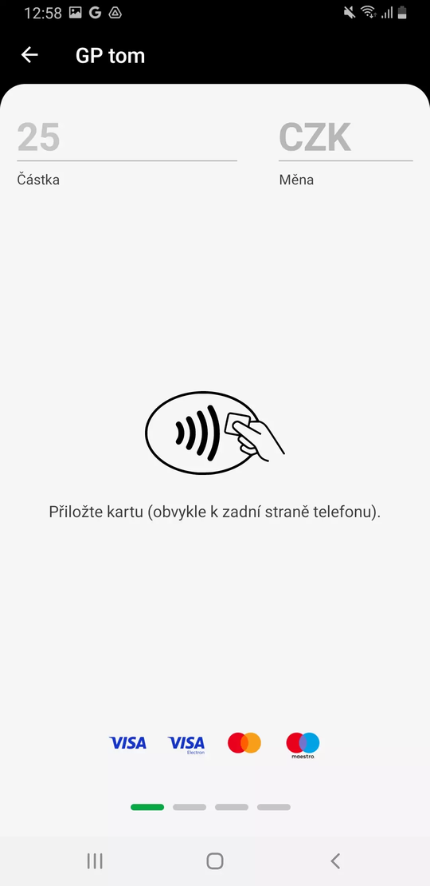
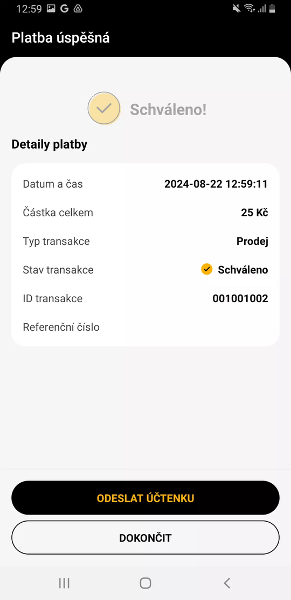
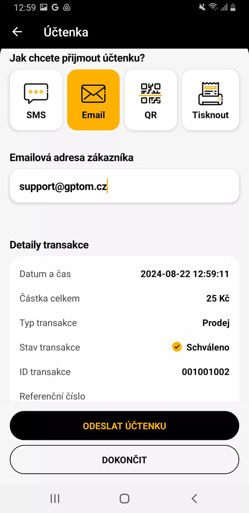

# Integrace s GP tom
> Update 14.10.2024

Addon **Integrace s GP tom** je určen především pro bezešvou integraci Business Central s platebními terminály, aby se staly nativní součástí obchodních procesů. Navíc umožnuje provádět i související obslužné operace přímo z prostředí BC.

Modul propojuje Microsoft Dynamics 365 Business Central s platebními terminály, resp. s řešením [**tom**](https://www.gptom.com/) na terminálech provozovaném.
Díky tomuto řešení umožníte zákazníkům platby nejen kartami Visa a Mastercard, ale tak pomocí Apple Pay, Google Pay, Edenred… Více [zde](https://www.gptom.com/docs/manual/zaciname/podporovana-karetni-schemata/).

## Použití

V následujícím textu je popsáno využití terminálu pro nejběžnější případ, tedy úhradu platební kartou.

### Registrace platby na terminálu dle výchozího nastavení
In this case, this is the standard BC functionality where the user uses the Post and Send function for posting. Each customer has a document posting profile set on his/her card, or the profile marked as default is used.

1. Vyberte ikonu , zadejte **Platební terminály** a poté vyberte související odkaz.
2.	Na stránce **Platební terminály** vyberte terminál, na kterém chcete provést platbu.
3.	Spusťte akci *Registrace plateb*.
4.	Na stránce **Registrovat platbu** zadejte v poli Částka hodnotu pro úhradu terminálem.
5.	Spusťte akci *Zaplatit*.
6.	Na terminálu se objeví dialog „Přiložte kartu“.

7.	Po úspěšné úhradě se objeví dialog, kde obsluha provede odeslání dokladu o platbě (popř. může rovnou Dokončit proces)

8.	V dialogu pro odeslání účtenky je předvyplněn způsob odeslání nastavený pro příslušný terminál

9.	Po ukončení procesu platby na terminálu se na stránce Registrovat platbu objeví oznámení s výsledkem operace, vč. volby Otevřít položku pro zobrazení položky s detaily o proběhlé komunikaci s terminálem.

> [!TIP]
> Při použití akce Zaplatit a zavřít v bodě 5 dojde po transakci k zavření stránky **Registrovat platbu**.

### Registrace platby na terminálu se specifickým nastavením
Specifickým nastavením je myšleno především zpracování spropitného a jiná měna transakce nežli ta výchozí.
1. Vyberte ikonu , zadejte **Platební terminály** a poté vyberte související odkaz.
2.	Na stránce **Platební terminály** vyberte terminál, na kterém chcete provést platbu.
3.	Spusťte akci *Registrace plateb*.
4.	Na stránce **Registrovat platbu** zadejte v poli *Částka* hodnotu pro úhradu terminálem.
5.	Na záložce Platba klikněte na *Zobrazit více*.
6.	Zapněte příznak *Vybrat spropitné*, pokud se má na terminálu uživateli nabídnout zadání spropitného. V poli *Částka spropitného* pak zadejte částku, která se má na terminálu objevit.
7.	V poli *Měna* zadejte měnu, ve které má být úhrada provedena.
8.	V poli *Referenční číslo* můžete změnit označení transakce využívané pro trasovatelnost mezi záznamy v BC a v GP Tom.
9.	Na záložce Možnosti vyberte v poli *Typ účtenky* hodnotu E-mail nebo Telefon; pak je třeba v poli Účtenku odeslat na zadat e-mailovou adresu, resp. telefonní číslo.
10.	Spusťte akci *Zaplatit*.
11.	Na terminálu se objeví dialog „Přiložte kartu“ a postupujte stejně jako je popsáno od bodu 6 dále v předchozí kapitole.

### Storno platby
Tuto operaci je možné provést přímo z BC, ale samozřejmě i [na terminálu](https://www.gptom.com/docs/manual/zakladni-funkce/storno-platby/) (podmínky storna jsou dány podmínkami GP tom v závislosti na konkrétním trhu).
1. Vyberte ikonu , zadejte **Transakce platebního terminálu** a poté vyberte související odkaz. 
2.	Na stránce **Transakce platebního terminálu** vyberte záznam, který chcete stornovat.
3.	Spusťte akci *Storno transakce*.
4.	Na potvrzujícím dialogu stiskněte Ano.
5.	Ověřte, že se stav transakce změnil na Stornovaná.

### Aktualizace stavu transakce
Může se stát, že terminál bude zpracovávat transakci déle, než je nastavená čekací doba. Nebo že transakce byla zrušena přímo na terminálu. V takovém případě je třeba, aby se dodatečně aktualizovala evidence v BC tak, aby obsahovala finální stav transakce.
1. Vyberte ikonu , zadejte **Transakce platebního terminálu** a poté vyberte související odkaz. 
2.	Na stránce **Transakce platebního terminálu** vyberte záznam, který chcete aktualizovat (s hodnotou „Vytvořená“ v poli Stav transakce).
3.	Spusťte akci *Aktualizovat stav transakce*.
4.	Ověřte, že se změnil stav transakce a byly doplněny další údaje identifikují transakci (např. ID transakce).

### Dodatečné odeslání účtenky
Tato možnost je dostupná pouze na terminálu v seznamu plateb.

### Uzávěrka
Tuto administrativní operaci je možné provést přímo z BC, ale samozřejmě i [na terminálu](https://www.gptom.com/docs/manual/zakladni-funkce/uzaverka/).
1. Vyberte ikonu , zadejte **Platební terminály** a poté vyberte související odkaz. 
2.	Na stránce **Platební terminály** vyberte terminál, na kterém chcete provést uzávěrku.
3.	Spusťte akci *Provést uzávěrku*.
4.	V aplikaci na terminálu se otevře seznam uzavřených dávek.

## Viz také
[Nastavení Integrace s GP tom](GPtom-Integration-setup.md)  
[Streamline Tools](streamlinetools.md)  
[ARICOMA řešení](../index.md)
