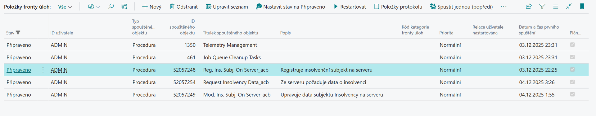

# Nastavení Insolvenčního rejstříku

> Aktualizace: 30.11.2025

Nejprve je potřeba modul Insolvenčního rejstříku správně nakonfigurovat a nastavit způsob, jakým se data z Insolvenčního rejstříku stahují do vaší databáze Business Central.

## Nastavení serverové komunikace (moderní)

Nový způsob komunikace je možný jak pro **Online**, tak i **On-premises** verzi Business Central. Pro zprovoznění je třeba kontaktovat **ARICOMA** **(bc_sales@aricoma.com)** pro získání přístupového klíče.

1. Vyberte ikonu , zadejte **Nastavení insolvenčního rejstříku** a poté vyberte související odkaz.
2. Ověřte, že na záložce **Zdroj dat** je zapnuto pole **Používat data ze vzdáleného serveru**.
3. Doplňte hodnotu přístupového klíče, který jste obdrželi od firmy ARICOMA, do pole **Tajný klíč**.
4. Pole **Kontrolovat insolvenční subjekty okamžitě** umožňuje okamžitou kontrolu při změnách na kartách zákazníků/dodavatelů.
5. Pole **Periodicky registrovat subjekty** zajišťuje automatickou registraci nových zákazníků/dodavatelů na server. Jeho nastavení automaticky vytváří úlohu plánovače pro tento účel.
6. Pole **Periodicky žádat o insolveční data** zajišťuje pravidelné stahování aktuálních insolvenčních informací ze serveru. Jeho nastavení automaticky vytváří úlohu plánovače pro tento účel.
7. Pole **Periodicky posílat požadavky na modifikaci** slouží k odesílání čekajících požadavků na úpravu dat na server. Toto pole lze aktivovat pouze tehdy, když není povolena okamžitá kontrola insolvenčních subjektů a automaticky se deaktivuje při zapnutí okamžitých kontrol. Jeho nastavení automaticky vytváří úlohu plánovače pro tento účel.
8. Aktivujte příznak **Povoleno**.
9. Pokud se vám zobrazí **Podmínky třetích stran**, přečtěte si je a potvrďte souhlas tlačítkem **Přijímám**.
10. Zavřete stránku.

**Schéma komunikace se serverem IR**  

Každá z periodických úloh vytváří záznam v **Položkách fronty úloh**, kde můžete sledovat jejich stav.

## Nastavení komunikace (klasické)

V **On-premises** verzi je možné využívat i nadále režim stahování dat do databáze. Zásadním rozdílem oproti modernímu způsobu popsanému výše je, že v tomto režimu jsou stahována veškerá data Insolvenčního rejstříku do databáze zákazníka (v roce 2025 je velikost dat IR v BC cca 27GB).

1. Vyberte ikonu , zadejte **Nastavení insolvenčního rejstříku** a poté vyberte související odkaz.
2. Ověřte, že na záložce **Zdroj dat** je **vypnuto** pole **Používat data ze vzdáleného serveru**.
3. Akcí **Nastavit výchozí webovou službu** je možné nastavit do výchozího stavu adresu webové služby.
4. Zkontrolujte požadovanou periodu stahování.
5. Aktivujte příznak **Povoleno**.
6. Přečtěte si **Podmínky třetích stran** a potvrďte souhlas tlačítkem **Přijímám**.
7. Zavřete stránku.

## Nastavení kontroly insolvence při prodeji a v servisu

1. Vyberte ikonu , zadejte **Nastavení insolvenčního rejstříku** a poté vyberte související odkaz.
2. Aktivujte **Kontrola insolvence při prodeji** pro upozorňování uživatelů při tvorbě prodejních dokladů na fakt, že má zákazník případ insolvence (otevřený či uzavřený).
3. V poli **Blokování účtování prodeje při insolvenci** nastavte, zda-li má být v případě aktivní Věci insolvenčního řízení blokováno účtování dodání, faktury nebo vše.
4. Aktivujte **Kontrola insolvence v Servisu** pro upozorňování uživatelů při tvorbě servisních dokladů na fakt, že má zákazník případ insolvence (otevřený či uzavřený).
5. V poli **Blokování účtování servisu při insolvenci** nastavte, zda-li má být v případě aktivní Věci insolvenčního řízení blokováno účtování dodání, faktury nebo vše.
6. Zavřete stránku.

## Nastavení uživatele s oprávněním vypínat kontrolu insolvence

1. Vyberte ikonu , zadejte **Nastavení uživatelů** a poté vyberte související odkaz.
2. Vyberte uživatele a nastavte hodnotu v poli **Povolit odemknutí blokace insolvence** na **Ano**.

## Související informace

[Insolvenční rejstřík](insolvence-register.md)  
[ARICOMA řešení](solutions.md)
