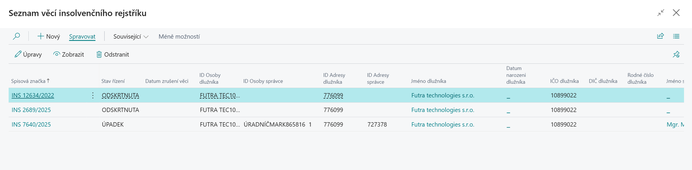
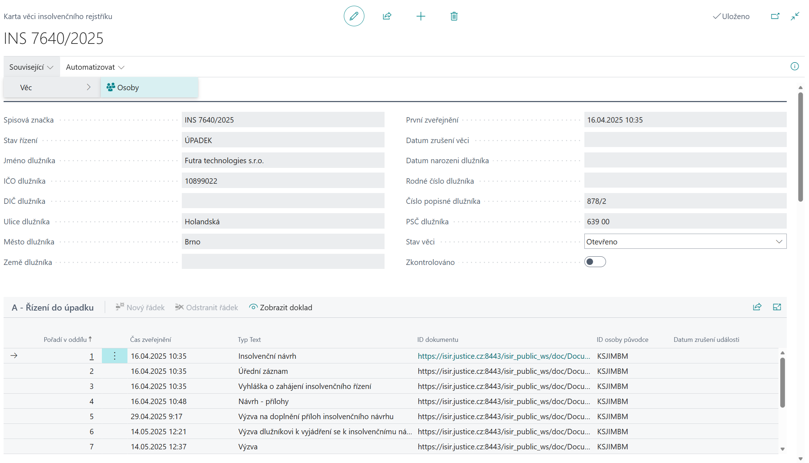
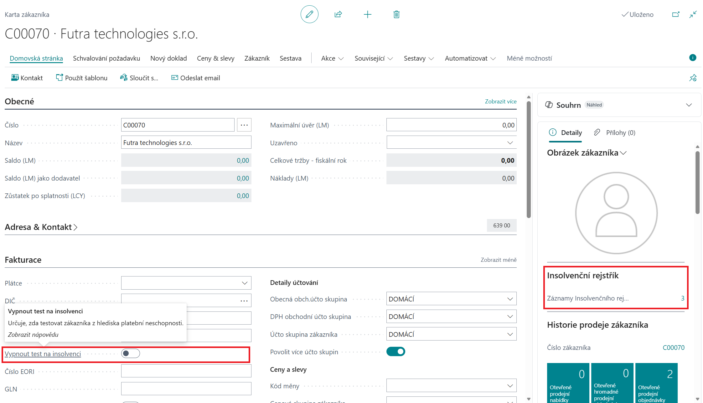
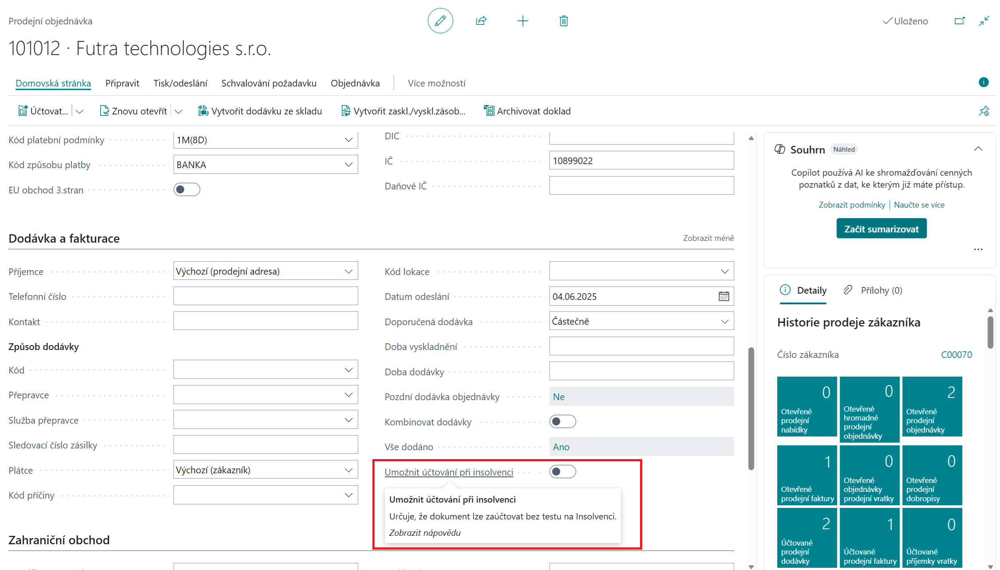
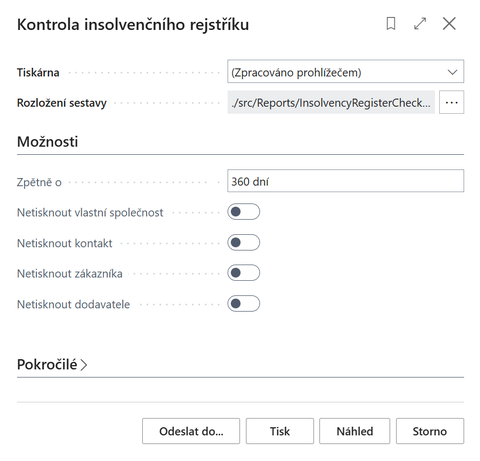
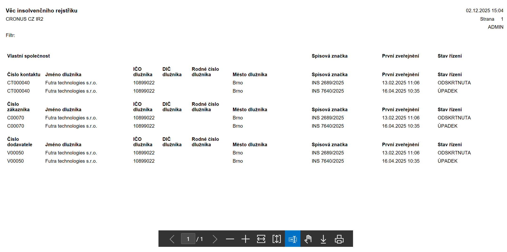
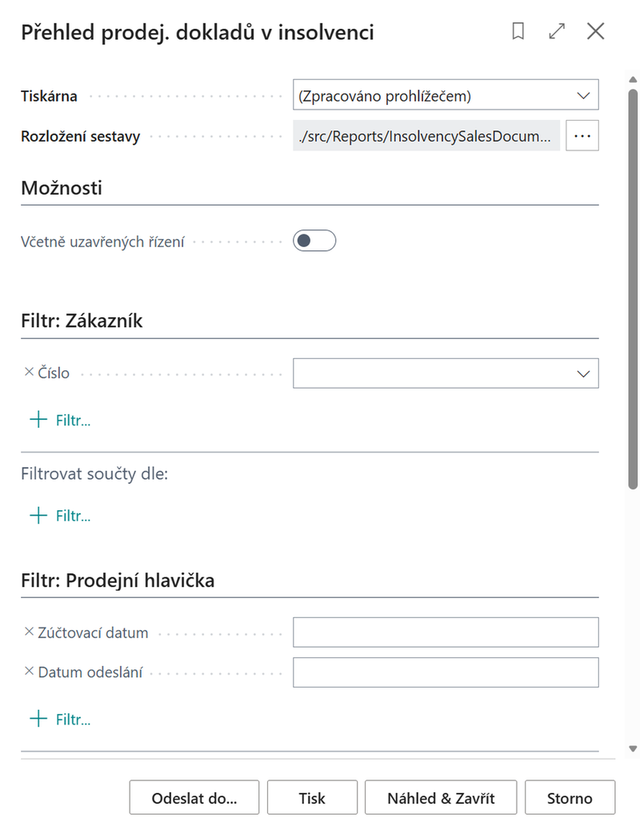

# Insolvenční rejstřík

**Insolvenční rejstřík** je rozšíření pro Microsoft Dynamics 365 Business Central, které umožňuje automatické ověřování platební schopnosti zákazníků a dodavatelů na základě dat stahovaných z oficiálního Insolvenčního rejstříku České republiky https://isir.justice.cz. **Insolvenční rejstřík (ISIR)** je veřejně dostupná online databáze spravovaná **Ministerstvem spravedlnosti ČR**, která eviduje informace o insolvenčních řízeních fyzických i právnických osob.

Databáze obsahuje:

- Rozhodnutí insolvenčního soudu (zahájení řízení, úpadek, oddlužení apod.)
- Přihlášky pohledávek věřitelů
- Zprávy insolvenčního správce
- Identifikační údaje o dlužníkovi (jméno, IČO, datum narození)
- Spisovou dokumentaci řízení v chronologickém pořadí

Rejstřík je důležitý pro:

- **Věřitele** – kvůli přihlášení pohledávek
- **Dlužníky** – pro sledování průběhu řízení
- **Podnikatele** – pro prověření obchodních partnerů
- **Veřejnost** – pro ověření finanční spolehlivosti osob a firem

Záznamy zůstávají v rejstříku **3 roky po ukončení řízení**.

**Aplikace Insolvenční rejstřík** pro Business Central zpřístupňuje tato veřejná data přímo do Business Central tak, aby měla společnost tyto informace přímo integrovány do obchodních procesů. Zavede-li firma do systému nového partnera (zákazníka, dodavatele, kontakt) se záznamem v ISIR, popř. se zavedený partner do ISIR dostane dodatečně, uživatel systému je o této skutečnosti informován.

## Klíčové funkce

- Zobrazení informace o insolvenčním řízení na kartě zákazníka, dodavatele, kontaktu a Informacích o společnosti
- Varování uživatele při práci s prodejním či servisním dokladem
- Nastavení zamezení účtování dokladů
- Možnost vypnout test na insolvenci pro konkrétního partnera (zákazníka, dodavatele)
- Umožnit účtování při insolvenci pro konkrétní doklad
- Kompletní informace o probíhajících i ukončených insolvenčních řízeních partnerů přímo v Business Central

### Cloud verze a serverová architektura

Pro cloudové verze Business Central je využívána **serverová část aplikace**, která zajišťuje:

- Centralizované načítání všech záznamů z ISIR (Insolvenční rejstřík)
- Poskytování API pro dotazy z klientské části IR
- Automatickou synchronizaci dat mezi serverem a klientskými aplikacemi

Serverová architektura eliminuje nutnost každé Business Central instance stahovat kompletní data z ISIR, což výrazně zvyšuje výkonnost a spolehlivost služby.

V případě **On-Premises varianty** Business Central je možné zvolit mezi dvěma způsoby implementace:

- **Serverová varianta** - využívá centralizovaný server pro stahování dat z ISIR, stejně jako cloudová verze. Tato varianta snižuje velikost databáze, neboť jsou stahována pouze data subjektů, kteří jsou v dané instanci Business Central evidováni jako zákazníci, dodavatelé či kontakty.
- **Přímé stahování** - z ISIR se stahují kompletní data přímo do databáze konkrétní instance Business Central bez využití centrálního serveru. Tento přístup je vhodný pro organizace, které preferují plnou kontrolu nad svými daty a nevyužívají cloudové služby.

## Použití

### Zobrazení informací o insolvenci partnera

- Vyberte ikonu , zadejte **Zákazníci** a poté vyberte související odkaz.
- Přejděte na záznam se zákazníkem se záznamem v insolvenčním rejstříku.
- Zvolte **Související > Zákazník > Insolvenční rejstřík**. Alternativně lze využít Informační panel Insolvenční rejstřík, kde je zobrazen počet otevřených záznamů Insolvenčního rejstříku.
- Na stránce Seznam věcí insolvenčního rejstříku vidíte seznam otevřených i uzavřených insolvencí zákazníka.

Stejné informace jsou k dispozici i na **kartě Dodavatele** a **Kontaktu**. Informace o insolvencích vůči vlastní organizaci je k dispozici na stránce **Informace o společnosti**.

#### Karta věci insolvenčního rejstříku

**Karta věci insolvenčního rejstříku** poskytuje detailní pohled na konkrétní insolvenční řízení a slouží k:

- **Zobrazení úplných informací** o insolvenčním řízení včetně spisové značky, data zahájení, stavu řízení a typu řízení
- **Sledování průběhu** insolvenčního řízení s chronologickým přehledem všech významných událostí
- **Identifikaci subjektu** - zobrazuje kompletní informace o dlužníkovi (název, IČO, sídlo, právní forma)
- **Přehledu dokumentů** připojených k insolvenčnímu řízení
- **Monitoringu změn** stavu řízení v čase
- **Přístupu k detailním údajům** o insolvenčním správci a věřitelích

Karta je automaticky aktualizována při stahování nových dat z ISIR a poskytuje uživatelům aktuální informace o vývoji insolvenčního řízení jejich obchodních partnerů.

Z Karty věci insolvenčního rejstříku je možné zobrazit i detailní informace o **subjektu** insolvenčního řízení kliknutím na volbu **Osoby**. K subjektu je dále možné zobrazit i adresní údaje kliknutím na volbu **Adresy**.

### Upozornění na prodejních dokladech

Je-li zapnuto **Kontrola insolvence při prodeji** v **Nastavení insolvenčního rejstříku**, pak při vložení zákazníka na prodejní doklad (nabídka, objednávka, faktura) bude v případě, že má zákazník libovolný záznam v insolvenčním rejstříku, zobrazena **notifikace**. Přímo z ní má uživatel možnost otevřít **Seznam věcí insolvenčního rejstříku**.

### Kontrola při účtování prodejního dokladu

Při spuštění akce Účtovat na prodejní objednávce či faktuře probíhá, dle nastavení kontroly insolvence při prodeji, kontrola na **otevřené případy v insolvenčním rejstříku**. Pokud je takový záznam nalezen, není uživateli dovoleno účtování provést. V Nastavení insolvenčního rejstříku lze specifikovat variantu **Blokování účtování prodeje při insolvenci** a to **Dodání, Faktura, Vše a prázdné (neblokuje účtování)**.

### Vypnutí kontroly insolvence zákazníka

Uživatel se speciálním oprávněním může na kartě zákazníka vypnout jeho testování vůči insolvenčnímu rejstříku. Vedlejším efektem je, že pro tohoto zákazníka nejsou zobrazovány záznamy o insolvenci (např. akce Insolvenční rejstřík na kartě zákazníka).

- Vyberte ikonu , zadejte **Zákazníci** a poté vyberte související odkaz.
- Přejděte na zákazníka se záznamem v insolvenčním rejstříku.
- Na **záložce Fakturace** zapněte **Vypnout test na insolvenci**.
- Ověřte, že akce Insolvenční rejstřík zobrazí prázdný seznam. Pro okamžitý efekt je potřeba aktualizovat stránku např. klávesou F5.

Stejné nastavení je i na kartě dodavatele (záložka Fakturace) i Kontaktu (záložka Zahraniční obchod). V těchto případech dochází k nezobrazování záznamů o těchto firmách v přehledech a na sestavách pro kontrolu insolvenčního rejstříku.

## Jednorázové vypnutí kontroly účtování na prodejních a servisních dokladech

Uživatel se speciálním oprávněním může na kartě prodejního dokladu (popř. na dokladu servisu) vypnout omezení účtování na základě existence otevřeného insolvenčního řízení. Pak je možné doklad zaúčtovat.

- Vyberte ikonu , zadejte **Prodejní objednávky** a poté vyberte související odkaz.
- Přejděte na záznam objednávky pro zákazníka s otevřenou insolvencí a spusťte akci Úpravy.
- Na záložce *Dodávka a fakturace* zapněte **Umožn****it**** účtování při insolvenci**.
- Spusťte akci Účtovat.
- Zavřete stránku.

### Sestava Kontrola insolvenčního rejstříku

Report automaticky upozorňuje na vstup obchodního partnera (kontaktu/zákazníka/dodavatele) do insolvenčního řízení nebo na podání návrhu na insolvenční řízení vůči vlastní společnosti.

- Vyberte ikonu , zadejte **Kontrola insolvenčního rejstříku** a poté vyberte související odkaz.
- Na stránce Kontrola insolvenční rejstříku definujte v možnostech parametry spuštění:
  - V poli **Zpětně o** zadejte například „5D", aby systém hledal záznamy za posledních 5 dnů
  - Dalšími příznaky definujte, zda-li se mají či nemají tisknout informace o vlastní společnosti, kontaktech, zákaznících či dodavatelích.
  - Spusťte sestavu tlačítkem **Náhled**.

> [!NOTE]
> Lze nastavit, aby byl uživatel pravidelně upozorňován, že má sestavu spustit a případně vyřešit. To lze nastavit prostřednictvím **[Úloh uživatele](https://learn.microsoft.com/cs-cz/dynamics365/business-central/across-user-tasks)** . Další možností je nastavit **Plán spouštění sestavy do schránky uživatele**.

## Sestava Přehled prodejních dokladů v insolvenci

Report automaticky upozorňuje na existenci dokladů v systému, u kterých má zákazník záznam v insolvenčním
rejstříku. Jedná se o tyto doklady a položky:

- Prodejní objednávky, faktury, nabídky
- Upomínky, Penále
- Otevřené položky zákazníka všech typů (faktura, platba, dobropis, upomínka, penále)

Spuštění sestavy Přehled prodejních dokladů v insolvenci:

- Vyberte ikonu , zadejte **Přehled prodej. dokladů v insolvenci** a poté vyberte související odkaz.
- Na stránce Přehled prodej. dokladů v insolvenci definujte v možnostech, má-li sestava zahrnout i uzavřená insolvenční řízení.
- Spusťte sestavu tlačítkem **Náhled**.  

## Související informace

[Nastavení - Insolvenční rejstřík](insolvence-register-setup.md)  
[ARICOMA řešení](solutions.md)
