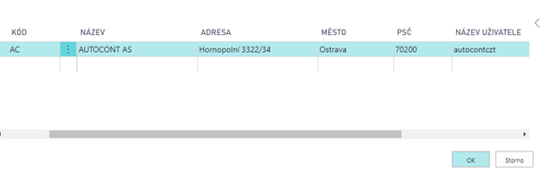
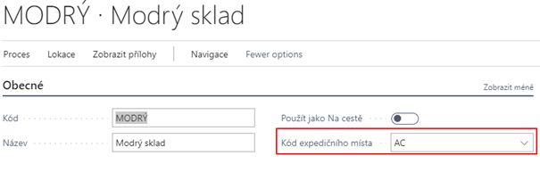
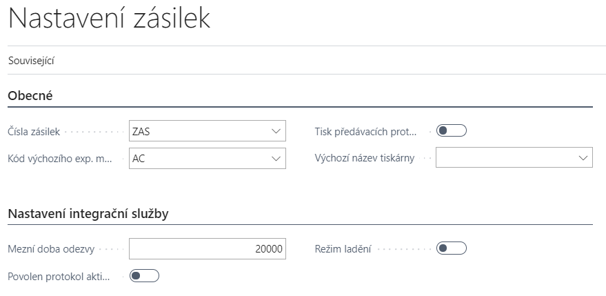
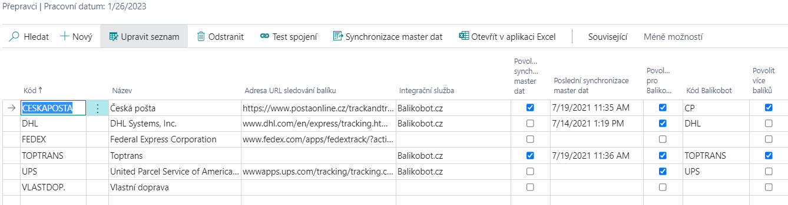

# Nastavení - Parcels - Integrace Balíkobot

> Aktualizace: 23.09.2026

Pro správné fungování addonu Zásilek je zapotřebí nastavit několik oblastí. Addon se prvotně nastavuje pomocí průvodce a poté je možné nastavení měnit ručně.

## Oblasti nastavení addonu

- Číselná řada
- Expediční místa
- Nastavení Zásilek
- Přepravce
- Nastavení lokací
- Parametry zásilky
- Nastavení tisku
- Nastavení způsobu platby (dobírka)
- Automatické aktualizace
- Nastavení v Sandboxovém prostředí

Ostatní číselníky (Služby přepravce, Manipulační jednotky a Pobočky přepravce) si addon stahuje z API Balíkobotu.

> [!IMPORTANT]
> Aby se uživatelé nedostali do problémů s používáním Business Central, jakmile aktivujete funkcionalitu modulu, nejprve nastavte oprávnění k funkcionalitě.
> S instalací modulu máte k dispozici následující Sady oprávnění:
>
>     |Název sady         |Popis                                    |
>     |-                  |-                                        |
>     | PARCELS_READ_ACC  | Pouze čtení                             |
>     | PARCELS_EDIT_ACC  | Pro běžné používání                     |
>     | PARCELS_SETUP_ACC | Pro možnost nastavení chování modulu    |
>     | PARCELS_ADMIN_ACC | Pro běžné používání a zároveň nastavení |

## Nastavení Parcels pomocí průvodce

1. Vyberte ikonu , zadejte **Asistovaná nastavení** a poté vyberte související odkaz.
2. Vyberte Nastavení zásilek.
3. Po přečtení instrukcí klikněte na tlačítko **Další**.
4. Pokud chcete, můžete importovat RapidStart balíček ručně, nebo můžete kliknout na **Další a balíček se stáhne a importuje sám**.
5. V dalším kroku vytvořte nové expediční místo pomocí tlačítka **Nový** a vyplňte pole:
    - Kód
    - Uživatelské jméno
    - Heslo
6. Můžete také vyplnit dodatečné informace:
    - Popis
    - Jméno
    - Adresa
    - Město
    - PSČ
7. V poli **Expediční místo** vyberte nově vytvořený záznam.
8. V dalším kroku vyberte lokaci, vytvořené expediční místo, a klikněte na další.
9. Vytvořte nového přepravce pomocí polí:
    - Kód
    - Jméno
    - Integrační služby: Balíkobot.cz
    - Kód balíkobot
    - Povolit více balíků - ANO
    - Synchronizace master dat - ANO
10. Vyberte funkci **Synchronizovat master data**.
11. Do pole Číselná řada vyberte patřičnou číselnou řadu pro zásilky.
12. Jakmile vše vyplníte a kliknete na **Dokončit**, asistovaný průvodce se zavře a začnou se synchronizovat master data.

## Ruční úprava nastavení

### Expediční místa

Expediční místo je místo Vašeho skladu, odkud jsou expedovány zásilky. Uživatel může mít několik expedičních míst. Pro každé expediční místo je nutné jiné API, dále je expediční místo spojeno s jednou lokací Vaší společnosti.

1. Vyberte ikonu , zadejte **Expediční místa** a poté vyberte související odkaz.
2. Na přehledu vyberte funkci **Nový**
3. Zadejte **Kód** pro expediční místo, popis, adresu a **Název uživatele a heslo** k Vašemu API
4. Zavřete přehled expedičních míst pomocí OK

### Nastavení lokací

Na kartě dané lokace je potřeba vybrat expediční místo, které je spjaté s daným API. Pokud bude více lokací, je nutné na každé nastavit příslušné expediční místo. Toto slouží k omezení chybovosti uživatelů, aby nemohli spojit do zásilky doklady s různými expedičními místy.

Pro přiřazení expedičního místa lokaci je zapotřebí nastavit **Kód Expedičního místa**.

1. Vyberte ikonu , zadejte **Lokace** a poté vyberte související odkaz.
2. Otevřete kartu požadované lokace
3. Vyplňte pole **Kód expedičního místa** v záložce Obecné

### Nastavení Zásilek

Základní nastavení Balíkobotu je nutné provést na stránce **Nastavení Zásilek**.

Okno Nastavení Zásilek obsahuje:

- **Čísla zásilek**- Číselná řada pro zásilky.
- **Kód výchozího expedičního místa** - Výchozí expediční místo, odkud budou odváženy zásilky (viz další kapitola)
- **Tisk předávacích protokolů svozu** – Automatický tisk předávacích protokolů po objednání svozu
- **Výchozí název tiskárny** – Určuje tiskárnu štítků
- **Mezní doba odezvy** – Určuje dobu timeoutu komunikace v jednotlivé zprávě
- **Povolen protokol aktivity** - Spuštění sledování logu aktivity
- **Režim ladění** – Umožňuje odchytávání zpráv v komunikaci s danou službou
- **Automatická synchronizace master dat** - Spustí na frontě úloh proceduru, která v určité časové periodě aktualizuje všechna data ze strany Balíkobotu.
- **Automatická aktualizace stavu přepravy** - Spustí na frontě úloh proceduru, která v určité časové periodě aktualizuje stav přepravy zásilek za poslední měsíc.

Základní nastavení se provede pomocí průvodce nastavení aplikace.
Ostatní tabulky se stahují a plní po zapnutí synchronizace master dat.
Aktualizace těchto dat probíhá ručně pomocí funkce „Resynchronizace master dat“.

#### Základní nastavení Parcels - Integrace Balíkobot

Pro spuštění funkcí Balíkobotu je potřeba provést nastavení:

1. Vyberte ikonu , zadejte **Nastavení Zásilek** a poté vyberte související odkaz.
2. Vyberte číselnou řadu pro zásilky
3. Vyberte kód výchozího expedičního místa
4. Povolte nebo zakažte automatický tisk protokolů svozu
5. Povolte nebo zakažte Protokol aktivity

### Nastavení přepravců

Základní číselník se nahrává pomocí RapidStart balíčku pro Business Central. Tento balíček obsahuje data, která se nestahují z API Balíkobotu:

#### Tabulka přepravců

Ostatní tabulky se stahují a plní po synchronizaci master dat a v tabulce přepravců.
Aktualizace těchto dat probíhá ručně pomocí funkce „Resynchronizace master dat“.

Přehled obsahuje i dopravce, které nemáte u Balíkobotu nakonfigurované. Pro takové se neprovádí import dalších dat (viz dále).

### Na přehledu přepravců je několik polí k nastavení

- **Integrační služba** – Určuje, přes jakou integrační službu se přepravce používá (v tomto případě Balikobot.cz)
- **Povolení synchronizace master dat** – Po zapnutí se mohou stáhnout master data
- **Poslední synchronizace master dat** – Datum poslední synchronizace master dat
- **Povoleno pro Balíkobot** - Přepravce je povolen a je možné ho používat
- **Povolit více balíků** - Při vytváření zásilky umožní funkce vytvořit více balíků v rámci jedné zásilky
- **Paletová přeprava**
- **Počet manipulačních jednotek** - U paletové přepravy je možnost nastavit více manipulačních jednotek
- **Pouze pobočky** – Určuje, že přepravce slouží pouze jako výdejní místo
- **Maximální délka adresy** – Nastavuje délku adresy u vybraného přepravce

### Funkce nad přepravci

- **Test spojení** – Test komunikace mezi integrační službou a Business Central
- **Synchronizace master dat** – Spustí synchronizaci master dat
- **Služby přepravců** - Tabulka služeb jednotlivých přepravců
- **Pobočky přepravců** - Tabulka lokalit, kde si mohou zákazníci zboží od přepravce převzít
- **Manipulační jednotky** - Tabulka manipulačních jednotek paletové přepravy
- **ADR jednotky přepravce** – Tabulka ADR jednotek přepravce

Pokud přidáte přepravce až poté, co byla provedeno prvotní nastavení pomocí asistovaného nastavení, je nutné správně vyplnit pole:

- Kód
- Adresa URL sledování balíku
- Integrační služba
- Kód Balíkobot

Poté je nutné použít funkci **Synchronizace master dat**!

### Nastavení služeb přepravců

Služby přepravců se stahují automaticky pomocí API Balíkobotu. Je možné vynutit určité nastavení pro jednotlivé služby přepravce. Postup pro nastavení:

1. Vyberte ikonu , zadejte **Přepravci** a poté vyberte související odkaz.
2. V seznamu vyberte požadovaného přepravce a zvolte funkci **Služby přepravce**
3. Na následující stránce vyplňte pole dle potřeby:
    - **Povoleno pro Balíkobot** - Službu je možné používat (ve výchozím stavu povoleno)
    - **Vynutit hmotnost zásilky**
    - **Vynutit objem zásilky**
    - **Vynutit cenu zásilky**
    - **Vynutit dobírku zásilky**
    - **Vynutit variabilní symbol zásilky**
    - **Hmotnost na řádku** - Hmotnost musí být vyplněna v řádku zásilky
    - **Služby ČP** – [Pouze pro Českou poštu](https://www.balikobot.cz/dokumentace/cp_ciselnik_sluzeb.pdf) - dlouhý textový řetězec služeb pošty nad danou zásilkou

### Nastavení API Balíkobotu

Tato systémová tabulka umožňuje nastavit rožšířené nastavení přepravců. Jde o nastavení pro API komunikaci, kde je možno u vybraných přepravců vybírat verze komunikací a další.

Z administrátorského hlediska, je zde možnost nastavit kód přepravce pro komunikaci v případně změn od Balíkobotu (pole API kód přepravce), kdy je název API přepravce delší než 10 znaků. (například DHL Freight EuroConnect, který měl název API "dhlfreight" a nyná využívá "dhlfreightec")

## Parametry zásilek

Parametry pro jednotlivé přepravce jsou stahovány z API balíkobotu.

### Nastavení způsobu platby - Dobírka

Pro nastavení a používání funkce zásilka na dobírku je zapotřebí nastavit na způsobu platby boolean **Dobírka**.

1. Vyberte ikonu , zadejte **Způsob platby** a poté vyberte související odkaz.  
2. V přehledu zaškrtněte možnost **Dobírka**.
3. Zavřete přehled způsobu platby.

## Nastavení tisku

### PDF reader

Pro tisk štítků je zapotřebí mít nainstalovaný PDF reader. Pro práci se štítky doporučujeme Foxit pdf a také ho mít nastavený jako výchozí program pro PDF soubory.

### Výběr formátu tisku – klientská zóna

Základním krokem nastavení tisku štítků je definice, jakým způsobem se budou generovat PDF se štítky ze strany Balíkobotu. V klientské zóně (`https://client.balikobot.cz/`) uživatel musí nastavit, zda se bude tisknout ve formátu na celou stránku nebo dle pozic na papíru velikosti A4. Vše záleží na tom, na jaké tiskárně se bude tisknout. Pro tisk na tiskárně pro štítky se nemusí vybírat pozice tisku štítku.

### Výběr tiskárny

Pro nastavení tisku štítku je potřeba nastavit ID sestavy a přidělit uživateli tiskárnu. Funkce tisk štítků je nastavená, aby tiskla na definované tiskárně.

Nutné pro definice tiskárny:

1. Vyberte ikonu , zadejte **Výběry tiskáren** a poté vyberte související odkaz.
2. Zvolit **Nový**.
3. Vyberte ID uživatele, ID sestavy 52068430 a Název tiskárny

Tisk předávacího protokolu se tiskne automaticky po objednání svozu. Pokud uživatel nechce automatický tisk, stačí v Nastavení Balíkobotu vypnout Boolean - Tisk předávacích protokolů svozu. Tisk se provádí z Výchozí tiskárny dle Vašeho zařízení. Případně, pokud máte nastavenou výchozí tiskárnu ve **Výběry tiskáren**, stejně  jako ostatní Vaše tiskové sestavy.

## Automatické aktualizace

### Automatická aktualizace master dat

Automatická aktualizace master dat spustí na frontě úloh proceduru, která v určité časové periodě aktualizuje všechna data ze strany Balíkobotu (Ve výchozím stavu v neděli ve 14:00).

Pro zapnutí této funkce postupujte následujícím způsobem:

1. Vyberte ikonu , zadejte **Nastavení Zásilek** a poté vyberte související odkaz.
2. V Nastavení zásilek zapněte "Automatická aktualizace master dat".
3. Uživatel bude vyzván k založení a otevření nové položky fronty úloh, která bude ve stavu "Vyčkávat".
4. Poté je možné nastavení zavřít.

### Automatická aktualizace stavu přepravy

Automatická aktualizace stavu přepravy spustí na frontě úloh proceduru, která v určité časové periodě aktualizuje stav přepravy zásilek za poslední měsíc.

Pro zapnutí této funkce postupujte následujícím způsobem:

1. Vyberte ikonu , zadejte **Nastavení Zásilek** a poté vyberte související odkaz.
2. V Nastavení zásilek zapněte "Automatická aktualizace stavu přepravy".
3. Uživatel bude vyzván k založení a otevření nové položky fronty úloh, která bude ve stavu "Vyčkávat".
4. Poté je možné nastavení zavřít.

## Nastavení v Sandboxovém prostředí

### Zablokování modulem runtime

Při asistovaném nastavení add-onu se může zobrazit hláška "*Požadavek byl zablokován modulem runtime*".

Pro vyřešení tohoto problému postupujte následujícím způsobem:

1. Vyberte ikonu , zadejte **Správa rozšíření** a poté vyberte související odkaz.
2. Otevře se stránka **Nainstalovaná rozšíření**.
3. Zvolte řádek rozšíření **Parcels** a poté použijte akci **Konfigurace**.
4. Na stránce **Konfigurace rozšíření** aktivujte přepínač **Povolit požadavky HttpClient**.
5. Poté stránku můžete zavřít a spustit znovu Asistovaného průvodce.

## Nastavení PaperLess Trade

### Zapnutí Paperless Trade u přepravce

Paperless Trade slouží k odeslání elektronické faktury (případě pro-forma faktury) pro celní řízení.

Pro správné nastavení postupujte tímto způsobem:

1. Vyberte ikonu , zadejte **Přepravci** a poté vyberte související odkaz.
2. Na přehledu přepravců vyberte přepravce, u kterého chcete službu zapnout.
3. Službu zapnete vybráním pole **Paperless Trade**.
4. Po nastavení můžete přehled zavřít.

### Automatické připojení faktury k zásilce

Pro správné fungování Paperless Trade musíte k zásilce připojit PDF soubor faktury (pro-forma faktury).

V případě vytváření zásilky z účtované prodejní faktury je možné vygenerovat doklad a připojit ho automaticky při vytváření zásilky. Pro správné nastavení pokračujte tímto způsobem:

1. Vyberte ikonu , zadejte **Přepravci** a poté vyberte související odkaz.
2. Na přehledu přepravců vyberte přepravce, u kterého chcete zapnout automatické vytváření dokladu.
3. Automatické vytváření PLT dokladů zapnete vybráním pole **Vytvořit PLT dokument**.
4. Po nastavení můžete přehled zavřít.

## Integrační události Balikobot

Codeunit `BalikobotAPIv2Events_aci` publikuje integrační eventy (`IntegrationEvent`), které umožňují upravit request/response data při volání Balikobot API v2 a doplnit vlastní logiku.

### Eventy Request/Response pro API metody

Pro každou operaci existuje dvojice eventů:

- **OnRequest** – volá se před odesláním requestu a umožňuje upravit JSON objekt v `RequestJsonData`
- **OnResponse** – volá se po přijetí odpovědi a umožňuje číst JSON objekt `ResponseJsonData`
| Event | Parametry | Kdy se volá |
|---|---|---|
| `OnCheckRequest` | `var PackageData: Record BalikobotPackageData_aci` `var RequestJsonData: JsonToken` | Před odesláním requestu metody **CHECK** – umožňuje upravit/doplnit odesílaná data. |
| `OnCheckResponse` | `var PackageData: Record BalikobotPackageData_aci` `ResponseJsonData: JsonToken` | Po přijetí odpovědi metody **CHECK**. |
| `OnAddRequest` | `var PackageData: Record BalikobotPackageData_aci` `var RequestJsonData: JsonToken` | Před odesláním requestu metody **ADD** – umožňuje upravit/doplnit odesílaná data (např. přidat carrier-specific atributy). |
| `OnAddResponse` | `var PackageData: Record BalikobotPackageData_aci` `ResponseJsonData: JsonToken` | Po přijetí odpovědi metody **ADD** (zásilka vytvořena). |
| `OnDropRequest` | `var PackageData: Record BalikobotPackageData_aci` `var RequestJsonData: JsonToken` | Před odesláním requestu metody **DROP** (storno zásilky). |
| `OnDropResponse` | `var PackageData: Record BalikobotPackageData_aci` `ResponseJsonData: JsonToken` | Po přijetí odpovědi metody **DROP**. |
| `OnOrderRequest` | `var PackageData: Record BalikobotPackageData_aci` `var RequestJsonData: JsonToken` | Před odesláním requestu metody **ORDER** (objednání svozu). |
| `OnOrderResponse` | `var PackageData: Record BalikobotPackageData_aci` `ResponseJsonData: JsonToken` | Po přijetí odpovědi metody **ORDER**. |
| `OnLabelsRequest` | `var PackageData: Record BalikobotPackageData_aci` `var RequestJsonData: JsonToken` | Před odesláním requestu metody **LABELS** (hromadné PDF se štítky). |
| `OnLabelsResponse` | `var PackageData: Record BalikobotPackageData_aci` `ResponseJsonData: JsonToken` | Po přijetí odpovědi metody **LABELS**. |
| `OnB2ARequest` | `var PackageData: Record BalikobotPackageData_aci` `var RequestJsonData: JsonToken` | Před odesláním requestu metody **B2A** (vratná/svozová zásilka). |
| `OnB2AResponse` | `var PackageData: Record BalikobotPackageData_aci` `ResponseJsonData: JsonToken` | Po přijetí odpovědi metody **B2A**. |
| `OnTrackV2Request` | `var PackageData: Record BalikobotPackageData_aci` `var RequestJsonData: JsonToken` | Před odesláním requestu metody **TRACK v2**. |
| `OnTrackV2Response` | `var PackageData: Record BalikobotPackageData_aci` `ResponseJsonData: JsonToken` `var StatusMessage: Record "Activity Log" temporary` | Po přijetí odpovědi metody **TRACK v2** – navíc obsahuje dočasnou tabulku se zapsanými stavy trackingu (`StatusMessage`). |
| `OnTrackStatusRequest` | `var PackageData: Record BalikobotPackageData_aci` `var RequestJsonData: JsonToken` | Před odesláním requestu metody **TRACKSTATUS**. |
| `OnTrackStatusResponse` | `var PackageData: Record BalikobotPackageData_aci` `ResponseJsonData: JsonToken` | Po přijetí odpovědi metody **TRACKSTATUS**. |

### Eventy pro aktualizaci zásilky

Volají se po zápisu výsledku API volání zpět do `ParcelHeader_aci`/`ParcelLine_aci` – vhodné pro navazující business logiku zpracování odpovědí z API Balikobot.

| Event | Parametry | Kdy se volá |
| --- | --- | --- |
| `OnAfterUpdateParcelAfterAdd` | `var ParcelHeader: Record ParcelHeader_aci` `var ParcelLine: Record ParcelLine_aci` `var PackageData: Record BalikobotPackageData_aci` | Po aktualizaci `ParcelHeader`/`ParcelLine` daty z odpovědi metody **ADD**. |
| `OnAfterUpdateParcelAfterDrop` | `var ParcelHeader: Record ParcelHeader_aci` `var ParcelLine: Record ParcelLine_aci` `var PackageData: Record BalikobotPackageData_aci` | Po aktualizaci `ParcelHeader`/`ParcelLine` daty z odpovědi metody **DROP**. |
| `OnAfterUpdateParcelAfterOrder` | `var ParcelHeader: Record ParcelHeader_aci` `var ParcelLine: Record ParcelLine_aci` `var PackageData: Record BalikobotPackageData_aci` | Po aktualizaci `ParcelHeader`/`ParcelLine` daty z odpovědi metody **ORDER**. |

### Poznámky k použití

- `RequestJsonData` je předáván jako `var JsonToken` – subscriber jej může nahradit/upravit před odesláním HTTP requestu (typicky obsahuje `JsonObject`/`JsonArray` s klíčem `"packages"`).
- `ResponseJsonData` je jen pro čtení – slouží k reakci na výsledek volání, ne k jeho úpravě.
- `PackageData` je vždy k dispozici jako `var Record BalikobotPackageData_aci` – obsahuje aktuální zpracovávaná data zásilky/zásilek.

## Seznam atributů Balikobot nepodporovaných v aplikaci Parcels

*(stav k 1.9.2026)*  

| Atribut | Datový typ | Popis | Dopravci |
| --- | --- | --- | --- |
| `account_number_duties` | string | FedEx účet plátce cla a daně. Povinné pro případy cla třetí strany CPT/FCA. | fedex |
| `account_number_shipping_charges` | string | FedEx účet plátce přepravy. Povinné pro případy přepravy třetí strany FCA/EXW. | fedex |
| `adr_content.adr_accessibility` | string | Zda je nebezpečné zboží přístupné během přepravy (ACCESSIBLE/INACCESSIBLE). Povinné pro DOT, IATA, ORMD. | fedex |
| `adr_content.adr_battery` | bool | Označení přepravy baterií. | fedex |
| `adr_content.adr_cargo_aircraft` | bool | Pouze nákladní letadlo (CAO). | fedex |
| `adr_content.adr_hazardous` | string/bool | Nebezpečné materiály. | fedex; tnt |
| `adr_content.adr_name_en` | string | Anglický název nebezpečné látky (doplněk k `adr_name`). | dachser |
| `adr_content.adr_other` | bool | Ostatní regulované materiály. | fedex |
| `adr_content.adr_package_type` | string | Typ balení nebezpečného nákladu (ADR) – bez podrobného popisu ve specifikaci. | dbschenker |
| `adr_content.adr_regulation` | string | Typ regulace nebezpečného zboží: ADR (silniční přeprava EU), DOT (US Dept. of Transportation), IATA (letecká přeprava), ORMD (Other Regulated Materials–Domestic). | fedex |
| `adr_content.adr_reportable_quantities` | bool | Nahlašovaná množství. | fedex |
| `adr_content.adr_small_quantity` | bool | Výjimka pro malé množství. Platí pouze pro zásilky s jedním kusem (`order_number = 1`). | fedex |
| `battery_data` (objekt) | array | Povinné při zasílání baterií – obsahuje `battery_packing_type`, `battery_regulatory_type`, `battery_material_type`. | fedex |
| `battery_data.battery_material_type` | string | Materiál baterie (např. LITHIUM_METAL). | fedex |
| `battery_data.battery_packing_type` | string | Typ balení baterie (příklad hodnoty: LOOSE). | fedex |
| `battery_data.battery_regulatory_type` | string | Regulační typ baterie (např. IATA_SECTION_II). | fedex |
| `branch_type` | string | Povinný atribut při vyplnění `branch_id`. Typ výdejního místa — povolené hodnoty: `packstation`, `filialedirekt` (i `filialedirect`). Jen pro zásilky v Německu. | dhlde |
| `consign_password` | bool | Odesláním `true`/`"1"` API vrátí v ADD odpovědi heslo pro vložení zásilky do boxu. Lze nastavit jako výchozí pro všechny zásilky v client zone. | zasilkovna |
| `content_data.content_eori` | string | EORI číslo vztahující se k dané položce obsahu zásilky (celní údaj). | zasilkovna |
| `content_data.content_food_or_book` | bool | Indikace, zda je obsah potravina nebo kniha (odlišné celní/daňové zacházení). | zasilkovna |
| `content_data.content_price_eur` | float | Cena položky obsahu v EUR – použito jako součet pro `price` u zásilek na Ukrajinu. | zasilkovna |
| `content_data.content_quantity` | int | Počet kusů dané položky obsahu. | fedex |
| `content_data.content_quantity_unit` | string | Měrná jednotka k `content_quantity`. | fedex |
| `content_data.content_volatile` | bool | Indikace těkavé/hořlavé látky v obsahu zásilky. | zasilkovna |
| `content_produce_code` | string | Povinný parametr pro mezinárodní zásilky, např. `"999"`. | magyarposta |
| `country_reference` | string | Referenční číslo země příjemce. U Dachser/DB Schenker pro PL, RO, BH, HU; u Raben jen pro RO. Max 35 (Dachser) / 99 znaků (Raben). | dachser; dbschenker; raben |
| `country_reference_type` | string | Typ referenčního čísla (u Raben pevná hodnota `"UIT"` pro RO). | dachser; dbschenker; raben |
| `customs_indicator` | bool | Indikátor cla – zda je zásilka v celním režimu (pro EU výchozí `false`, mimo EU výchozí `true`). | dachser |
| `date_delivery` | string | Datum plánovaného doručení zásilky (formát YYYY-MM-DD). Povinné pro doplňkovou službu "in time service!". | gw; gwcz |
| `dcl_pdf` | string | Celní deklarace – povinné při odesílání mimo EU, pokud zboží není celně odbaveno dopravcem. Base64 kódované PDF. | dhlde |
| `del_exworks_account_number` | string | Účet plátce cla/přepravy pro EXWORKS zásilky (u DHL Express: Billing Account Number; UPS: UPS Account ID; TNT: účet pro platbu přepravy; FedEx: účet plátce cla/daní/přepravy). | dhl; fedex; tnt; ups |
| `eori` | string | Číslo EORI. | spring |
| `eu_eori` | string | EU EORI číslo. | spring |
| `export_customs_declarant` (objekt) | array | Údaje o vývozním celním deklarantovi – kdo řeší vývozní celní odbavení na straně odesílatele. Povinné, pokud zásilka vyžaduje celní odbavení. | dbschenker |
| `export_customs_declarant.ecd_info` (objekt) | array | Vnořený objekt s plnými kontaktními údaji deklaranta – povinný, pokud `ecd_type = other`. | dbschenker |
| `export_customs_declarant.ecd_type` | string | Hodnoty: `notrequired`, `dbschenker`, `other`. | dbschenker |
| `gb_eori` | string | UK (britské) EORI číslo. | spring |
| `generate_invoice` | bool | Pro vygenerování faktury u dopravce (z odeslaných dat) odešlete `"1"` nebo `TRUE`. U FedEx neplatí pro tuzemské služby a je neslučitelné s `invoice_pdf`. | dhl; fedex |
| `import_customs_declarant` (objekt) | array | Určuje, kdo řeší dovozní celní odbavení na straně příjemce. Povinné, pokud zásilka vyžaduje celní odbavení. | dbschenker |
| `import_customs_declarant.icd_info` (objekt) | array | Vnořený objekt s plnými kontaktními údaji deklaranta – povinný, pokud `icd_type = other`. | dbschenker |
| `import_customs_declarant.icd_type` | string | Hodnoty: `notrequired`, `dbschenker`, `other`. | dbschenker |
| `invoice_type` | string | Typ faktury při zaslání vlastní PDF faktury (`PRO_FORMA_INVOICE` nebo `COMMERCIAL_INVOICE`). Pokud neodesláno, použije se výchozí hodnota z client zone. | fedex |
| `is_dutiable` | bool | Indikace, zda zásilka podléhá clu (bez podrobného popisu ve specifikaci). | dhl |
| `is_lockers` | bool | Indikace doručení do balíkového boxu/schránky (bez podrobného popisu ve specifikaci). | airway; liftago |
| `loading_length_pallets` | float | Nakládková délka v počtu kusů palet. Pokud neuvedeno, doplní se výchozí hodnota z konfigurace dopravce v client zone. | raben |
| `mu_sub_count` | int | Počet kusů daného `mu_sub_type`. Povinné pouze pokud `mu_sub_type = YA`. | geis |
| `mu_sub_type` | string | Podtyp manipulační jednotky – používá se při stohování jednotek na sebe (palety na paletách). Hodnoty: `SE`, `SF`, `DF`, `KH`, `PEP`, `FP`, `PFP`, `PC`, `YA`. | geis |
| `p_o_number` | string | P_O_NUMBER reference (max 30 znaků). | fedex |
| `payer` | string | Plátce zásilky. Hodnoty: `1` – zákazník, `2` – odesílatel, `3` – příjemce. | fofr |
| `rec_block` | string | Identifikátor bloku (jen pro BG Speedy). | pbh |
| `rec_branch_id` | string | ID pobočky/výdejního místa příjemce (bez podrobného popisu ve specifikaci). | dhlparcel |
| `rec_contact` | string | Kontaktní údaj příjemce (doplňkové kontaktní pole, bez podrobného popisu ve specifikaci). | balikovna; ceskaposta; cp; dhl; geis; sp; toptrans; zasilkovna |
| `rec_entrance` | string | Číslo vchodu (jen pro BG Speedy). | pbh |
| `rec_flat_number` | string | Číslo bytu (jen pro BG Speedy). | pbh |
| `rec_floor` | string | Číslo patra (jen pro BG Speedy). | gwcz; pbh |
| `rec_house_number` | string | Popisné + orientační číslo. Pokud neodesláno, extrahuje se z `rec_street`. | gls; pbh; sds; zasilkovna |
| `rec_id` | string | Pro odeslání do německých výdejních boxů (Packstation/Postfiliale) se musí příjemce zaregistrovat na webu DHL a získat unikátní "Post Number". | dhlde; pbh; ppl |
| `rec_tin` (objekt) | object | Údaje příjemce pro účely celního odbavení – obsahuje `tin_number` a `tin_type`. | fedex |
| `rec_tin.tin_number` | string | Daňové identifikační číslo. | fedex |
| `rec_tin.tin_type` | string | Typ daňového ID (např. BUSINESS_UNION). | fedex |
| `return_barcode` | bool | Pokud se použije, vrací informace o čárovém kódu dopravce v ADD odpovědi. | dpd; gls; ppl |
| `return_final_carrier_id` | bool | Pro vrácení ID zásilky v rámci cílového dopravce (`carrier_id_final`, u Zásilkovny i `track_url_final`) v odpovědi ADD odešlete `TRUE`/`"1"`. | ppl; spring; zasilkovna |
| `rma_association` | string | Hodnota RMA_ASSOCIATION bude vytištěna na štítku jako čárový kód pro vratnou zásilku (max 20 znaků). | fedex |
| `service_type_number` | string | Číselný podtyp/varianta typu služby (bez podrobného popisu ve specifikaci). | geis; ppl |
| `shipper_vat` | string | Identifikační číslo plátce (DIČ). | spring |
| `size` | string | Povinný parametr pro doručení do balíkového terminálu/schránky. | magyarposta; messenger |
| `sm1_service` | bool | SMS služba (SM1) – notifikace s možností odeslat vlastní text (`sm1_text`). | gls |
| `sm1_text` | string | SMS text pro upozornění přes `sm1_service` (max 160 znaků, lze použít proměnnou `#ParcelNr#`). Pokud neodesláno, použije se text z client zone. | gls |
| `sm2_service` | bool | PreAdvice Service (SM2) – SMS notifikace před doručením zásilky. | gls |
| `tax_country` | string | Země původu zboží; pro rumunskou logistickou daň povinné, pokud `tax_subject = true`. | zasilkovna |
| `tax_subject` | bool | Udává, zda přepravované zboží podléhá logistické dani (rumunský zákon platný od 1. 1. 2026). | zasilkovna |

## Viz také

[Zásilky](parcels.md)  
[Productivity Pack](productivity-pack.md)  
[ARICOMA řešení](solutions.md)
