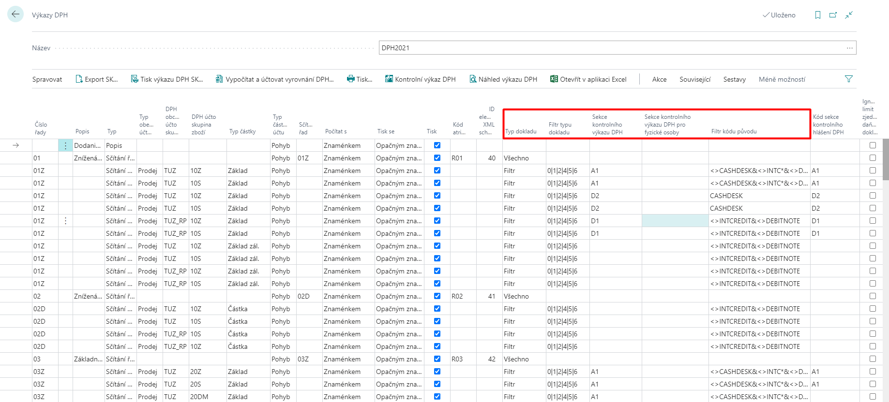

# Kontrolní výkaz DPH - nastavení

> Aktualizace 21.09.2025

Pro zajištění správné funkčnosti je potřeba nastavit několik níže uvedených oblastí.

## Nastavení financí

Pro aktivování slovenských funkčností využijte následující postup:

1. Vyberte ikonu , zadejte **Nastavení financí** a poté vyberte související odkaz.
2. Na kartě **Nastavení financí** je nutné vybrat do pole **Legislativa** hodnotu **SK**.
3. Potvrďte pomocí tlačítka **OK**.

## Nastavení XML schémat

> [!TIP]
> Kompletní nastavení XML schémat najdete v Konfiguračním balíčku, který získáte spuštěním Asistovaného nastavení *Nastavit SK lokalizaci* (buď pouze naimportujte poslední verzi pomocí tlačítka *AssistEdit* ve stávající společnosti nebo v prázdné společnosti proveďte kompletní import vzorové parametrizace pomocí akce *Použít balíček*).

XML schéma ke Kontrolnímu výkazu DPH je potřebné do aplikace naimportovat do XML schémat.

1. Vyberte ikonu , zadejte **XML schémata** a poté vyberte související odkaz.
2. Na stránce **XML schémata** vyberte akci **Načíst schéma**.
3. Otevře se vám okno pro import, kde vyberete příslušný XML soubor.
4. Po import se na kartě **XML schémata** objeví nový řádek.
5. Do pole **XML port ID** vyberte hodnotu pro příslušný rok platnosti - viz tabulka níže.
6. do pole **Přiřazeno legislativě** vyberte hodnotu **SK**.
7. Potvrďte pomocí tlačítka **OK**.

>[!NOTE]
>
> | XML port ID | Platnost    |
> |   --------  | -------     |
> |   52068903  | od 1.1.2017 |
> |   52068904  | od 1.1.2021 |
> |   52068845  | od 1.1.2023 |
> |   52068847  | od 1.1.2025 |

## Nastavení řádků výkazu DPH - rozšíření

Pro zajištění správného vykazování Kontrolního výkazu DPH je potřeba nastavit pole v řádcích výkazu DPH:

1. Vyberte ikonu , zadejte **Výkazy DPH** a poté vyberte související odkaz.
2. Pro jednotlivé řádky výkazu DPH definujte pole:

   - Filtr kódu původu
   - Typ dokladu
   - Filtr typu dokladu
   - Sekce kontrolního výkazu DPH
   - Sekce kontrolního výkazu DPH pro fyzické osoby

   

3. Potvrďte pomocí tlačítka **OK**.

> [!WARNING]
> Pole **Sekce kontrolního výkazu DPH** musí být nastaveno pouze na jednom řádku výkazu DPH pro stejné hodnoty v polích:
>
> - Typ obecného účtování
> - DPH obchodní účto skupina
> - DPH účto skupina zboží
> - Typ částky
> - Filtr typu dokladu
> - Filtr kódu původu
>
> Pokud je stejná hodnota sekce nastavena na více řádcích pro stejné hodnoty polí výše, dochází ke zdvojení částek.

## Nastavení sekcí kontrolního výkazu DPH

Pro nastavení využijte následující postup:

1. Vyberte ikonu , zadejte **Sekce kontrolního výkazu DPH** a poté vyberte související odkaz.
2. Nastavte kódy sekcí dle platných nařízení pro vykazování.
3. Pro vykazování přijatých zjednodušených faktur je potřeba nastavit **Kód sekce pod limit** a **Kód sekce nad limit**. Zároveň se vyplní i pole **Limit částky DPH** a **Platnost limitu od**.

## Nastavení sloupců sekcí kontrolního výkazu DPH

Pro jednotlivé sekce je potřeba nastavit sloupce, které budou exportovány do xml souboru.

1. Vyberte ikonu , zadejte **Sekce kontrolního výkazu DPH** a poté vyberte související odkaz.
2. Označte řádek, pro který chcete nastavovat sloupce a poté zvolte funkci **Akce** -> **Sekce** -> **Nastavení sloupců sekcí výkazu**.
3. Zadejte kódy dle platného nařízení pro vykazování. V poli **Přiřazené pole v řádku výkazu** je nastavení, z jakého systémového pole bude hodnota naplněna do Kontrolního výkazu.

> [!WARNING]
> Pro zachování možnosti exportovat Kontrolní výkaz dle různých XML schémat, je třeba mít definovány pro každé schéma všechny sloupce.
> 

## Viz také

[ARICOMA Řešení](solutions.md)  
[SK Legislativní balíček](sk-legislative-pack.md)  
[Kontrolní výkaz DPH](sk-vat-check-report-export.md)
