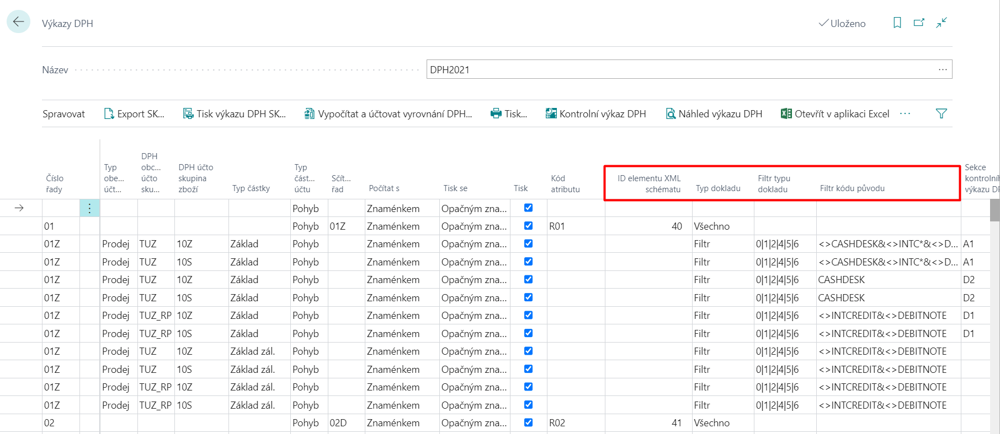

# Výkaz DPH - nastavení

> Aktualizace 31.05.2024

Pro generování výkazu DPH je využita standardní funkčnost systému. Tato funkčnost byla upravena o specifika slovenského vykazování.

Pro zajištění správné kalkulace částek Výkazu DPH a exportu do požadované struktury XML dle slovenské legislativy, je potřeba nastavit několik níže uvedených oblastí.

## Nastavení financí

Pro aktivování slovenských funkčností využijte následující postup:

1. Vyberte ikonu , zadejte **Nastavení financí** a poté vyberte související odkaz.
2. Na kartě **Nastavení financí** je nutné vybrat do pole **Legislativa** hodnotu **SK**.
3. Potvrďte pomocí tlačítka **OK**.

## Nastavení XML schémat

> [!TIP]
> Kompletní nastavení XML schémat najdete v Konfiguračním balíčku, který získáte spuštěním Asistovaného nastavení *Nastavit SK lokalizaci* (buď pouze naimportujte poslední verzi pomocí tlačítka *AssistEdit* ve stávající společnosti nebo v prázdné společnosti proveďte kompletní import vzorové parametrizace pomocí akce *Použít balíček*).

Do XML schémat naimportujte aktuální šablonu XML schématu dle následujícího postupu:

1. Vyberte ikonu , zadejte **XML schémata** a poté vyberte související odkaz.
2. Na stránce **XML schémata** v sekci **Proces** vyberte akci **Načíst schéma**.
3. Otevře se vám okno pro import, kde vyberete příslušný XML soubor.
4. Po importu se na kartě **XML schémata** objeví nový řádek.
5. Do pole **XML port ID** vyberte hodnotu pro příslušný rok platnosti - viz tabulka níže.
6. V poli **Přiřazeno legislativě** vyberte hodnotu **SK**.
7. Potvrďte pomocí tlačítka **OK**.

>[!NOTE]
>
> | XML port ID | Platnost    |
> |   --------  | -------     |
> |   52068861  | od 1.1.2018 |
> |   52068862  | od 1.1.2021 |
> |   52068860  | od 1.1.2025 |

## Nastavení šablon výkazu DPH

Pro nastavení využijte následující postup:

1. Vyberte ikonu , zadejte **Šablony výkazu DPH** a poté vyberte související odkaz.
2. Na stránce **Šablony výkazu DPH** vyberte ve sloupci **Formát XML SK** možnost **Použij XML schéma**.
3. Na stránce **Šablony výkazu DPH** zvolte sekci **Související**, potom **Šablona** a otevřete **Názvy výkazů**.
4. Na stránce **DPH Výkaz DPH** vyberte pro každý řádek příslušné schéma, která bude použito při exportu – pole **XML schéma**.
5. Potvrďte pomocí tlačítka **OK**.

Příklad můžete vidět na obrázku níže:

## Nastavení řádků výkazu DPH

Pro zajištění správného vykazování DPH je potřeba nastavit pole v řádcích výkazu DPH:

1. Vyberte ikonu , zadejte **Výkazy DPH** a poté vyberte související odkaz.
2. Pro jednotlivé řádky výkazu DPH definujte pole:

    - Filtr kódu původu
    - Typ dokladu
    - Filtr typu dokladu
    - ID elementu XML schématu - vyplěním bude automaticky vyplněn i Kód atributu DPH

3. Potvrďte pomocí tlačítka **OK**.

Příklad můžete vidět na obrázku níže:

## Nastavení kódů původu pro interní opravní doklady

Pro nastavení využijte následující postup:

1. Vyberte ikonu , zadejte **Nastavení kódů původu** a poté vyberte související odkaz.
2. Na záložce Prodej zadejte do pole **Prodejní interní dobropis** hodnotu INTCREDIT a do pole **Prodejní vrubopis** hodnotu DEBITNOTE. Hodnoty musí být nejdříve zadané v Kódech původu.
3. Na záložce Nákup zadejte do pole **Nákupní interní dobropis** hodnotu INTCREDIT a do pole **Nákupní vrubopis** hodnotu DEBITNOTE. Hodnoty musí být nejdříve zadané v Kódech původu.

## Nastavení tuzemského samozdanění

Pro nastavení komodit spadajících do režimu tuzemského samozdanění je využita standardní karta Čísla sazebníku.
V Nastavení financí a Nastavení účtování DPH je možné aktivovat systémové kontroly při účtování těchto komodit.

### Nastavení čísel sazebníku

1. Vyberte ikonu , zadejte **Čísla sazebníku** a poté vyberte související odkaz.
2. Definujte jednotlivé kódy komodit a zaškrněte pro tyto kódy pole **Tuzemské samozdanění**.
3. Pro kódy v režimu tuzemského samozdanění zadejte pole **Kód pro vykazování**.
4. Potvrďte pomocí tlačítka **OK**.

### Nastavení financí - tuzemské samozdanění

1. Vyberte ikonu , zadejte **Nastavení financí** a poté vyberte související odkaz.
2. Na kartě **Nastavení financí** definujte pole **Výše základu DPH pro tuzemské samozdanění** a **Datum platnosti DPH pro tuzemské samozdanění**.
3. Potvrďte pomocí tlačítka **OK**.

### Nastavení účtování DPH - tuzemské samozdanění

1. Vyberte ikonu , zadejte **Nastavení účtování DPH** a poté vyberte související odkaz.
2. Na kartě **Nastavení účtování DPH** můžete nastavit kontroly pro tuzemské samozdanění na jednotlivých kombinacích DPH účtoskupin v poli **Kontrola PDP**.
3. Potvrďte pomocí tlačítka **OK**.

## Viz také

[ARICOMA Řešení](solutions.md)  
[SK Legislativní balíček](sk-legislative-pack.md)
[Výkaz DPH - export](sk-vat-statement-export.md)
