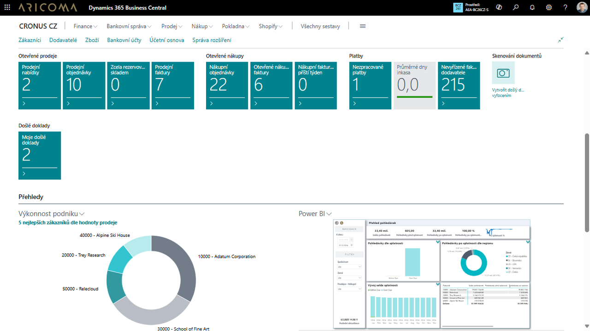

# Microsoft Dynamics 365 Business Central

Microsoft Dynamics 365 Business Central je moderní informační systém pro malé a středně velké společnosti, které hledají jednoduché a snadno přizpůsobitelné řešení s komplexním pokrytím jejich potřeb a s intuitivním uživatelským prostředím. Nabízí zvýšení produktivity a konkurenceschopnosti, šetří vstupní investice a snižuje starosti spojené s provozem a bezpečností.

Data jsou dostupná kdykoliv a odkudkoliv. Provoz informačního systému je možný v cloudu nebo ve vlastním prostředí. On-line provoz systému v cloudu má zásadní výhodu v nižších počátečních nákladech na implementaci, zajištěné bezpečnosti a snazších aktualizacích systému. Uživatelé se mohou připojit z počítače, chytrého telefonu nebo tabletu s Google Android nebo Apple iOS.

Více informací k Business Central naleznete na našich stránkách [Aricoma ERP pro střední a menší firmy](https://www.aricoma.com/cs/co-delame/podnikove-aplikace/informacni-systemy-microsoft/erp-pro-stredni-a-mensi-firmy/microsoft-dynamics-365-business-central).

**Nasazení Microsoft Dynamics 365 Business Central od společnosti ARICOMA je jednoduché a rychlé díky široké škále rozšiřujících modulů a oborových řešení.**

## Rozšiřující moduly

Standardní systém Dynamics 365 Business Central rozšiřujeme o řadu funkcionalit doplňujících legislativní požadavky a osvědčené postupy.

## Slovenská Lokalizace
Pro slovenské společnosti poskytujeme rozšíření o [Slovenskou legislativu a Slovenský jazyk](sk-legislative-pack.md).

## Oborová řešení
Kromě rozšiřujících modulů jsou k dispozici níže uvedená specializovaná oborová řešení.

- Lázeňství, hotelnictví a wellness
- Doprava a logistika
- Řízené sklady (WMS)
- Řešení pro výrobu a montáže
- Neziskové organizace
- Řízení projektů a zakázek
- Servisní firmy
- Holdingové společnosti
- Vydavatelství
- Farmaceutický a kosmetický průmysl
- Velkoobchod a maloobchod, distribuce
- a řada dalších

## Viz také
[Financial Pack](finance-pack.md)  
[Productivity Pack](productivity-pack.md)  
[Streamline Tools](streamlinetools.md)  
[SK Legislative Pack](sk-legislative-pack.md)  
