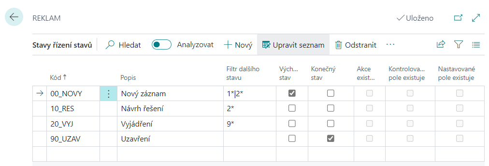

# Řízení stavů - Nastavení

## Nastavení šablony řízení stavů

1. Vyberte ikonu , zadejte **Šablony řízení stavů** a poté vyberte související odkaz.
2. Na stránce **Šablony řízení stavů** zvolte akci **Nový**.
3. Vyplňte pole **Kód**, **Popis** a **Číslo tabulky** (pro kterou bude šablona nastavena).
4. Pokud chcete, aby se automaticky logovaly změny, zaškrtněte políčko **Logovat změny**.

5. Pokud chcete zadat jednotlivé stavy nově vytvořeného řízení stavů, klikněte na **Stavy**.

Pro každý stav Řízení stavů je třeba nadefinovat **Kód**, **Popis** a **Filtr dalšího stavu**, který určuje, do jakých dalších stavů je možné z daného stavu přejít. Právě jeden ze stavů musí být označen jako **Výchozí stav** (zaškrtnutím tlačítka Výchozí stav). Tento stav se pak automaticky vyplní při založení nového řádku tabulky, s kterou řízení stavů pracuje (dokument, požadavek, atd.).

Některé stavy mohou být označeny jako **Konečný stav**, z něhož se už nepokračuje do žádného dalšího stavu.

Příklad nastavení stavů pro Řízení stavů je zobrazen na obrázku níže.

Pro aktivní řádek na stránce **Stavy Řízení stavů** lze specifikovat:

- **Kontrolovaná pole**
- **Kontrolované tabulky**
- **Nastavovaná pole**
- **Akce Řízení stavů**

### Kontrolovaná pole

Pro každý stav (řádek na stránce Stavy Řízení stavů) je možné nadefinovat pole, která se budou kontrolovat při přechodu do daného stavu.

Pro kontrolovaná pole je nutné vyplnit minimálně **Kód**, **ID pole** (kde se zaznamenává pole, které by mělo být kontrolováno) a pole **Kontrola hodnoty** (udává, jaký typ kontroly bude prováděn při nastavení daného stavu):
- **Kód nutný** – Pokud do pole Kontrola hodnoty zadáte tuto možnost, systém bude kontrolovat, zda je v poli (které jste zadali do pole ID pole) vyplněna libovolná hodnota. Pokud je pole libovolně vyplněno, tak se bude dát přepnout stav do daného stavu.
- **Stejný kód** – Tato možnost označuje, že v poli (které je vyplněno v poli ID pole) musí být vyplněna stejná hodnota jako v poli **Hodnota** na stránce Kontrolovaná pole Řízení stavů. V tomto případě, nemůžete vyplnit pole Podmínka porovnání.
- **Žádný kód** – v poli (které je vyplněno v poli ID pole) nesmí být při přechodu do daného stavu nic vyplněno.
- **Porovnat hodnotu** - Při výběru této možnosti, systém porovnává hodnotu v daném poli s hodnotou vyplněnou v poli **Hodnota** na stránce Kontrolovaná pole Řízení stavů. Proto musí být pole Hodnota, při výběru této možnosti, vyplněno. Rozdíl vůči možnosti Stejný kód je v tom, že v poli **Podmínka porovnání** můžete zvolit metodu porovnání (Rovná se, Nerovná se, Menší než, Menší než nebo rovno, Větší než, Větší než nebo rovno).
- **Porovnat pole** - Při výběru této možnosti je důležité vyplnit pole **Číslo pole porovnání**. V tomhle poli se určuje, s kterým polem budeme dané pole porovnávat. Dále je podstatné vyplnit pole **Podmínka porovnání**, kde můžeme také určit způsoby porovnání jako v předchozí možnosti.

### Nastavovaná pole

Pro každý stav je možné nadefinovat pole, která se budou nastavovat při přechodu do tohoto stavu.

Pro nastavované pole je nutné vyplnit pole **ID pole** a **Hodnota**. V poli Hodnota se zadává, na jakou hodnotu se nastaví pole při přechodu na daný stav Řízení stavů.

### Akce Řízení stavů

V Akcích mohou být definované Codeunity, Reporty a XMLPorty, které je možné spouštět při přechodu do daného stavu. Codeunity pro akce si může partner vytvářet sám dle vlastní potřeby v číslech objektů povolených jeho licencí.

Pro každý stav je možné nadefinovat akce, které se budou provádět při přechodu do daného stavu. Pro akci je nutné nadefinovat pole **Kód akce**, **Číslo pole (hodnota)** a **Hodnota**.

V poli **Číslo pole (hodnota)** se definuje z jakého pole se vezme obsah a předá se jako parametr akci (např. při změně stavu na kartě zákazníka je možné vyplnit číslo pole 102 a jako parametr se akci předá obsah pole E-mail). V poli Hodnota se zadává přímo hodnota, která se předá akci jako parametr (např. konkrétní e-mail).
Pomocí funkce Texty mailu je možné definovat obsah mailu (předmět a vlastní text). Do textu je možné vkládat kódy, které se při odeslání mailu nahradí obsahem polí. Kódy se definují pomocí funkce Pole mailu.

### Kontrolované tabulky

Tato funkce pomáhá kontrolovat nastavené pole na jiné stránce (v jiné tabulce, jako je tabulka, v které aktuálně pracujete). Je to obdobná funkce jako Akce Řízení stavů. Pomocí této funkce můžete ověřit či je pole na jiné stránce nastaveno tak, jak je potřebné při přechodu, do daného stavu, na kterém tuto funkci využíváte.

Pokud kliknete na funkci Kontrolované tabulky, otevře se stránka Kontrolované tabulky Řízení stavů, kde je automaticky vyplněno pole **Kód šablony** a **Kód stavu**. Na této stránce je potřebné vyplnit pole **Kód**, **ID tabulky**, v které chcete zkontrolovat nějaké pole, **Metoda kontroly tabulky** a popřípadě pole **Hodnota**.

## Nastavení Řízení stavů

Toto nastavení slouží k propojení definovaných šablon řízení stavů s entitou, ve které má být dané řízení stavů použito.

1. Vyberte ikonu , zadejte **Nastavení řízení stavů** a poté vyberte související odkaz.
2. Na stránce **Nastavení řízení stavů** zvolte akci **Nový**.
3. Vyplňte pole **Číslo tabulky** a **Šablony řízení stavů**.
4. Pokud chcete povolit uživatelské kontroly stavů, zaškrtněte políčko **Uživatelské kontroly Řízení stavů povoleny**.

> [!NOTE]
> Nastavení řízení stavů bude aktivováno až po následném odhlášení a znovu přihlášení uživatelů, tak jak upozorňuje informativní hláška.

## Viz také

[WorkFlow - řízení stavů](workflow-status-management.md)  
[Productivity Pack](productivity-pack.md)
