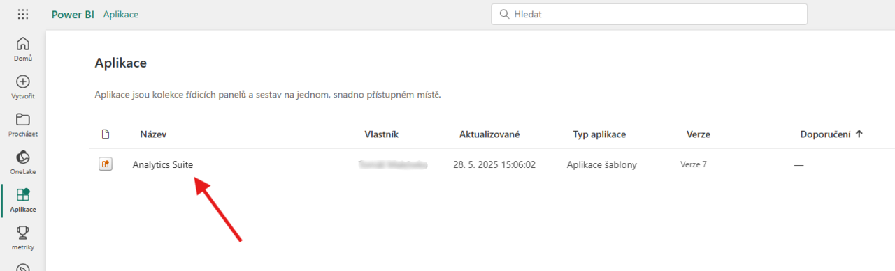

# Analytics Suite – Nastavení

> Aktualizace: 28.05.2025

Modul **Analytics Suite** rozšiřuje možnosti analýzy dat a vizualizace klíčových ukazatelů v prostředí Dynamics 365 Business Central. Pro správné fungování je nutné provést následující nastavení:

- **Instalace rozšíření v Business Central**
- **Nastavení Analytics Suite v Business Central**
- **Připojení Power BI aplikace k vlastním datům**

## Instalace rozšíření v Business Central

1. Přihlaste se do prostředí Business Central.
2. Otevřete **AppSource** a vyhledejte **Analytics Suite**.

3. Vyberte rozšíření **Analytics Suite for Business Central** a klikněte na **Nainstalovat aplikaci**.

4. Dokončete instalaci dle průvodce.

## Nastavení Analytics Suite v Business Central

1. Vyberte ikonu , zadejte **Nastavení Analytics Suite** a poté vyberte související odkaz.
2. Na stránce **Nastavení Analytics Suite** aktivujte modul zaškrtnutím políčka **Povoleno**.

3. Vyberte ikonu , zadejte **Informace o společnosti** a poté vyberte související odkaz.
4. Na stránce **Informace o společnosti** a u dalších společností, které chcete analyzovat v Analytics Suite, aktivujte možnost **Zahrnout do Analytics Suite**.

## Připojení Power BI aplikace k datům

Pro správné zobrazení reportů a dashboardů je nutné propojit Power BI aplikaci s vaším prostředím Business Central:

1. Přejděte na [powerbi.com](https://powerbi.com) a přihlaste se.
2. V levém panelu zvolte **Aplikace**.

3. Klikněte na **Získat aplikace**.

4. Do vyhledávacího pole zadejte **Analytics Suite** a vyberte aplikaci od společnosti **Aricoma**.

5. Klikněte na **Získat hned** a nainstalujte aplikaci.

6. Otevřete aplikaci **Analytics Suite** v příslušném workspace.

7. Klikněte na **Připojit data**.

8. Do pole **EnvironmentName** zadejte název prostředí vaší instance Business Central.

## Viz také

[Analytics Suite – Přehled](analytics-suite.md)  
[Streamline Tools](../StreamlineTools/streamlinetools.md)