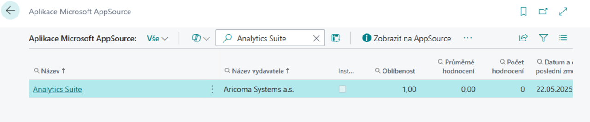
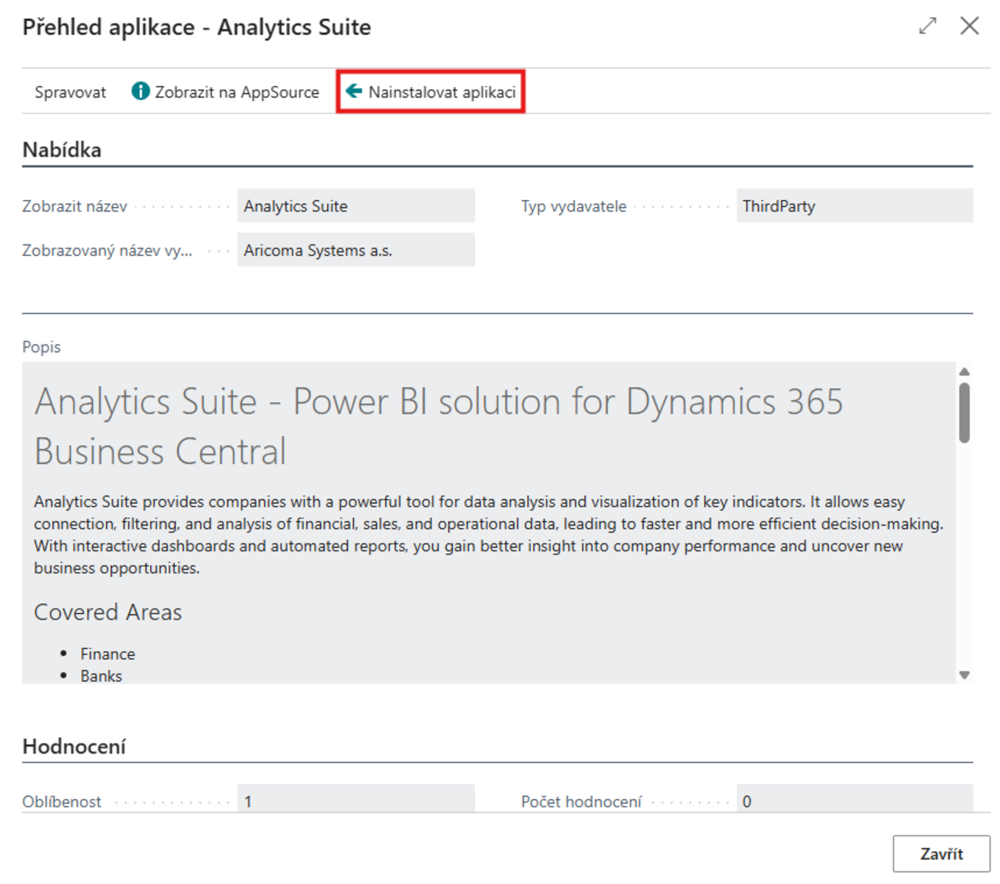

# Analytics Suite – Nastavení

> Aktualizace: 28.05.2025

Modul **Analytics Suite** rozšiřuje možnosti analýzy dat a vizualizace klíčových ukazatelů v prostředí Dynamics 365 Business Central. Pro správné fungování je nutné provést následující nastavení:

- **Instalace rozšíření v Business Central**
- **Nastavení Analytics Suite v Business Central**
- **Připojení Power BI aplikace k vlastním datům**

## Instalace rozšíření v Business Central

1. Přihlaste se do prostředí Business Central.
2. Otevřete **AppSource** a vyhledejte **Analytics Suite**.

3. Vyberte rozšíření **Analytics Suite for Business Central** a klikněte na **Get it now** (Instalovat).

4. Dokončete instalaci dle průvodce.

## Nastavení Analytics Suite v Business Central

1. Vyberte ikonu , zadejte **Analytics Suite Setup** a poté vyberte související odkaz.
2. Na stránce **Analytics Suite Setup** aktivujte modul zaškrtnutím políčka **Enabled**.
3. Přejděte na stránku **Informace o společnosti** a u společností, které chcete analyzovat v Analytics Suite, aktivujte možnost **Enabled**.

## Připojení Power BI aplikace k datům

Pro správné zobrazení reportů a dashboardů je nutné propojit Power BI aplikaci s vaším prostředím Business Central:

1. Přejděte na [powerbi.com](https://powerbi.com) a přihlaste se.
2. V levém panelu zvolte **Apps**.
3. Klikněte na **Get Apps**.
4. Do vyhledávacího pole zadejte **Analytics Suite** a vyberte aplikaci od společnosti Aricoma.
5. Klikněte na **Get it now** a nainstalujte aplikaci.
6. Otevřete report **Analytics Suite** v příslušném workspace.
7. Klikněte na **Connect your data**.
8. Do pole **Environment** zadejte název prostředí vaší instance Business Central (část URL před ".dynamics.com").

## Viz také

[Analytics Suite – Přehled](analytics-suite.md)  
[Streamline Tools](../StreamlineTools/streamlinetools.md)
