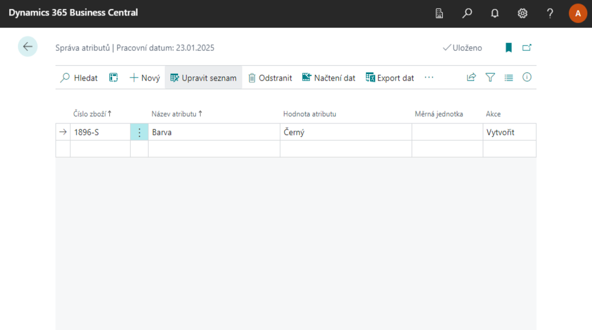
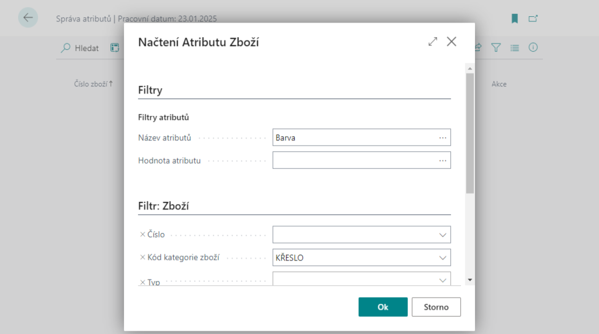
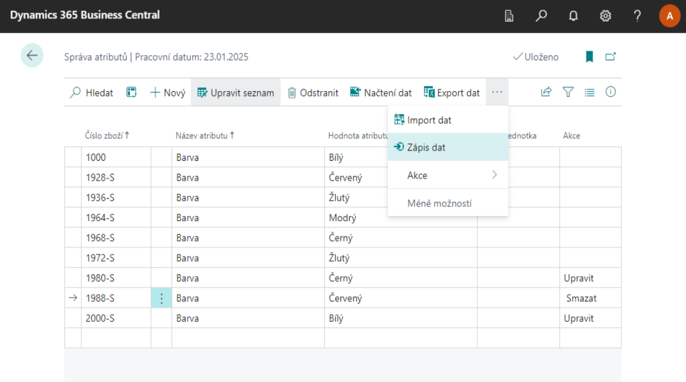
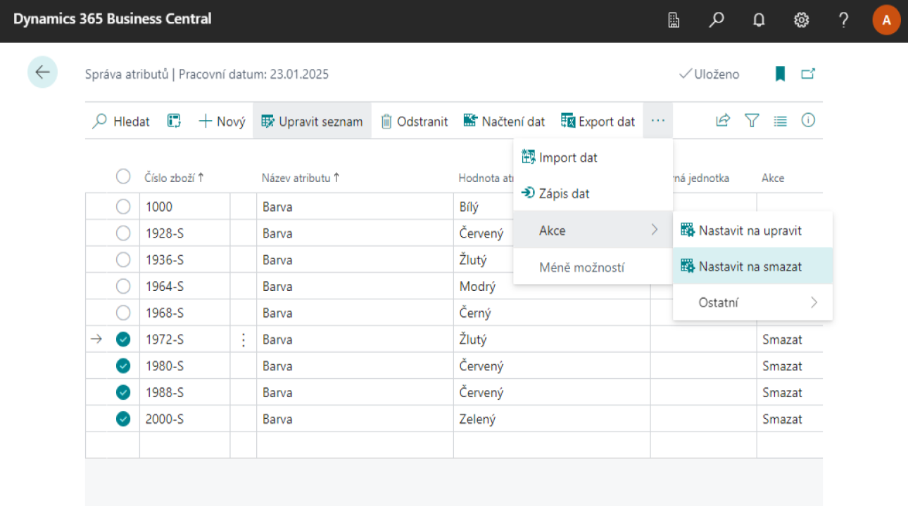
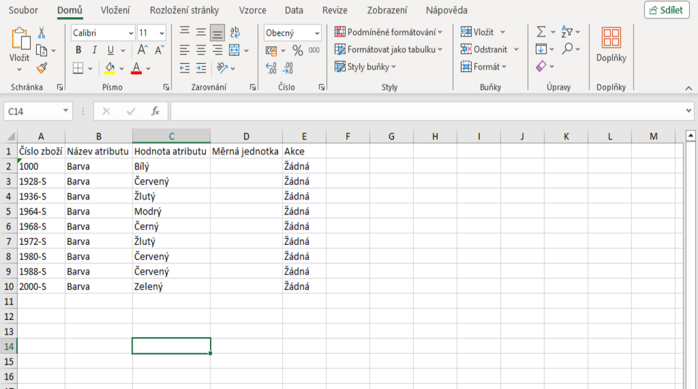
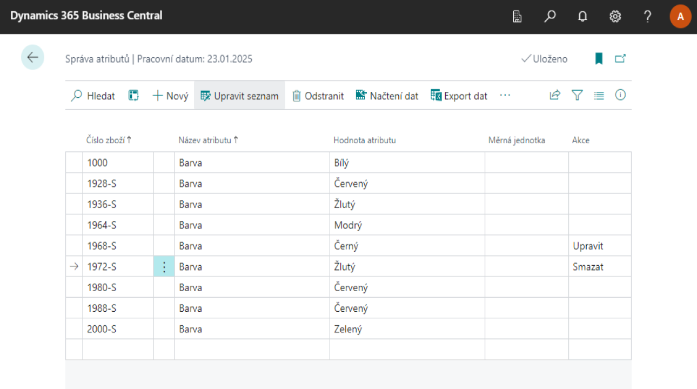

# Správa atributů

Modul **Správa atributů** je rozšíření pro hromadnou práci s atributy zboží tak, aby uživatel nemusel zadávat atributy zboží u jednotlivých produktů, ale aby mohl je přidat, upravit či smazat pro všechny produkty na jedné stránce.

Hlavní stránkou tohoto rozšíření je Správa atributů, ze které vychází celý modul.

## Vytváření nových atributů

1. Na stránce **Správa atributů** vyberte ikonu **Nový**.
2. Zadejte **Číslo zboží**, **Název atributu** a **Hodnotu atributu**.
3. Do pole **Akce** se automaticky přidá hodnota **Vytvořit**.
4. Nyní vyberte ikonu **Zápis dat**.

Pro kontrolu si můžete zobrazit stránku **Zboží** a podívat se do atributů zboží u zboží, pro které jste zadávaly atribut.

## Úprava existujích atributů

Po vytvoření atributů je možné atributy upravovat nebo je smazat.
První je ale potřeba existující atributy zobrazit následovně:

1. Na stránce **Správa atributů** vybereme ikonku **Načtení dat** a nyní si můžeme zafiltrovat které atributy zboží chceme načíst podle zboží či názvu atributu.
2. Po vyfiltrování klikneme na tlačítko **OK**.
3. Následně si můžeme vyfiltrovat hodnotu atributu a kliknout na tlačítko **OK**. Pokud si hodnotu atributu filtrovat nepřejeme, klikneme na tlačítko **Zrušit**.

Zobrazená data můžeme libovolně upravovat. Pokud si přejeme u daného atributu zboží změnit hodnotu, změníme hodnotu v poli **Hodnota atributu** a systém automaticky změní hodnotu pole akce na **Upravit**. Pokud si přejeme daný atribut smazat, změníme hodnotu pole akce na **Smazat**. Jakmile máme všechny úpravy provedené, vybereme ikonku **Zápis dat** čímž změny aplikujeme na data u zboží.

Pokud si přejeme hromadně smazat několik atributů zboží, klikneme u jednoho ze záznamů na **Tři tečky** a klikneme na tlačítko **Vybrat více**. To nám umožní vybrat více záznamů kliknutím na **Kroužek** před požadovaným záznamem. Jakmile máme vybrané všechny požadované záznamy, vybereme ikonku **Nastavit na smazat**, čímž se u vybraných záznamů nastaví hodnota pole akce na **Smazat**. Pro aplikování změn opět vybereme ikonku **Zápis dat**.

## Úprava atributů v Excelu

Další možností úpravy atributů je pomocí aplikace Excel.

Podle předchozí části si opět můžete vyfiltrovat a načíst data v Business Central. Tyto data si pomocí ikonky **Export dat** můžete vyexportovat do excelového souboru. Popřípadě můžete dát **Export dat** bez předešlého filtrování a načtení dat pro získání rozložení excelového souboru.

V Excelu si můžete upravit hodnoty podle potřeby a poté kliknout na ikonku **Import dat** v Business Central a vložit zde excelový soubor. Po vložení se zobrazí data v Business Central. Hodnota pole **Akce** bude určena podle hodnoty kterou jste zadali v Excelu. Pokud jste žádnou nezadali, tak se upraví podle změn provedených s daným atributem. Například pokud zadáte číslo zboží a název atributu existujícího atributu zboží, ale zadáte jinou hodnotu atributu než tu, kterou u něj teď je, hodnota pole bude automaticky změněna na hodnotu **Upravit**.

Takto naimportovaná data můžete zkontrolovat a upravit. Po kontrole vyberete ikonku **Zápis dat** a data se propíší ke  zboží.

**Viz také**

[Práce s atributy zboží](https://learn.microsoft.com/cs-cz/dynamics365/business-central/inventory-how-work-item-attributes)
